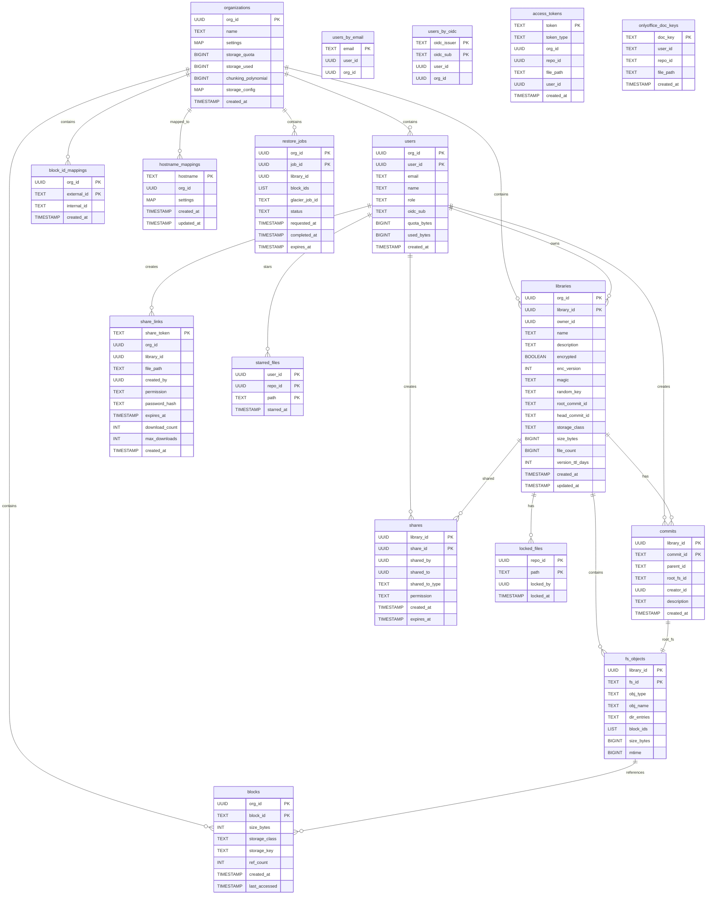

# SesameFS Architecture

This document covers architectural decisions and storage design for SesameFS.

---

## Overview

SesameFS is a Seafile-compatible cloud storage API with modern internals:
- **Go** backend with Gin HTTP framework
- **Apache Cassandra** for globally-distributed metadata
- **S3-compatible** block storage with multi-region support
- **FastCDC** chunking for server-side uploads
- **Seafile protocol** compatibility for desktop/mobile clients

---

## Core Decisions

### Database: Apache Cassandra 5.0

**Rationale**:
- **Apache 2.0 License** - Fully permissive, no restrictions at any scale
- **Global Distribution** - NetworkTopologyStrategy for multi-DC replication
- **Self-Healing** - Automatic repair with tunable consistency (LOCAL_QUORUM)
- **Battle-Tested** - Netflix, Apple, Discord, Instagram scale

**Rejected Alternatives**:
- ScyllaDB - License changed to Source Available (Dec 2024), free tier limited to 50 vCPU/10 TB
- CockroachDB - BSL license, restrictive for commercial use
- FoundationDB - Smaller community, steeper learning curve

---

### Chunking: Adaptive FastCDC

| Upload Path | Who Chunks? | Algorithm | Block Size | Hash |
|-------------|-------------|-----------|------------|------|
| **Seafile Desktop/Mobile** | **Client** (cannot change) | Rabin CDC | 256KB-4MB | SHA-1 |
| **Web file upload** | **Server** | FastCDC | 2-256MB (adaptive) | SHA-256 |
| **v2 API upload** | **Server** | FastCDC | 2-256MB (adaptive) | SHA-256 |

**Key Insight**: Seafile clients control their own chunking. We cannot change this. Server translates SHA-1→SHA-256 for internal storage.

**Why FastCDC over Rabin?**

| Metric | Rabin CDC | FastCDC |
|--------|-----------|---------|
| Speed | Baseline | **10x faster** |
| Dedup Ratio | Excellent | Excellent (same) |
| Implementation | Complex | Simpler |

**Adaptive Sizing Logic**:
```
Speed Detected    │ Chunk Size
──────────────────┼─────────────
500 Kbps (mobile) │ 2 MB (minimum)
5 Mbps (home)     │ 5 MB
50 Mbps (office)  │ 50 MB
500 Mbps (DC)     │ 256 MB (maximum)
```
Target: ~8 seconds per chunk upload

**Configuration**:
```yaml
chunking:
  algorithm: fastcdc
  hash_algorithm: sha256
  adaptive:
    enabled: true
    absolute_min: 2097152       # 2 MB floor
    absolute_max: 268435456     # 256 MB ceiling
    initial_size: 16777216      # 16 MB starting point
    target_seconds: 8           # Target ~8 seconds per chunk
```

---

### SHA-1 to SHA-256 Block ID Mapping

Seafile clients use SHA-1 (40 chars) for block IDs, but SesameFS stores everything as SHA-256 (64 chars) internally.

**Schema**:
```cql
CREATE TABLE block_id_mappings (
    org_id UUID,
    external_id TEXT,    -- SHA-1 from Seafile client (40 chars)
    internal_id TEXT,    -- SHA-256 used in storage (64 chars)
    created_at TIMESTAMP,
    PRIMARY KEY ((org_id), external_id)
);
```

**Flow**:
```
Seafile Client (SHA-1)           SesameFS (SHA-256)
─────────────────────────────────────────────────────────
PUT block/abc123... (40)         → Compute SHA-256 of data
                                 → Store with internal SHA-256 ID
                                 → Save mapping: abc123... → SHA-256
─────────────────────────────────────────────────────────
GET block/abc123... (40)         → Lookup mapping: abc123... → SHA-256
                                 → Retrieve using internal SHA-256 ID
```

---

### Client Compatibility: Seafile Protocol

**Choice**: Implement Seafile sync protocol (`/seafhttp/`) for client compatibility

**Rationale**:
- Leverage existing Seafile desktop/mobile apps
- iOS app is Apache 2.0 licensed
- Desktop and Android are GPLv3 (usable as clients)
- Reduces time-to-market significantly

---

### Storage Strategy: Block-Based with S3

**Architecture**:
```
File → FastCDC Chunks → SHA-256 Hash → S3 (hot) → Glacier (cold)
```

**Key Features**:
- Blocks stored by hash (deduplication)
- Blocks can tier to Glacier automatically
- Reference counting for garbage collection
- Per-tenant isolation (optional cross-tenant dedup)

---

### Multi-Tenancy Model

**Phase 1 - Logical Separation**:
- Single Cassandra keyspace, data partitioned by `org_id`
- Shared S3 bucket with org-based prefixes: `s3://sesamefs-blocks/{org_id}/`
- Per-tenant chunking polynomial for security
- No cross-tenant deduplication (isolation by default)

**Phase 2 - Configurable Per-Customer Isolation**:
- Dedicated S3 buckets per customer
- Different storage classes per customer
- Different regions for data residency compliance
- Custom lifecycle policies

---

### Versioning Strategy: All Versions with TTL

**Implementation**:
- Every file change creates a new version (commit)
- Versions stored as separate commits (Git-like model)
- TTL configurable per library (default: 90 days)
- Expired versions eligible for garbage collection
- Option to keep versions indefinitely (TTL = 0)

**Configuration**:
```yaml
versioning:
  default_ttl_days: 90
  min_ttl_days: 7
  gc_interval: 24h
```

---

### Authentication: OIDC

**Choice**: OIDC with accounts.sesamedisk.com

**Dev Mode Config**:
```yaml
auth:
  dev_mode: true
  dev_tokens:
    - token: "dev-token-123"
      user_id: "00000000-0000-0000-0000-000000000001"
```

---

### License: MIT (Initial)

- Open source from the start
- MIT is simple and permissive
- May transition to different license later
- Core will remain open source

---

## Storage Architecture

### Storage Classes

A **Storage Class** is a named configuration for a specific storage backend.

**Naming Convention**: `{tier}-{type}-{region}`
- **tier**: `hot` (immediate access) or `cold` (delayed access, cheaper)
- **type**: `s3`, `glacier`, `disk`
- **region**: `usa`, `china`, `eu`, `africa`, `local`, etc.

**Examples**:

| Class Name | Type | Tier | Endpoint | Bucket |
|------------|------|------|----------|--------|
| `hot-s3-usa` | S3 | hot | s3.us-east-1.amazonaws.com | sesamefs-usa |
| `hot-s3-china` | S3 | hot | s3.cn-north-1.amazonaws.com.cn | sesamefs-china |
| `cold-glacier-usa` | Glacier | cold | glacier.us-east-1.amazonaws.com | sesamefs-archive-usa |

**Configuration**:
```yaml
storage:
  classes:
    hot-s3-usa:
      type: s3
      tier: hot
      endpoint: "https://s3.us-east-1.amazonaws.com"
      bucket: sesamefs-usa
      region: us-east-1

    cold-glacier-usa:
      type: glacier
      tier: cold
      endpoint: "https://glacier.us-east-1.amazonaws.com"
      vault: sesamefs-archive-usa
      region: us-east-1
```

---

### Storage Policies

**Policies** determine which storage class to use when storing a new block.

**Priority (highest to lowest)**:
1. **Library Override** - Specific library configured to use a storage class
2. **Endpoint/Region** - Based on which API endpoint received the request
3. **Organization Default** - Organization-level default
4. **Global Default** - System-wide fallback

**Policy Resolution Flow**:
```
Incoming Upload
      │
      ▼
Library has override? ──yes──▶ Use library class
      │ no
      ▼
Endpoint region mapping ──▶ Find hot class for region
      │
      ▼
Store block + record storage_class in DB
```

**Endpoint-to-Region Mapping**:
```yaml
policies:
  endpoint_regions:
    "us.sesamefs.com": "usa"
    "eu.sesamefs.com": "eu"
    "cn.sesamefs.com": "china"

  region_classes:
    usa:
      hot: "hot-s3-usa"
      cold: "cold-glacier-usa"
    eu:
      hot: "hot-s3-eu"
      cold: "cold-glacier-eu"
```

---

### Block Retrieval Flow

```
1. Client requests block: GET /seafhttp/repo/{repo_id}/block/{block_id}

2. Server looks up in Cassandra:
   SELECT storage_class, storage_key FROM blocks
   WHERE org_id = ? AND block_id = ?

   → Returns: storage_class = "hot-s3-usa", storage_key = "blocks/ab/c1/abc123"

3. Server selects storage backend by class name

4. Server retrieves from backend and returns to client
```

---

### Lifecycle Policies

Blocks can be migrated between storage classes based on access patterns:

```yaml
lifecycle:
  rules:
    - name: "Move to cold after 90 days"
      condition:
        last_accessed_days_ago: 90
        current_tier: hot
      action:
        move_to_tier: cold

    - name: "Delete if unused for 1 year"
      condition:
        last_accessed_days_ago: 365
        ref_count: 0
      action:
        delete: true
```

---

### High Availability

#### Database HA (Cassandra)

```
        DC: us-east-1         DC: eu-west-1        DC: cn-north-1
        ┌─────────────┐       ┌─────────────┐      ┌────────────┐
        │ Node 1      │       │ Node 1      │      │ Node 1     │
        │ Node 2      │  ←──► │ Node 2      │ ←──► │ Node 2     │
        │ Node 3      │       │ Node 3      │      │ Node 3     │
        └─────────────┘       └─────────────┘      └────────────┘

        Replication Factor: 3 per DC
        Write Consistency: LOCAL_QUORUM (2 of 3 in local DC)
        Read Consistency: LOCAL_QUORUM
```

#### Storage Backend HA

Each storage backend has failover endpoints:

```yaml
storage:
  classes:
    hot-s3-usa:
      type: s3
      endpoints:
        - url: "https://s3.us-east-1.amazonaws.com"
          priority: 1  # Primary
        - url: "https://s3.us-west-2.amazonaws.com"
          priority: 2  # Failover

      health_check:
        interval: 30s
        timeout: 5s
        unhealthy_threshold: 3

      failover:
        mode: "same-region"
        fallback_class: "hot-s3-usa-west"
```

---

### File-Level Storage Consistency

When a file is uploaded, **ALL blocks of that file** must use the same storage class. The policy is evaluated once at the start of the upload session, not per-block.

---

### Cross-Session Deduplication

**First-Write Wins**:
```
Session 1 (USA): Block abc123 → stored in hot-s3-usa, recorded in DB
Session 2 (China): Block abc123 → DB lookup finds it exists in hot-s3-usa
                   → Skip upload, reference existing block
                   → China user retrieves from USA (cross-region)
```

---

## Garbage Collection Architecture

### Components

#### GC Worker (runs every gc_interval)

```
1. SCAN: Find commits older than version_ttl_days
   SELECT * FROM commits WHERE created_at < NOW() - TTL

2. MARK: Identify orphaned blocks
   - Walk FS tree of each commit to be deleted
   - Decrement ref_count for each block
   - Mark blocks with ref_count = 0 as orphaned

3. SWEEP: Delete orphaned data
   - Delete commits from commits table
   - Delete orphaned fs_objects
   - Delete orphaned blocks from S3 (ref_count = 0)
   - Clean up block_id_mappings for deleted blocks
```

**Safety measures**:
- Never delete HEAD commit or its ancestors within TTL
- Grace period: blocks marked orphaned wait 24h before S3 deletion
- Dry-run mode for testing
- Metrics: commits_deleted, blocks_deleted, bytes_reclaimed

#### Reference Counting

**Operations**:
- **File upload**: `ref_count = 1` (new block) or increment if dedup
- **File copy**: increment `ref_count`
- **Commit deletion**: decrement `ref_count` for all blocks in commit
- **Block deletion**: only when `ref_count = 0`

---

## Runtime Versions

| Component | Version | Notes |
|-----------|---------|-------|
| **Go** | 1.25.5 | Latest stable |
| **Debian** | Trixie 13 slim | `debian:trixie-slim` |
| **Cassandra** | 5.0.6 | Latest |
| **gocql driver** | v2.0.0 | Apache official driver |
| **aws-sdk-go-v2** | v1.41.0 | Latest |
| **Gin** | v1.10.0 | HTTP framework |

---

## Open Decisions

### Migration Strategy (Seafile → SesameFS)

**Options**:
1. **Lazy migration** - Read from Seafile storage, copy to SesameFS on access
2. **Bulk migration** - Offline migration with maintenance window
3. **Shadow mode** - Run both systems, compare responses, gradual cutover

**Current Recommendation**: Lazy migration with shadow mode validation

### Encryption Strategy (Deferred to Phase 4)

**Options**:
1. Server-side only (S3 SSE) - Simplest
2. Client-side encryption - Zero-knowledge, like Seafile
3. Both - Let users choose

**Current Plan**: Start with S3 SSE, add client-side in Phase 4

---

## Database Schema (ER Diagram)

The following diagram shows the Cassandra tables and their relationships:



### Table Relationships

| Relationship | Description |
|--------------|-------------|
| `organizations` → `users` | Users belong to an organization (partition key) |
| `organizations` → `libraries` | Libraries belong to an organization |
| `libraries` → `commits` | Git-like commit history per library |
| `commits` → `fs_objects` | Each commit points to a root fs_object (directory tree) |
| `fs_objects` → `blocks` | Files reference content blocks by ID |
| `blocks` ← `block_id_mappings` | SHA-1 to SHA-256 translation for Seafile clients |
| `users` → `starred_files` | User favorites |
| `libraries` → `locked_files` | File locking for collaborative editing |

### Cassandra Partition Keys

Cassandra tables use partition keys (PK) for data distribution:

| Table | Partition Key | Clustering Key | Purpose |
|-------|---------------|----------------|---------|
| `users` | `org_id` | `user_id` | Group users by org |
| `libraries` | `org_id` | `library_id` | Group libraries by org |
| `commits` | `library_id` | `commit_id` | History per library |
| `fs_objects` | `library_id` | `fs_id` | Tree per library |
| `blocks` | `org_id` | `block_id` | Blocks per org (dedup) |
| `starred_files` | `user_id` | `repo_id, path` | User favorites |

---

## Technical Notes

### Why Not ScyllaDB?

As of December 2024, ScyllaDB changed from AGPL to a "Source Available" license:
- Free tier limited to **50 vCPU and 10 TB** per organization
- Beyond that requires commercial license
- This makes it unsuitable for a scaling cloud storage business

### Seafile Sync Protocol Complexity

The `/seafhttp/` protocol is undocumented but reverse-engineerable:
- Git-like commit/tree model
- Block-based file storage
- State machine: init → check → commit → fs → data → update-branch

Implementation requires studying:
- [seafile-server fileserver code](https://github.com/haiwen/seafile-server/tree/master/fileserver)
- [seafile client sync code](https://github.com/haiwen/seafile/tree/master/daemon)

### Why Cassandra for Global Storage?

```
User in USA uploads file → Blocks stored in hot-s3-usa
                           ↓
                        Cassandra records: block_id → "hot-s3-usa"
                           ↓
                        Cassandra replicates to all DCs
                           ↓
User in China downloads → Looks up in local Cassandra DC
                           ↓
                        Finds: block_id → "hot-s3-usa"
                           ↓
                        Routes request to USA S3 (cross-region)
```

Without global replication, a user in China wouldn't know that their block is in USA.
