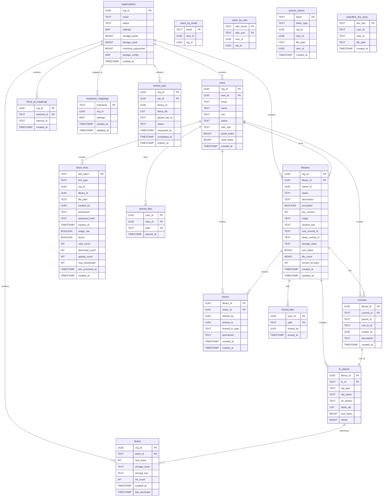

# SesameFS Architecture

This document covers architectural decisions and storage design for SesameFS.

---

## Overview

SesameFS is a Seafile-compatible cloud storage API with modern internals:
- **Go** backend with Gin HTTP framework — pure API server (no SPA serving)
- **React** frontend served by `nginx:alpine` in a separate Docker container
- **Apache Cassandra** for globally-distributed metadata
- **S3-compatible** block storage with multi-region support
- **FastCDC** chunking for server-side uploads
- **Seafile protocol** compatibility for desktop/mobile clients

**Runtime topology:**
```
Internet → nginx (TLS, rate limiting, routing)
              ├── /api2/, /api/v2/, /api/v2.1/, /seafhttp/, /d/, /u/d/, /lib/ → sesamefs (Go :8080)
              ├── /                                                            → frontend (nginx:alpine :80)
              └── mobile User-Agent                                           → mobile-frontend (:80)
```

---

## Core Decisions

### Database: Apache Cassandra 5.0

**Rationale**:
- **Apache 2.0 License** - Fully permissive, no restrictions at any scale
- **Global Distribution** - NetworkTopologyStrategy for multi-DC replication
- **Self-Healing** - Automatic repair with tunable consistency (LOCAL_QUORUM)
- **Battle-Tested** - Netflix, Apple, Discord, Instagram scale

**Rejected Alternatives**:
- ScyllaDB - License changed to Source Available (Dec 2024), free tier limited to 50 vCPU/10 TB
- CockroachDB - BSL license, restrictive for commercial use
- FoundationDB - Smaller community, steeper learning curve

---

### Chunking: Adaptive FastCDC

| Upload Path | Who Chunks? | Algorithm | Block Size | Hash |
|-------------|-------------|-----------|------------|------|
| **Seafile Desktop/Mobile** | **Client** (cannot change) | Rabin CDC | 256KB-4MB | SHA-1 |
| **Web file upload** | **Server** | FastCDC | 2-256MB (adaptive) | SHA-256 |
| **v2 API upload** | **Server** | FastCDC | 2-256MB (adaptive) | SHA-256 |

**Key Insight**: Seafile clients control their own chunking. We cannot change this. Server translates SHA-1→SHA-256 for internal storage.

**Why FastCDC over Rabin?**

| Metric | Rabin CDC | FastCDC |
|--------|-----------|---------|
| Speed | Baseline | **10x faster** |
| Dedup Ratio | Excellent | Excellent (same) |
| Implementation | Complex | Simpler |

**Adaptive Sizing Logic**:
```
Speed Detected    │ Chunk Size
──────────────────┼─────────────
500 Kbps (mobile) │ 2 MB (minimum)
5 Mbps (home)     │ 5 MB
50 Mbps (office)  │ 50 MB
500 Mbps (DC)     │ 256 MB (maximum)
```
Target: ~8 seconds per chunk upload

**Configuration**:
```yaml
chunking:
  algorithm: fastcdc
  hash_algorithm: sha256
  adaptive:
    enabled: true
    absolute_min: 2097152       # 2 MB floor
    absolute_max: 268435456     # 256 MB ceiling
    initial_size: 16777216      # 16 MB starting point
    target_seconds: 8           # Target ~8 seconds per chunk
```

---

### Representation-Aware Block ID Mapping

Seafile-facing surfaces still use SHA-1 block IDs, while SesameFS stores canonical
block data by SHA-256 internally. The mapping is no longer modeled as org-wide
`SHA-1 -> SHA-256`; it is representation-aware.

Why: the same logical content can exist in different byte domains inside one org.
For plaintext libraries the external SHA-1 is computed over plaintext bytes; for
encrypted libraries it is computed over library-specific encrypted bytes. Those are
different physical block identities and must not share one mapping namespace.

**Active identity model**:

- physical block identity: `(org_id, internal_sha256)`
- external mapping identity: `(org_id, representation_id, external_sha1)`

**Representation IDs**:

- `plain:v1` for plaintext libraries
- `library:<library_id>` for encrypted libraries

**Active schema**:
```cql
CREATE TABLE block_id_mappings (
  org_id UUID,
  representation_id TEXT,
  external_id TEXT,
  internal_id TEXT,
  created_at TIMESTAMP,
  PRIMARY KEY ((org_id, representation_id, external_id))
);
```

Libraries persist `block_representation_id`, and canonical `blocks` rows also keep
the `representation_id` used for exact forward-mapping cleanup during GC.

**Flow**:
```
Seafile-facing SHA-1            SesameFS canonical storage
────────────────────────────────────────────────────────────────────
PUT block in library L          → compute internal SHA-256 from bytes
                → resolve effective representation_id for L
                → store canonical block metadata
                → save mapping:
                  (org, representation_id, external_sha1) -> internal_sha256
────────────────────────────────────────────────────────────────────
GET/resolve block for library L → resolve effective representation_id for L
                → look up mapping inside that representation only
                → retrieve by internal SHA-256
```

See [BLOCK-REPRESENTATION-DESIGN.md](./BLOCK-REPRESENTATION-DESIGN.md) for the PR1
design and rollout notes.

---

### Client Compatibility: Seafile Protocol

**Choice**: Implement Seafile sync protocol (`/seafhttp/`) for client compatibility

**Rationale**:
- Leverage existing Seafile desktop/mobile apps
- iOS app is Apache 2.0 licensed
- Desktop and Android are GPLv3 (usable as clients)
- Reduces time-to-market significantly

---

### Storage Strategy: Block-Based with S3

**Architecture**:
```
File → FastCDC Chunks → SHA-256 Hash → S3 (hot) → Glacier (cold)
```

**Key Features**:
- Blocks stored by hash (deduplication)
- Blocks can tier to Glacier automatically
- Reference counting for garbage collection
- Per-tenant isolation (optional cross-tenant dedup)

#### Storage Config Formats

The storage manager (`internal/api/server.go` -> `initStorageManager`) supports two config formats. Multi-region is the production default shape, while `backends:` remains as an explicit single-region compatibility path.

**`classes:` - multi-region production default**

Used by `configs/config.prod.yaml`, `configs/config.docker.yaml`, `configs/config.example.yaml`, and the multiregion test configs under `configs/`. These files carry the structural topology in YAML (`bucket`, `region`, `endpoint`, `use_path_style`, `failover_class`, routing maps), while credentials still come from env vars. In shared-domain production, `SERVER_REGION` selects the node-local default region when a request does not arrive on a region-specific hostname.

```yaml
storage:
  default_class: hot-s3-usa
  classes:
    hot-s3-usa:
      type: s3
      tier: hot
      bucket: nihao-usa
      region: us-east-1
      failover_class: hot-s3-eu
    hot-s3-eu:
      type: s3
      tier: hot
      bucket: nihao-eu
      region: eu-west-1
  endpoint_regions:
    "us.nihaoshares.com": "usa"
    "eu.nihaoshares.com": "eu"
  region_classes:
    usa: { hot: hot-s3-usa }
    eu:  { hot: hot-s3-eu }
```

**`backends:` - single-region compatibility**

Used only when `SERVER_REGION` is empty and the legacy `hot` backend is explicitly configured through `S3_BUCKET`, `S3_REGION`, and optional `S3_ENDPOINT`. Runtime env overrides switch `default_class` back to `hot` for this mode. Empty legacy S3 backends are skipped so a multi-region node cannot accidentally route writes to an unconfigured `hot` bucket.

```yaml
storage:
  default_class: hot
  backends:
    hot:
      type: s3
      # bucket -> S3_BUCKET, region -> S3_REGION, endpoint -> S3_ENDPOINT
      # credentials -> S3_ACCESS_KEY_ID, S3_SECRET_ACCESS_KEY
```

**Production switch**: Set `SERVER_REGION` per node for multi-region (`usa`, `eu`, `asia`, etc.). Leave it empty only for the legacy single-bucket deployment.

---

### Multi-Tenancy Model

**Phase 1 - Logical Separation**:
- Single Cassandra keyspace, data partitioned by `org_id`
- Shared S3 bucket with org-based prefixes: `s3://sesamefs-blocks/{org_id}/`
- Per-tenant chunking polynomial for security
- No cross-tenant deduplication (isolation by default)

**Phase 2 - Configurable Per-Customer Isolation**:
- Dedicated S3 buckets per customer
- Different storage classes per customer
- Different regions for data residency compliance
- Custom lifecycle policies

---

### Versioning Strategy: All Versions with TTL

**Implementation**:
- Every file change creates a new version (commit)
- Versions stored as separate commits (Git-like model)
- TTL configurable per library (default: 90 days)
- Expired versions eligible for garbage collection
- Option to keep versions indefinitely (TTL = 0)

**Configuration**:
```yaml
versioning:
  default_ttl_days: 90
  min_ttl_days: 7
  gc_interval: 24h
```

---

### Authentication: OIDC

**Choice**: OIDC with accounts.sesamedisk.com

**Status enforcement**: When a user or org is deactivated/deleted, all their sessions are immediately invalidated (killed at source via `sessions_by_user` reverse-index table) and their share links are set `active=false`. This means session-authenticated requests don't need per-request status queries. Repo API tokens are checked via `enforceAccountStatus()` in both `authMiddleware` and `smartLinkAuthMiddleware`. The OIDC `provisionUser` flow rejects login attempts from deactivated/deleted users and orgs. Share link resolution distinguishes "disabled" (admin action, reversible on reactivation) from "expired" (time/download limit, permanent).

**Dev Mode Config**:
```yaml
auth:
  dev_mode: true
  dev_tokens:
    - token: "dev-token-123"
      user_id: "00000000-0000-0000-0000-000000000001"
```

---

### License: MIT (Initial)

- Open source from the start
- MIT is simple and permissive
- May transition to different license later
- Core will remain open source

---

## Storage Architecture

### Storage Classes

A **Storage Class** is a named configuration for a specific storage backend.

**Naming Convention**: `{tier}-{type}-{region}`
- **tier**: `hot` (immediate access) or `cold` (delayed access, cheaper)
- **type**: `s3`, `glacier`, `disk`
- **region**: `usa`, `china`, `eu`, `africa`, `local`, etc.

**Examples**:

| Class Name | Type | Tier | Endpoint | Bucket |
|------------|------|------|----------|--------|
| `hot-s3-usa` | S3 | hot | s3.us-east-1.amazonaws.com | sesamefs-usa |
| `hot-s3-china` | S3 | hot | s3.cn-north-1.amazonaws.com.cn | sesamefs-china |
| `cold-glacier-usa` | Glacier | cold | glacier.us-east-1.amazonaws.com | sesamefs-archive-usa |

**Configuration**:
```yaml
storage:
  classes:
    hot-s3-usa:
      type: s3
      tier: hot
      endpoint: "https://s3.us-east-1.amazonaws.com"
      bucket: sesamefs-usa
      region: us-east-1

    cold-glacier-usa:
      type: glacier
      tier: cold
      endpoint: "https://glacier.us-east-1.amazonaws.com"
      vault: sesamefs-archive-usa
      region: us-east-1
```

---

### Storage Policies

**Policies** determine which storage class to use when storing a new block.

**Priority (highest to lowest)**:
1. **Library Override** - Specific library configured to use a storage class
2. **Endpoint/Region** - Based on which API endpoint received the request
3. **Organization Default** - Organization-level default
4. **Global Default** - System-wide fallback

**Policy Resolution Flow**:
```
Incoming Upload
      │
      ▼
Library has override? ──yes──▶ Use library class
      │ no
      ▼
Endpoint region mapping ──▶ Find hot class for region
      │
      ▼
Store block + record storage_class in DB
```

**Endpoint-to-Region Mapping**:
```yaml
policies:
  endpoint_regions:
    "us.sesamefs.com": "usa"
    "eu.sesamefs.com": "eu"
    "cn.sesamefs.com": "china"

  region_classes:
    usa:
      hot: "hot-s3-usa"
      cold: "cold-glacier-usa"
    eu:
      hot: "hot-s3-eu"
      cold: "cold-glacier-eu"
```

---

### Block Retrieval Flow

```
1. Client requests block: GET /seafhttp/repo/{repo_id}/block/{block_id}

2. Server looks up in Cassandra:
   SELECT storage_class, storage_key FROM blocks
   WHERE org_id = ? AND block_id = ?

   → Returns: storage_class = "hot-s3-usa"

3. Server selects storage backend by class name and constructs an org-scoped
   BlockStore for `org_id`.

4. Server derives `blocks/<org_id>/ab/c1/abc123`, retrieves it and returns it.
   A persisted non-empty `storage_key` is an invariant check, not an arbitrary locator.
```

---

### Lifecycle Policies

Blocks can be migrated between storage classes based on access patterns:

```yaml
lifecycle:
  rules:
    - name: "Move to cold after 90 days"
      condition:
        last_accessed_days_ago: 90
        current_tier: hot
      action:
        move_to_tier: cold

    - name: "Delete if unused for 1 year"
      condition:
        last_accessed_days_ago: 365
        ref_count: 0
      action:
        delete: true
```

---

### High Availability

#### Database HA (Cassandra)

```
        DC: us-east-1         DC: eu-west-1        DC: cn-north-1
        ┌─────────────┐       ┌─────────────┐      ┌────────────┐
        │ Node 1      │       │ Node 1      │      │ Node 1     │
        │ Node 2      │  ←──► │ Node 2      │ ←──► │ Node 2     │
        │ Node 3      │       │ Node 3      │      │ Node 3     │
        └─────────────┘       └─────────────┘      └────────────┘

        Replication Factor: 3 per DC
        Write Consistency: LOCAL_QUORUM (2 of 3 in local DC)
        Read Consistency: LOCAL_QUORUM
```

#### Storage Backend HA

Each storage backend has failover endpoints:

```yaml
storage:
  classes:
    hot-s3-usa:
      type: s3
      endpoints:
        - url: "https://s3.us-east-1.amazonaws.com"
          priority: 1  # Primary
        - url: "https://s3.us-west-2.amazonaws.com"
          priority: 2  # Failover

      health_check:
        interval: 30s
        timeout: 5s
        unhealthy_threshold: 3

      failover:
        mode: "same-region"
        fallback_class: "hot-s3-usa-west"
```

---

### File-Level Storage Consistency

When a file is uploaded, **ALL blocks of that file** must use the same storage class. The policy is evaluated once at the start of the upload session, not per-block.

---

### Cross-Session Deduplication

**First-Write Wins**:
```
Session 1 (USA): Block abc123 → stored in hot-s3-usa, recorded in DB
Session 2 (China): Block abc123 → DB lookup finds it exists in hot-s3-usa
                   → Skip upload, reference existing block
                   → China user retrieves from USA (cross-region)
```

---

## Garbage Collection Architecture

### Design Principle: Tolerate Before Doubt

The GC system is designed around a single overriding principle: **it is always better to leave garbage and retry than to delete data that might still be referenced**. Every decision in the GC pipeline favors data safety over cleanup speed:

- If block liveness is ambiguous during concurrent reference mutation, skip it — the next scanner sweep will re-enqueue it if it is truly orphaned.
- If enqueueing a child item fails, do NOT delete the parent — let the worker retry the entire operation.
- If a block has been claimed by GC (`gc_state='deleting'`) but a concurrent upload needs it, the upload backs off and retries after GC finishes rather than fighting the delete claim.
- Grace periods (1h default) ensure that recently-enqueued items have time for in-flight operations to complete before processing.
- The scanner runs every 24h — any item missed in one pass will be caught in the next.

This principle applies to **all flows**: blocks, commits, fs_objects, cascades, and cross-region replication scenarios.

### Components

The GC system has two independent goroutines: a **Worker** (every 30s) and a **Scanner** (every 24h).

#### GC Worker (runs every 30s)

Drains the `gc_queue` table. Each item has a type; the worker dispatches accordingly:

| Item Type | Action |
|-----------|--------|
| `block` | Check org-scoped reference rows; if none, claim + recheck → delete metadata and the exact org-scoped S3 object |
| `commit` | Fetch commit → enqueue root `fs_object` for cascading deletion → delete commit |
| `fs_object` | Enqueue child dir entries (recursive) + enqueue blocks → delete fs_object |
| `block_mapping` | Delete forward + reverse `block_id_mappings` entries |
| `share_link` | Delete from all 4 share_links tables (quad-delete) |
| `share` | Delete user-to-user share from `shares` + `shares_by_user` |
| `restore_job` | Delete completed/expired restore job |
| `user_cascade` | Soft-delete owned libraries, remove from groups, clean shares/starred/monitored, hard-delete user |
| `library_cascade` | Enqueue all library contents (commits, fs_objects, artifacts), hard-delete library + deleted_libraries |
| `org_cascade` | Enqueue all libraries as `library_cascade`, clean up all users, delete all groups, hard-delete org |

**Two-phase deletion**: items sit in `gc_queue` for a grace period (default 1h) before the worker processes them. The `gc_queue` table is durable (no TTL); items are removed only by explicit `Complete` (success), `RequeueItem` (transient failure → back of the queue), or `FailItem` (retry-cap reached → moved to `gc_failed_items` DLQ).

**Cascading**: Commit → fs_object → blocks. Library deletion enqueues commit/fs_object cascades directly, and the scanner can also enqueue old commits or fs_objects for retention-based cleanup; blocks are discovered and enqueued during fs_object processing. Cascade items use the parent's `queued_at` timestamp (`EnqueueCascade`) so they skip the grace period — the parent already waited.

**Error tolerance**: All cascade enqueue operations propagate errors. If enqueueing a child item fails, the parent is NOT deleted — the worker returns an error, the item stays in the queue, and the next worker sweep retries it. Principle: **better to leave garbage and retry than to delete and lose a reference chain**.

**Library deletion** also enqueues artifact cleanup: shares, share links, repo tags, file tags, API tokens, locked files, starred files, monitored repos, restore jobs, and tag counters.

#### GC Scanner (12 phases, runs every 24h + on startup)

| Phase | What it scans | Action |
|-------|--------------|--------|
| 1 | Discoverable zero-reference block candidates | Enqueue for deletion |
| 2 | Expired share links (`expires_at < now`) | Enqueue for deletion |
| 3 | Orphaned commits (library no longer exists) | Enqueue for deletion |
| 4 | Orphaned fs_objects (library no longer exists) | Enqueue for deletion |
| 5 | Expired versions (`version_ttl_days`) | Enqueue old commits |
| 6 | Auto-delete expired objects (`auto_delete_days`) | Enqueue old fs_objects |
| 7 | Expired user-to-user shares | Delete directly |
| 8 | Expired/completed restore jobs | Delete directly |
| 9 | Orphaned group shares (group deleted but shares remain) | Delete directly |
| 10 | Expired deleted users (`deleted_at` < now - `UserGraceDays`) | Enqueue `user_cascade` |
| 11 | Expired deleted libraries (`deleted_at` < now - `TrashRetentionDays`) | Enqueue `library_cascade` |
| 12 | Expired deleted orgs (`deleted_at` < now - `OrgGraceDays`) | Enqueue `org_cascade` |

**Soft-delete grace periods** (configurable in `gc:` config):
- `user_grace_days`: 7 days (user → user_cascade)
- `trash_retention_days`: 30 days (library → library_cascade)
- `org_grace_days`: 30 days (org → org_cascade)

**Retention contract**:
- Version history in a live library is retained by `version_ttl_days`. Once a commit falls out of the HEAD chain and ages past that setting, GC Phase 5 may enqueue it for deletion.
- Deleted file/folder restore inside a live library depends on those retained historical commits, so restoreability is bounded by the same `version_ttl_days` window rather than by an indefinite trash guarantee.
- Deleted library restore is bounded by `trash_retention_days`; once that window expires, GC Phase 11 may enqueue `library_cascade`.
- After any item is enqueued, the `gc_queue` grace period is the final delay before destructive processing begins.

**Stats persistence**: Worker/scanner timestamps and `blocks_deleted_total` are saved to `gc_stats` table on shutdown and restored on startup, surviving container restarts.

**Audit logging**: Deletion events (library artifacts cleaned, blocks deleted, groups deleted) are written to the `audit_log` table (365-day TTL, partitioned by `org_id`).

**Safety measures**:
- **"Tolerate before doubt"**: GC always errs on the side of keeping data. If any check is ambiguous, the item stays in the queue for the next sweep rather than being deleted.
- Never delete HEAD commit or its ancestors within TTL
- Grace period: items wait 1h in queue before processing
- `gc_queue` is durable in the baseline schema. Stuck items reach the
  retry cap (5 attempts) and are moved to `gc_failed_items` (DLQ with explicit
  30-day retention via `gc_failed_items_by_expiry`) for operator inspection via
  `GET /api/v2.1/admin/gc/failed-items`. If
  `IncrementRetry` reports an error, the worker first verifies whether the
  original queue row still exists: it escalates only when the old row is still
  present, treats the requeue as successful when the old row is already gone,
  and otherwise leaves the item untouched when the verification itself fails.
- **Claim-then-verify block deletion**: before deleting, the worker (1) point-reads `BlockHasReferences` and skips if any reference row exists; (2) `ClaimBlockDelete` marks `gc_state='deleting'` via LWT; (3) re-checks `BlockHasReferencesGlobal` at `EACH_QUORUM` and, if a concurrent upload re-referenced the block, releases the claim (`gc_state=null`) and skips; only then deletes from DB and S3. This is one of several block-path conditional transitions; first-writer metadata creation is also an LWT.
- **Liveness via reference rows**: liveness is a single-partition point query on `block_references` (replacing the old per-org full scan of live fs_objects). SHA-1→SHA-256 resolution happens at write time, so the GC read needs no resolution.
- **Sentinel protection for uploads**: `RegisterUploadedBlock` registers its reference first, then reads `gc_state`; if it sees `'deleting'` it backs off with exponential delay, waiting for GC to finish, then re-creates the metadata under its reference. This is the row-model analogue of the old `-999` backoff.
- **Idempotent reference removal**: `RemoveBlockReference` is an idempotent `DELETE` of a single `(block, referrer)` row, so a retried fs_object GC pass or upload rollback cannot double-decrement. The entire class of decrement-idempotency bookkeeping (`gc_processed_items` markers, repair passes) is gone with the counter.
- **Renewable hard-delete leases**: user, library, and org cascades use `lease_token` + heartbeat rows. Live cascades renew the lease, crashed workers can be taken over after stale heartbeat detection, and active lock contention is postponed without consuming retry budget.
- **DLQ requeue identity preservation**: Failed items are requeued with their original `queued_at` and stable `identity_at` so cascade stale checks and semantic dedupe keep the same deletion identity when an operator retries a failed item.
- **Cascade error propagation**: If enqueueing child items fails, the parent item is NOT deleted — the worker returns an error and the item stays in queue for retry.
- Dry-run mode for testing (toggle at runtime via admin API); the worker logs simulated actions without consuming queued items.
- Prometheus metrics: `gc_worker_duration`, `gc_scanner_duration`, `gc_queue_size`, `gc_blocks_deleted_total`, `gc_worker_consecutive_errors`, `gc_queue_growth_rate`, `gc_worker_last_success_timestamp_seconds`, `gc_failed_items_total`, `gc_dirty_orgs_total`, `gc_snapshot_age_seconds`, `gc_reconcile_duration_seconds`, `gc_snapshot_drift_corrected_total`
- Scanner runs immediately on startup to catch anything missed during downtime
- Health alerting: `gc_worker_consecutive_errors` tracks sequential failures (alert if > 5), `gc_queue_growth_rate` tracks net queue growth (positive = queue growing faster than worker can drain)

#### Block Liveness — Row-Per-Reference Model

`blocks.ref_count` was removed (2026-05-27). Block liveness is now modeled as rows
in `block_references`: **a block is alive iff at least one reference row exists**.
A reference row is `((org_id, block_id), referrer)` where:
- `referrer = fs:<library_id>:<fs_id>` — a **permanent** reference: this fs_object
  contains the block. A row exists iff the fs_object exists in `fs_objects`.
- `referrer = up:<operation_id>` — a **provisional** reference written with
  a TTL while one upload attempt/session is in flight (before its fs_object is
  committed). Abandoned rows are recovered through the canonical
  `gc_provisional_block_refs` expiry table plus its by-day discovery projection.

**Operations** (`block_references` steady-state INSERT/DELETE is idempotent and
non-LWT; canonical metadata creation and lifecycle state transitions are separate):
- **File upload**: `RegisterUploadedBlock` — `UpsertBlockMetadata` (INSERT IF NOT EXISTS) + `AddBlockReference(up:…, TTL)`. Backs off if the row is mid-GC (`gc_state='deleting'`).
- **fs_object creation (upload commit / copy)**: `RegisterFSObjectBlockReferences` — resolves SHA-1→SHA-256 (fail-closed) and `AddBlockReference(fs:<lib>:<fs_id>)` per block. These are the **permanent** refs, promoted only after the fs_object row is persisted (the publish race holds liveness via provisional publish-attempt refs); the call fails closed if the fs_object row is missing. A same-library copy shares the content-addressed fs_id, so it adds no new reference; a cross-library copy creates a new fs_object and therefore a new reference.
- **fs_object deletion (GC only)**: `removeFSObjectBlockReferences` — `DELETE` the `fs:<lib>:<fs_id>` reference per block; any block left with no references becomes a GC candidate. Explicit file/dir deletes do **not** decrement — the fs_object survives in `fs_objects` (reachable from older commits) until GC sweeps it.
- **GC block deletion**: claim-then-verify — pre-check `BlockHasReferences`; `ClaimBlockDelete` marks `gc_state='deleting'` via LWT; **re-check** `BlockHasReferencesGlobal` at `EACH_QUORUM` and, if a concurrent upload re-referenced it, release the claim and skip; otherwise `RecordS3Orphan` → `DELETE blocks` → delete `blocks/<org_id>/...` through a `BlockStore` bound to the queued org and canonical storage class. Deletes intentionally do not health-fail over to another class/backend. Claim, release and finalize use conditional transitions; they are not the only block-path Paxos operations.
- **S3 orphan recovery**: reuses the orphan row's `(org_id, storage_class)` to resolve the same physical key. An empty class or invalid org fails closed, leaves the orphan row for operator repair/retry, and does not advance the recovery cursor past the unresolved row.

**Lifecycle**:
```
Upload:        block_references += up:<operation>    (TTL)  + blocks row (metadata)
Commit:        block_references += fs:<lib>:<fs_id>          (permanent)
fs_object GC:  block_references -= fs:<lib>:<fs_id>  → if none left, enqueue block
Block GC:      pre-check none → claim gc_state='deleting' (LWT) → re-verify none → DELETE + S3
Upload race:   writer sees gc_state='deleting' → backs off → re-creates after GC finishes
```

**Multi-region considerations**: reference `INSERT`/`DELETE` use `LOCAL_QUORUM` (no
cross-DC Paxos), so concurrent uploads/deletes no longer collide on a shared
mutable counter. Block-path `SERIAL` operations include the first-writer
`UpsertBlockMetadata` LWT, conditional identity backfills, GC candidate
create/replacement, GC claim/release/finalize and orphan lifecycle transitions. GC
must be enabled in only one DC (see `configs/config.prod.yaml` comments and
KNOWN_ISSUES.md `ISSUE-GC-MULTIINSTANCE-01`). The 1h grace period is a mitigation
for ordinary cross-DC lag, not a correctness bound: with RF 1 per DC,
`LOCAL_QUORUM` reference writes and reads need not intersect. Destructive GC remains
disabled pending the physical-delete ABA blocker
(`ISSUE-GC-UPLOAD-FENCE-REMATERIALIZATION-01`). The replication DC set and RF are an
operationally stable X2 precondition; changing them with existing reference state
requires a separately certified migration before GC can be reconsidered.

#### Reverse Lookup Table — DROPPED (PR7, migration 006)

`block_id_mappings_by_internal` (a reverse internal SHA-256 → external SHA-1 lookup, dual-written on every upload) **was dropped** in `006_drop_block_id_mappings_by_internal.cql`. GC cleanup now sources the external SHA-1 from `blocks.sha1` (a keyed point read captured before the block row is deleted) and deletes the single forward `block_id_mappings` row by `(org_id, representation_id, external_id)` — no reverse enumeration, no dual-write. See [SHA256-CANONICAL-BLOCK-IDS.md](./SHA256-CANONICAL-BLOCK-IDS.md) (PR7).

---

## Runtime Versions

| Component | Version | Notes |
|-----------|---------|-------|
| **Go** | 1.25.5 | Latest stable |
| **Debian** | Trixie 13 slim | `debian:trixie-slim` |
| **Cassandra** | 5.0.6 | Latest |
| **gocql driver** | v2.0.0 | Apache official driver |
| **aws-sdk-go-v2** | v1.41.0 | Latest |
| **Gin** | v1.10.0 | HTTP framework |

---

## Open Decisions

### Migration Strategy (Seafile → SesameFS)

**Options**:
1. **Lazy migration** - Read from Seafile storage, copy to SesameFS on access
2. **Bulk migration** - Offline migration with maintenance window
3. **Shadow mode** - Run both systems, compare responses, gradual cutover

**Current Recommendation**: Lazy migration with shadow mode validation

### Encryption Strategy (Deferred to Phase 4)

**Options**:
1. Server-side only (S3 SSE) - Simplest
2. Client-side encryption - Zero-knowledge, like Seafile
3. Both - Let users choose

**Current Plan**: Start with S3 SSE, add client-side in Phase 4

---

## Database Schema (ER Diagram)

The following diagram shows the Cassandra tables and their relationships:


```mermaid
erDiagram
    organizations {
        UUID org_id PK
        TEXT name
        TEXT status
        MAP settings
        BIGINT storage_quota
        BIGINT storage_used
        BIGINT chunking_polynomial
        MAP storage_config
        TIMESTAMP created_at
    }

    users {
        UUID org_id PK
        UUID user_id PK
        TEXT email
        TEXT name
        TEXT role
        TEXT status
        TEXT oidc_sub
        BIGINT quota_bytes
        BIGINT used_bytes
        TIMESTAMP created_at
    }

    users_by_email {
        TEXT email PK
        UUID user_id
        UUID org_id
    }

    users_by_oidc {
        TEXT oidc_issuer PK
        TEXT oidc_sub PK
        UUID user_id
        UUID org_id
    }

    libraries {
        UUID org_id PK
        UUID library_id PK
        UUID owner_id
        TEXT name
        TEXT description
        BOOLEAN encrypted
        INT enc_version
        TEXT magic
        TEXT random_key
        TEXT root_commit_id
        TEXT head_commit_id
        TEXT storage_class
        BIGINT size_bytes
        BIGINT file_count
        INT version_ttl_days
        TIMESTAMP created_at
        TIMESTAMP updated_at
    }

    commits {
        UUID library_id PK
        TEXT commit_id PK
        TEXT parent_id
        TEXT root_fs_id
        UUID creator_id
        TEXT description
        TIMESTAMP created_at
    }

    fs_objects {
        UUID library_id PK
        TEXT fs_id PK
        TEXT obj_type
        TEXT obj_name
        TEXT dir_entries
        LIST block_ids
        BIGINT size_bytes
        BIGINT mtime
    }

    blocks {
        UUID org_id PK
        TEXT block_id PK
        INT size_bytes
        TEXT storage_class
        TEXT storage_key
        INT ref_count
        TIMESTAMP created_at
        TIMESTAMP last_accessed
    }

    block_id_mappings {
        UUID org_id PK
        TEXT external_id PK
        TEXT internal_id
        TIMESTAMP created_at
    }

    share_links {
        TEXT link_token PK
        TEXT link_type
        UUID org_id
        UUID library_id
        TEXT file_path
        UUID created_by
        TEXT permission
        TEXT password_hash
        TIMESTAMP expires_at
        BOOLEAN single_use
        BOOLEAN active
        INT view_count
        INT download_count
        INT upload_count
        INT max_downloads
        TIMESTAMP last_accessed_at
        TIMESTAMP created_at
    }

    shares {
        UUID library_id PK
        UUID share_id PK
        UUID shared_by
        UUID shared_to
        TEXT shared_to_type
        TEXT permission
        TIMESTAMP created_at
        TIMESTAMP expires_at
    }

    starred_files {
        UUID user_id PK
        UUID repo_id PK
        TEXT path PK
        TIMESTAMP starred_at
    }

    locked_files {
        UUID repo_id PK
        TEXT path PK
        UUID locked_by
        TIMESTAMP locked_at
    }

    access_tokens {
        TEXT token PK
        TEXT token_type
        UUID org_id
        UUID repo_id
        TEXT file_path
        UUID user_id
        TIMESTAMP created_at
    }

    hostname_mappings {
        TEXT hostname PK
        UUID org_id
        MAP settings
        TIMESTAMP created_at
        TIMESTAMP updated_at
    }

    onlyoffice_doc_keys {
        TEXT doc_key PK
        TEXT user_id
        TEXT repo_id
        TEXT file_path
        TIMESTAMP created_at
    }

    restore_jobs {
        UUID org_id PK
        UUID job_id PK
        UUID library_id
        LIST block_ids
        TEXT glacier_job_id
        TEXT status
        TIMESTAMP requested_at
        TIMESTAMP completed_at
        TIMESTAMP expires_at
    }

    %% Relationships
    organizations ||--o{ users : "contains"
    organizations ||--o{ libraries : "contains"
    organizations ||--o{ blocks : "contains"
    organizations ||--o{ block_id_mappings : "contains"
    organizations ||--o{ restore_jobs : "contains"
    organizations ||--o{ hostname_mappings : "mapped_to"

    users ||--o{ libraries : "owns"
    users ||--o{ starred_files : "stars"
    users ||--o{ commits : "creates"
    users ||--o{ shares : "creates"
    users ||--o{ share_links : "creates"

    libraries ||--o{ commits : "has"
    libraries ||--o{ fs_objects : "contains"
    libraries ||--o{ shares : "shared"
    libraries ||--o{ locked_files : "has"

    commits ||--|| fs_objects : "root_fs"
    fs_objects ||--o{ blocks : "references"
```

### Table Relationships

| Relationship | Description |
|--------------|-------------|
| `organizations` → `users` | Users belong to an organization (partition key) |
| `organizations` → `libraries` | Libraries belong to an organization |
| `libraries` → `commits` | Git-like commit history per library |
| `commits` → `fs_objects` | Each commit points to a root fs_object (directory tree) |
| `fs_objects` → `blocks` | Files reference content blocks by ID |
| `blocks` ← `block_id_mappings` | SHA-1 to SHA-256 translation for Seafile clients |
| `blocks.sha1` + `block_id_mappings` | GC resolves SHA-256 → SHA-1 from the block row, while desktop download keeps the forward SHA-1 → SHA-256 mapping |
| `users` → `starred_files` | User favorites |
| `libraries` → `locked_files` | File locking for collaborative editing |

### Cassandra Partition Keys

Cassandra tables use partition keys (PK) for data distribution:

| Table | Partition Key | Clustering Key | Purpose |
|-------|---------------|----------------|---------|
| `users` | `org_id` | `user_id` | Group users by org |
| `libraries` | `org_id` | `library_id` | Group libraries by org |
| `commits` | `library_id` | `commit_id` | History per library |
| `fs_objects` | `library_id` | `fs_id` | Tree per library |
| `blocks` | `org_id` | `block_id` | Blocks per org (dedup) |
| `block_id_mappings` | `org_id, external_id` | — | Desktop SHA-1 → SHA-256 lookup |
| `starred_files` | `user_id` | `repo_id, path` | User favorites |

---

## Technical Notes

### Why Not ScyllaDB?

As of December 2024, ScyllaDB changed from AGPL to a "Source Available" license:
- Free tier limited to **50 vCPU and 10 TB** per organization
- Beyond that requires commercial license
- This makes it unsuitable for a scaling cloud storage business

### Seafile Sync Protocol Complexity

The `/seafhttp/` protocol is undocumented but reverse-engineerable:
- Git-like commit/tree model
- Block-based file storage
- State machine: init → check → commit → fs → data → update-branch

Implementation requires studying:
- [seafile-server fileserver code](https://github.com/haiwen/seafile-server/tree/master/fileserver)
- [seafile client sync code](https://github.com/haiwen/seafile/tree/master/daemon)

### Why Cassandra for Global Storage?

```
User in USA uploads file → Blocks stored in hot-s3-usa
                           ↓
                        Cassandra records: block_id → "hot-s3-usa"
                           ↓
                        Cassandra replicates to all DCs
                           ↓
User in China downloads → Looks up in local Cassandra DC
                           ↓
                        Finds: block_id → "hot-s3-usa"
                           ↓
                        Routes request to USA S3 (cross-region)
```

Without global replication, a user in China wouldn't know that their block is in USA.

---

## Future Consideration: Microservices Architecture

**Status**: Under consideration (not implemented)

The current architecture is a monolithic Go binary. A microservices split could provide better isolation and independent deployment.

### Proposed Service Split

```
┌─────────────────┐  ┌─────────────────┐  ┌─────────────────┐  ┌─────────────────┐
│   Frontend      │  │  Core Service   │  │  Compatibility  │  │   File Works    │
│   (React)       │  │  (REST API)     │  │  (Sync Protocol)│  │  (Viewers)      │
└────────┬────────┘  └────────┬────────┘  └────────┬────────┘  └────────┬────────┘
         │                    │                    │                    │
         └────────────────────┴────────────────────┴────────────────────┘
                                       │
                              ┌────────┴────────┐
                              │  Shared Storage │
                              │  (Cassandra/S3) │
                              └─────────────────┘
```

### Service Responsibilities

| Service | Responsibility | Endpoints |
|---------|---------------|-----------|
| **Core Service** | REST API for web frontend, library management, file operations | `/api/v2.1/*`, `/api2/*` |
| **Compatibility Service** | Seafile desktop/mobile client sync protocol | `/seafhttp/*` |
| **File Works** | OnlyOffice proxy, image/PDF/video viewers | `/lib/*/file/*`, `/onlyoffice/*` |
| **Frontend** | React SPA (already separate) | Static assets |

### Arguments For

| Benefit | Why |
|---------|-----|
| **Risk isolation** | Sync protocol bugs can't crash web experience |
| **Independent deployment** | Ship web fixes without touching sync code |
| **Clear ownership** | Each service has defined scope |
| **Different scaling** | Web API needs low latency; sync can be slower |
| **Option to deprecate** | Could drop Seafile sync if never stable |

### Arguments Against

| Challenge | Why |
|-----------|-----|
| **Shared state** | All services need Cassandra, S3, decrypt sessions |
| **Decrypt sessions** | Currently in-memory; would need Redis or service calls |
| **Operational complexity** | 4 services to deploy, monitor, version |
| **Doesn't fix bugs** | Sync protocol issues are data format problems, not code coupling |
| **Distributed transactions** | Upload = blocks + fs_objects + commit spans concerns |

### Critical Shared State Problem

```
Web Frontend unlocks library → Core Service stores file key in memory
                                        ↓
Seafile Client requests block → Compatibility Service needs that key
                                        ↓
                               HOW DOES IT GET IT?
```

**Options if splitting**:
1. **Redis session store** - Add infrastructure for shared decrypt sessions
2. **Service-to-service call** - Compatibility calls Core for keys (adds coupling)
3. **Duplicate unlock** - Client must unlock in both services (poor UX)

### Recommendation

Don't split until:
1. Core functionality (web + sync) works correctly
2. Team size requires parallel development
3. Scaling needs diverge significantly between services

The current issues are in data formats and protocol logic, not code coupling. Splitting won't fix those bugs.

### If Implementing

**Phase 1**: Extract Frontend (already done - separate React app)

**Phase 2**: Extract File Works
- Lowest risk - mostly stateless
- Only needs read access to storage
- Can proxy to Core for file metadata

**Phase 3**: Extract Compatibility Service
- Highest risk - complex protocol
- Requires shared decrypt session solution
- Consider only after sync protocol is stable

---

### Sync Protocol Implementation History

This section documents the issues encountered while implementing the Seafile sync protocol and the fixes applied. This history is important context for understanding why certain implementation choices were made.

#### Issue 1: fs_id Hash Mismatch (2026-01-11)

**Symptom**: Client reported "Failed to find dir" errors. fs_id computed by server didn't match what client expected.

**Root Cause**: Go structs serialize fields in declaration order, not alphabetically. Seafile computes fs_id as SHA-1 of JSON with alphabetically-ordered keys.

**Fix**: Changed from struct serialization to `map[string]interface{}` which Go serializes with alphabetical keys:

```go
// WRONG - struct order depends on field declaration
type FSObject struct {
    Version int             `json:"version"`
    Type    int             `json:"type"`
    Dirents json.RawMessage `json:"dirents"`
}

// CORRECT - map serializes keys alphabetically
jsonObj := map[string]interface{}{
    "version": 1,
    "type":    3,
    "dirents": rawDirents,  // produces: {"dirents":...,"type":3,"version":1}
}
```

**File**: `internal/api/sync.go` - `PackFS()`, `RecvFS()`, and fs_id computation functions

#### Issue 2: pack-fs Compression Format (2026-01-12)

**Symptom**: Client reported "Failed to inflate" and "Failed to decompress dir object" errors.

**Root Cause**: Initial implementation sent raw JSON in pack-fs response. However, Seafile server stores fs objects as zlib-compressed data on disk, and pack-fs sends them as-is (compressed). The client expects compressed data and tries to decompress it.

**Investigation**: Reading `common/fs-mgr.c:1605` in Seafile source showed the client calls zlib decompress on pack-fs data.

**Fix**: Added zlib compression to pack-fs response:

```go
// pack-fs must send zlib-compressed data
var compressed bytes.Buffer
zlibWriter := zlib.NewWriter(&compressed)
zlibWriter.Write(jsonBytes)
zlibWriter.Close()

// Format: [40-byte hex fs_id][4-byte size BE][zlib data]
buf.WriteString(fsID)
binary.Write(&buf, binary.BigEndian, uint32(compressed.Len()))
buf.Write(compressed.Bytes())
```

**File**: `internal/api/sync.go` - `PackFS()`

#### Issue 3: fs-id-list Incomplete (2026-01-12)

**Symptom**: Client successfully downloaded root directory but failed on file objects with "Failed to find dir".

**Root Cause**: `fs-id-list` endpoint only returned the root fs_id. Seafile client expects ALL fs_ids recursively - directories AND file objects (seafile objects containing block_ids).

**Fix**: Added recursive collection of fs_ids:

```go
func (h *SyncHandler) collectFSIDs(repoID, fsID string, dirOnly bool, fsIDs *[]string) {
    *fsIDs = append(*fsIDs, fsID)

    // Query fs_object type
    var fsType string
    var entriesJSON string
    h.db.Session().Query(`SELECT obj_type, dir_entries FROM fs_objects ...`).Scan(&fsType, &entriesJSON)

    if fsType != "dir" {
        return  // File objects are leaf nodes
    }

    // Recursively collect children
    var entries []struct{ ID string; Mode int }
    json.Unmarshal([]byte(entriesJSON), &entries)
    for _, entry := range entries {
        h.collectFSIDs(repoID, entry.ID, dirOnly, fsIDs)
    }
}
```

**File**: `internal/api/sync.go` - `GetFSIDList()`, `collectFSIDs()`

---

### Download Pipeline Architecture (2026-02-16)

The download pipeline is optimized for maximum throughput on large files (multi-GB). All streaming logic lives in `internal/streaming/` — a shared package used by all download routes.

**Benchmark** (11.42 GB, localhost): ~300 MB/s across all 4 download paths.

#### Block Streaming Model

Files are split into 16 MB blocks stored in S3/MinIO. Downloads stream blocks directly to the HTTP response — never loading the full file into RAM.

```
Client ←── HTTP Response ←── [Block N streamed via 4MB io.CopyBuffer] ←── S3 GetObject
                              ↑
                        [Block N+1 prefetching in goroutine]
```

**Memory usage**: O(2 × block_size + 4 MB buffer) ≈ 36 MB per concurrent download.

#### Shared Streaming Package (`internal/streaming/`)

All download routes use the same streaming code:

- `streaming.StreamBlocks(c, ctx, blockStore, resolvedIDs, fileKey, logPrefix)` — prefetch pipeline with 4MB buffers
- `streaming.BatchResolveBlockIDs(db, orgID, blockIDs)` — bounded concurrent Cassandra point-read resolution
- `streaming.GetCopyBuf()` / `PutCopyBuf()` — 4MB `sync.Pool` buffers
- `streaming.PrefetchBlock()` — goroutine-based block prefetch
- `streaming.BlockReader` interface — satisfied by `*storage.BlockStore`

**Consumers**: `seafhttp.streamFileFromBlocks`, `seafhttp.addFileToZip`, `fileview.ServeRawFile`, `fileview.DownloadHistoricFile`, `sharelink_view.handleShareLinkRaw`

#### Prefetching Pipeline

To overlap S3 latency with HTTP write latency, block N+1 is fetched in a goroutine while block N is being streamed:

```go
nextResult := streaming.PrefetchBlock(ctx, blockStore, resolvedIDs[0], fileKey)
for i := range resolvedIDs {
    result := <-nextResult
    if i+1 < len(resolvedIDs) {
        nextResult = streaming.PrefetchBlock(ctx, blockStore, resolvedIDs[i+1], fileKey)
    }
    // stream result to HTTP response...
}
```

For encrypted libraries, the goroutine fetches AND decrypts the block.

#### Batch Block ID Resolution

SHA-1 block IDs (from Seafile clients) are translated to SHA-256 via `block_id_mappings` table. Because that table is now partitioned by `((org_id, representation_id, external_id))`, resolution uses bounded concurrent single-row reads (`mappingResolveConcurrency = 32`) instead of cross-partition `IN` queries:

```sql
SELECT internal_id FROM block_id_mappings
WHERE org_id = ? AND representation_id = ? AND external_id = ?
```

For a 28 GB file with ~1,763 blocks, the path still resolves upfront before streaming, but it does so as up to 32 concurrent point reads instead of serial per-block lookups or partition-crossing `IN` batches.

Resolution is **strict and fail-closed**: `BatchResolveBlockIDs` returns `([]string, error)` and, if any 40-char ID cannot be resolved (lookup error, missing mapping row, or empty `internal_id`), returns `(nil, err)` — it never yields a partially-resolved list. SHA-256 IDs (64 chars) never hit `block_id_mappings`, so the common path issues zero lookups.

**Single-file** download handlers (`streamFileFromBlocks`, `ServeRawFile`, `DownloadHistoricFile`, `ServeHistoricFileRaw`, share-link views) resolve **before writing any response headers/body** and abort with HTTP 500 on error. This closes a fail-open hole where a stale SHA-1 sent to SHA-256 storage truncated the download mid-stream after `Content-Length`/status were already committed (see `StreamBlocks`: "headers already sent, can't return error to client").

**ZIP directory downloads** now preflight the tree before sending headers: they resolve the library block store, walk the directory, load per-file metadata, and resolve every file's block IDs up front. A Cassandra lookup failure or missing mapping therefore fails clean with HTTP 500 **before** `Content-Type: application/zip` / `200 OK` are committed.

They still stream the archive body on the fly after headers, so **late** failures during block reads, decrypt, ZIP write, or client disconnect can still truncate an already-started ZIP. That remaining streaming limitation is tracked as ISSUE-ZIP-STREAM-LATEFAIL-01.

#### ZIP Directory Downloads

ZIP archives use `zip.Store` (no compression) for maximum throughput. Deflate compression on-the-fly caps at ~50-100 MB/s on a single CPU core, which is the bottleneck for archive downloads. Since stored data is already compressed (images, videos, office docs) or incompressible (encrypted blocks), Deflate provides negligible size reduction at massive CPU cost.

#### S3 Transport Configuration

The S3 client uses a custom `http.Transport`:
- `MaxIdleConnsPerHost: 64` (Go default: 2)
- `MaxConnsPerHost: 64`
- `ReadBufferSize: 128 KB`
- `IdleConnTimeout: 120s`

This ensures connection reuse and parallelism for prefetch operations.

---

#### Issue 4: Client State Caching (2026-01-12)

**Symptom**: After server fixes, client still failed. Server-side endpoints verified working correctly (pack-fs returns compressed data, hash matches).

**Root Cause**: Seafile client caches sync state in memory. Changes to local SQLite database (`repo.db`) are only read at startup. The client had:
- Corrupted fs objects stored locally (from previous buggy pack-fs)
- `local-head` = `remote-head` in memory (thinks it's synchronized)

**Workaround**: Required user to:
1. Clean local storage: `rm -rf ~/Seafile/.seafile-data/storage/{commits,fs}/<repo_id>`
2. Reset database: `UPDATE RepoProperty SET value='0000...' WHERE key='local-head'`
3. **Restart Seafile client** to reload from database

**Lesson**: Server fixes alone don't help if client has corrupted cached state. Integration testing requires client restarts between test iterations.

#### Current Status (2026-01-12)

Server-side implementation verified correct:
- ✅ pack-fs returns zlib-compressed data (header `78 9c`)
- ✅ fs_id hash matches SHA-1 of alphabetically-ordered JSON
- ✅ fs-id-list returns all fs_ids recursively

Pending verification:
- ⏳ End-to-end sync with fresh client state (requires client restart)

#### Key Learnings

1. **The Seafile sync protocol is undocumented** - must read C source code to understand expected formats
2. **Binary format details matter** - byte order, compression, field ordering all critical
3. **Hash computation must be exact** - same JSON content, same key order, same bytes
4. **Client caches aggressively** - database changes need client restart to take effect
5. **Integration testing is essential** - unit tests can't catch format mismatches

---

## HTML Template System

Backend-rendered pages (file preview, share links, error pages, auth) use Go's `html/template` with base template inheritance.

### Directory Structure

```
internal/templates/
  html_templates.go        # Template manager (embed.FS, Render/RenderString)
  templates.go             # Office document templates (DOCX/XLSX/PPTX XML)
  html/
    base.html              # Base layout: <head>, CSS link, {{block}} slots
    error_page.html         # Error display
    file_preview.html       # File preview (images, video, audio, text, PDF)
    file_preview_historic.html  # Historic version preview
    login_success.html      # Desktop client SSO callback
    onlyoffice_editor.html  # Full-page OnlyOffice editor

frontend/public/static/css/
  sesamefs-pages.css       # Shared CSS for all backend-rendered pages
```

### How It Works

1. **Base template** (`base.html`) defines the HTML skeleton with `{{block}}` slots: `title`, `head`, `body-attrs`, `body`
2. **Page templates** override blocks via `{{define "title"}}...{{end}}`, etc.
3. **Template manager** parses each page template together with the base at init time using `embed.FS`
4. **Rendering**: `templates.Render(w, "file_preview.html", data)` renders through the base layout
5. **Data structs**: Each template has a typed Go struct (e.g., `FilePreviewData`, `ErrorPageData`)

### Adding a New Page

1. Create `internal/templates/html/my_page.html` with `{{define "title"}}`, `{{define "body"}}` blocks
2. Add a data struct to `html_templates.go` (e.g., `type MyPageData struct { ... }`)
3. Use CSS classes from `sesamefs-pages.css` — no need to duplicate styles
4. Call `templates.Render(c.Writer, "my_page.html", data)` from your handler

### Security

- `html/template` auto-escapes all `{{.Field}}` values (XSS protection)
- Use `template.HTML` type for trusted pre-escaped HTML snippets
- Use `template.JS` type for trusted JSON injected into `<script>` blocks
- Fallback one-liner HTML strings exist for when template rendering itself fails

### Public Share/Upload Pages

Public share and upload pages are now frontend-owned shells. The backend no longer renders dedicated HTML templates for those routes; it only serves bootstrap/data endpoints and raw file actions.
- The resolved map is cached at startup; a backend restart is required to pick up new bundle hashes after a frontend rebuild.

**Implementation:** `internal/api/v2/sharelink_view.go` — `fetchBundleManifest()` + `NewShareLinkViewHandler()`.
