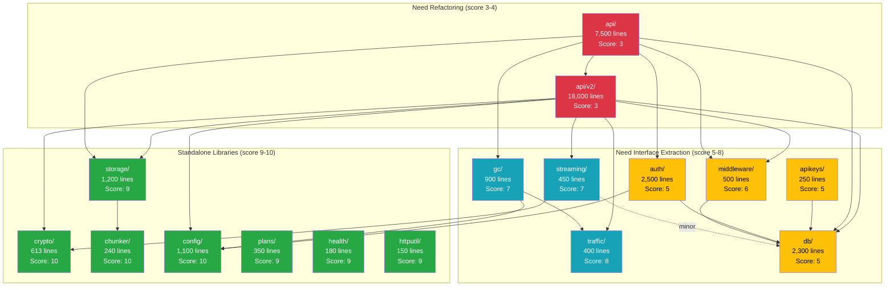

# Backend Reusability Analysis

**Date:** 2026-04-13
**Scope:** Go backend (`internal/`) — 83,000 LOC across 16 packages.
**Goal:** Identify what's cleanly reusable, what's tightly coupled, and what needs
refactoring so anyone running this open-source project gets a maintainable codebase.

**Related:** [Security Assessment v2](./SECURITY-ASSESSMENT-2026-04-v2.md) |
[Architecture Diagrams](./diagrams/)

---

## How to read this document

Each package gets a **reusability score** from 1–10:
- **9–10:** Can be extracted as a standalone library today, zero changes needed.
- **7–8:** Clean within the project, minor coupling. One interface away from standalone.
- **5–6:** Functional but tightly coupled to the database or config. Needs refactoring to reuse.
- **3–4:** God object or severe duplication. Works but painful to maintain or test.
- **1–2:** Not separable in current form.

---

## Package Scorecard

| Package | Lines | Score | Standalone? | Key issue |
|---------|-------|-------|-------------|-----------|
| `crypto/` | 613 | **10** | Yes | Pure functions. Zero internal imports. Publish as-is. |
| `chunker/` | 240 | **10** | Yes | Pure FastCDC algorithm. Zero internal imports. |
| `config/` | 1,100 | **10** | Yes | Foundation. Everything depends on it, it depends on nothing. |
| `plans/` | 350 | **9** | Yes | Pure business logic. Only imports config (read-only). |
| `health/` | 180 | **9** | Yes | Interface-based. No db, no config dependency. |
| `httputil/` | 150 | **9** | Yes | Formatting and relay utilities. Zero internal imports. |
| `storage/` | 1,200 | **9** | Nearly | Only imports chunker (also standalone). Clean S3 abstraction. |
| `traffic/` | 400 | **8** | Nearly | Uses `DBSession` interface — not coupled to concrete db.DB. |
| `streaming/` | 450 | **7** | Nearly | Uses `BlockReader` interface. Minor db call for ID resolution. |
| `gc/` | 900 | **7** | With work | Uses `GCStore` interface (good). But GCStore has 60+ methods (too wide). |
| `middleware/` | 500 | **6** | Split | RateLimiter is standalone (10/10). PermissionMiddleware is db-coupled (4/10). |
| `apikeys/` | 250 | **5** | No | Hard-wired to db.DB. No repository interface. |
| `auth/` | 2,500 | **5** | No | OIDC client is complex and valuable but hard-wired to db.DB for sessions. |
| `db/` | 2,300 | **5** | N/A | Foundation layer, but leaky — exposes raw Session() and too many read-model methods. |
| `api/v2/` | 18,000 | **3** | No | 15+ handler files with scattered queries, duplicated patterns, god objects. |
| `api/` | 7,500 | **3** | No | Server bootstrap hub. Imports 13 internal packages. Expected, but hard to test. |

---

## The good: Packages ready to extract

These five packages have **zero or minimal internal dependencies** and could be published
as standalone Go libraries today:

### `crypto/` — Encryption library (Score: 10/10)

```
Imports:     0 internal packages
Imported by: 2 packages (streaming, api/v2)
Lines:       613
```

Pure stateless functions. Implements Seafile-compatible PBKDF2 encryption and Argon2id
strong-mode encryption. AES-256-CBC per block, constant-time password verification.
No database, no config, no HTTP — just crypto.

### `chunker/` — Content-defined chunking (Score: 10/10)

```
Imports:     0 internal packages
Imported by: 1 package (storage)
Lines:       240
```

FastCDC algorithm with adaptive sizing (2–256MB). SHA-256 block IDs. Generic enough to
use in any content-addressable storage system.

### `storage/` — S3 storage abstraction (Score: 9/10)

```
Imports:     1 internal package (chunker)
Imported by: 3 packages (api, api/v2, streaming)
Lines:       1,200
```

Clean interface: `Store` with `Put`, `Get`, `Delete`, `Exists`. Concrete `S3Store` wraps
AWS SDK v2. `BlockStore` adds content-addressing and two-level sharding. `Manager` handles
multi-region backend selection. No database, no auth, no HTTP context.

### `plans/` — Quota and plan logic (Score: 9/10)

```
Imports:     1 internal package (config, read-only)
Imported by: 1 package (api/v2)
Lines:       350
```

Pure business logic: resolves storage quotas, upload limits, and feature flags from plan
definitions. No side effects.

### `health/` — Liveness/readiness checks (Score: 9/10)

```
Imports:     0 internal packages
Imported by: 1 package (api)
Lines:       180
```

Interface-based: accepts `DatabaseChecker` and `StorageChecker` interfaces. Framework-agnostic.

---

## The coupled: Packages that need interface extraction

These packages are valuable but can't be reused without their concrete database dependency.
Each needs a **repository interface** extracted.

### `auth/` — OIDC + session management (Score: 5/10)

```
Imports:     db, config, middleware, traffic
Lines:       2,500
```

**What's good:** Full OIDC implementation with PKCE, audience validation, role mapping,
state management with TTL/cap. Session store with SHA-256 hashed tokens and in-memory cache.

**What's coupled:** Both `OIDCClient` and `SessionManager` call `db.Session().Query()`
directly. Sessions are stored/retrieved via raw Cassandra queries scattered through the file.

**To make reusable:** Extract a `SessionRepository` interface:

```go
type SessionRepository interface {
    Store(ctx context.Context, tokenHash, userID, orgID string, expiresAt time.Time) error
    Lookup(ctx context.Context, tokenHash string) (*Session, error)
    Delete(ctx context.Context, tokenHash string) error
    DeleteAllForUser(ctx context.Context, orgID, userID string) error
}
```

Then `SessionManager` takes a `SessionRepository` instead of `*db.DB`.
Same pattern for OIDC user provisioning queries.

**Effort:** ~1 day.

### `middleware/` — Split personality (Score: 6/10)

`RateLimiter` is a perfect standalone component (per-IP token bucket, no external deps).
`PermissionMiddleware` calls `db.Session().Query()` for every permission check.

**To make reusable:** Extract `PermissionRepository`:

```go
type PermissionRepository interface {
    HasLibraryAccess(ctx, orgID, userID, repoID string, level PermLevel) (bool, error)
    GetUserRole(ctx, orgID, userID string) (string, error)
}
```

**Effort:** ~0.5 day.

### `apikeys/` — API key validation (Score: 5/10)

Same pattern — hard-wired to `db.DB`. Extract `APIKeyRepository`.

**Effort:** ~0.5 day.

---

## The problem areas: What needs refactoring

### `api/v2/files.go` — The 4,719-line god object

This is the single biggest maintainability problem in the backend.

**What it contains:** File upload, download, move, copy, delete, rename, lock, unlock,
history, revert, batch operations, encryption/decryption, directory listing, trash,
star/unstar, tags, comments, and more. All in one `FileHandler` struct with 50+ methods.

**Why it matters:** Any change to file handling risks breaking unrelated functionality.
New contributors can't understand the file without reading all 4,700 lines. Unit testing
is impossible because every method depends on db, storage, config, and permissions.

**Recommended split:**

| New file | Methods to move | Lines (est.) |
|----------|----------------|-------------|
| `file_upload.go` | Upload, chunked upload, block upload | ~600 |
| `file_download.go` | Download, streaming, range requests | ~500 |
| `file_ops.go` | Move, copy, rename, delete, batch | ~800 |
| `file_lock.go` | Lock, unlock, lock status | ~200 |
| `file_history.go` | History, revert, diff | ~500 |
| `file_encryption.go` | Encrypt, decrypt, key management | ~400 |
| `file_dir.go` | Directory listing, mkdir, traversal | ~600 |
| `file_misc.go` | Star, tags, comments, smart links | ~400 |

Each file gets the same `FileHandler` struct (or a subset of its dependencies).
No behavior change — just splitting the file.

**Effort:** ~1 day (mechanical split, no logic changes).

### Raw Cassandra queries scattered everywhere

**434 instances** of `db.Session().Query(...)` across **45 files** in `api/v2/`.

This means:
- Schema changes require grep-and-fix across 45 files
- No way to mock the database for unit tests
- Query logic mixed with HTTP handler logic
- Duplicate queries for the same data in different handlers

**Current state:**

```
internal/db/              → 6 read-model files (admin, shares)
internal/api/v2/*.go      → 434 raw queries (everything else)
internal/gc/store_cassandra.go → 2,114 lines of queries behind GCStore interface
```

The GC package got this right — `GCStore` is an interface, `store_cassandra.go` is the
concrete implementation. The rest of the codebase doesn't follow this pattern.

**Recommended repositories:**

| Repository | Covers | Est. queries to move |
|-----------|--------|---------------------|
| `LibraryRepository` | Library CRUD, permissions, settings | ~80 |
| `FileRepository` | fs_objects, blocks, commits, history | ~100 |
| `UserRepository` | Users, accounts, profiles, status | ~50 |
| `ShareRepository` | Share links, upload links, counters | ~60 |
| `GroupRepository` | Groups, memberships, departments | ~50 |
| `AdminRepository` | Admin read models (already partially exists in db/) | ~40 |
| `SessionRepository` | Sessions, tokens | ~30 |
| `TrafficRepository` | Quota, traffic records | ~20 |

**Effort:** ~3–5 days for the full migration. Can be done incrementally — start with
`LibraryRepository` and `FileRepository` which cover the most queries.

### Duplicated patterns (top 5)

| Pattern | Count | Fix |
|---------|-------|-----|
| `c.GetString("user_id")` / `c.GetString("org_id")` | 212 | Create `RequestContext` helper struct |
| `c.JSON(http.StatusOK, ...)` | 408 | Optional: response builder. Low priority — this is idiomatic Gin. |
| `resolveLibraryBlockStore(...)` | 12 | Already a helper. Consider caching per-request. |
| Permission check boilerplate | 37 | Consolidate into middleware decorators |
| `log.Printf` (unstructured) | 193 | Migrate to `slog` with request-scoped fields |

**`RequestContext` helper** (highest-value, lowest-effort fix):

```go
// internal/api/v2/context.go
type RequestContext struct {
    OrgID  string
    UserID string
    Email  string
    Role   string
}

func GetRequestContext(c *gin.Context) RequestContext {
    return RequestContext{
        OrgID:  c.GetString("org_id"),
        UserID: c.GetString("user_id"),
        Email:  c.GetString("email"),
        Role:   c.GetString("role"),
    }
}
```

Replaces 212 scattered `c.GetString` calls with `ctx := GetRequestContext(c)`.

**Effort:** ~2 hours.

### Global hooks pattern

`api/v2` uses global package-level functions to access GC and traffic services:

```go
// Current: global setters called from api/server.go
v2.SetGCHooks(blockEnqueuer, libraryEnqueuer, commitEnqueuer)
traffic.SetRecorder(recorder)
traffic.SetChecker(checker)

// Then in handlers:
gcBlockEnqueuer.Enqueue(...)  // package-level variable
traffic.GetRecorder().Record(...)  // package-level variable
```

This obscures the dependency graph. When reading a handler, you can't tell where the
GC or traffic services come from without tracing back to server initialization.

**Fix:** Pass services via handler struct constructors (already done for some handlers —
just not all). This is consistent with how `db`, `config`, and `storage` are already passed.

**Effort:** ~0.5 day.

---

## Dependency diagram



---

## Priority refactoring roadmap

### Week 1: Quick wins (2–3 days)

| Task | Effort | Impact |
|------|--------|--------|
| Create `RequestContext` helper | 2 hours | Eliminates 212 duplicate `c.GetString` calls |
| Split `files.go` into 8 files | 1 day | Reduces largest file from 4,719 to ~600 lines each |
| Replace global GC/traffic hooks with DI | 0.5 day | Explicit dependency graph |
| Migrate `log.Printf` to `slog` in api/v2/ | 0.5 day | Consistent structured logging |

### Week 2: Repository layer (3–5 days)

| Task | Effort | Impact |
|------|--------|--------|
| Extract `LibraryRepository` interface | 1 day | ~80 queries centralized, testable |
| Extract `FileRepository` interface | 1 day | ~100 queries centralized |
| Extract `SessionRepository` interface | 0.5 day | Decouples auth/ from db/ |
| Extract `PermissionRepository` interface | 0.5 day | Decouples middleware/ from db/ |
| Extract `ShareRepository` interface | 0.5 day | ~60 queries centralized |

### Week 3+: Deeper refactoring

| Task | Effort | Impact |
|------|--------|--------|
| Split `GCStore` (60+ methods) into 3–4 focused interfaces | 1 day | Cleaner gc/ abstraction |
| Add unit tests for handlers using mock repositories | 2–3 days | Test coverage without Cassandra |
| Extract `UserRepository` and `GroupRepository` | 1 day | Remaining query centralization |
| Consider splitting api/v2/ into domain subpackages | 2 days | api/v2/files/, api/v2/shares/, etc. |

---

## What NOT to refactor

Some coupling is **expected and fine**:

- **`api/server.go` importing 13 packages** — it's the composition root. That's its job.
- **`config/` being imported by everything** — it's the foundation layer.
- **Handler files having 200+ lines** — that's normal for HTTP handlers with validation.
- **Gin-specific code in api/v2/** — the HTTP framework is a deliberate choice, not accidental coupling.
- **`c.JSON(http.StatusOK, ...)` being repeated 408 times** — this is idiomatic Gin. A response builder adds abstraction without value.
