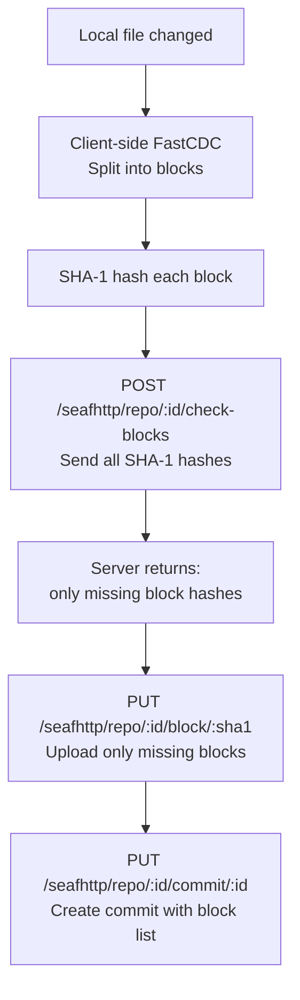
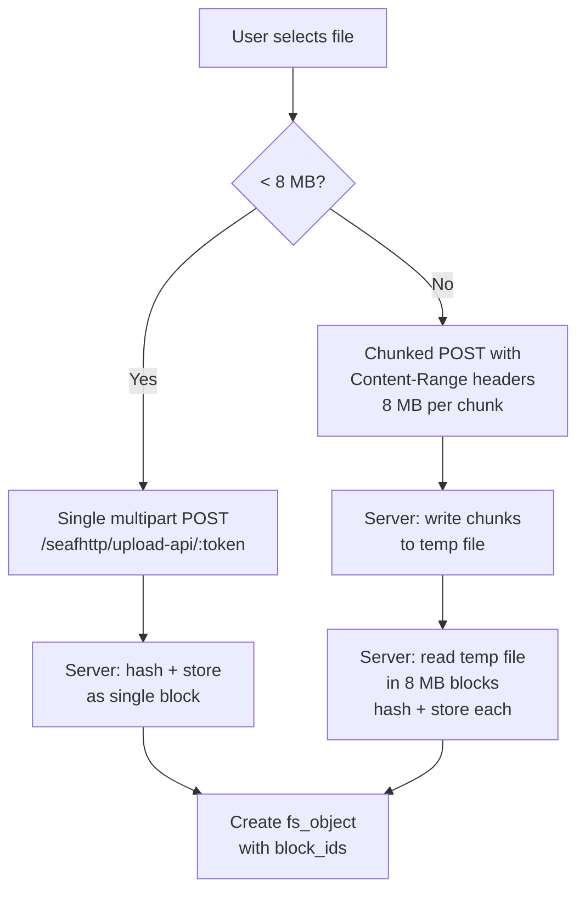
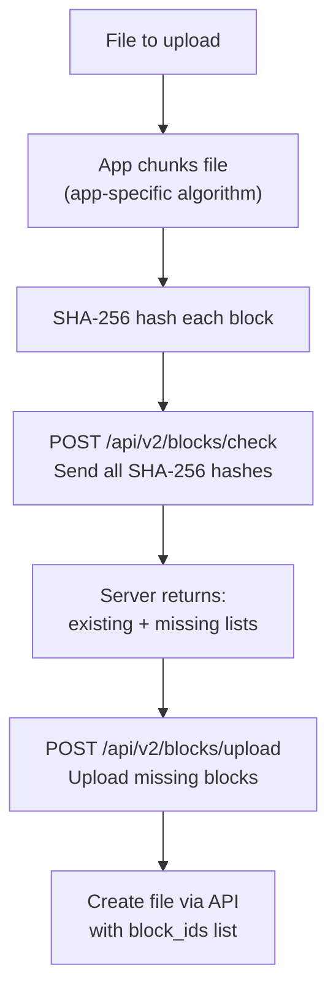

# Chunking & Block Storage Analysis

**Date:** 2026-04-14
**Scope:** How files are split into blocks, stored, deduplicated, and served
to different client types (desktop sync, web UI, mobile app).

---

## How chunking works

SesameFS uses **FastCDC** (Fast Content-Defined Chunking) to split files into
variable-size blocks. Unlike fixed-size chunking, FastCDC finds boundaries based
on file content, so inserting or deleting bytes in the middle of a file only
affects the blocks around the change — not every block after it.

### Block size parameters

| Parameter | Default | Range | Effect |
|-----------|---------|-------|--------|
| `absolute_min` | 2 MB | Fixed | Smallest possible block |
| `absolute_max` | 256 MB | Fixed | Largest possible block |
| `initial_size` (avg) | 16 MB | Adaptive | Target block size |
| `target_seconds` | 8s | Config | Chunk size = speed × 8s |

The adaptive system adjusts block sizes based on network speed:
- Fast connection (100 Mbps): larger blocks (~100 MB), fewer round-trips
- Slow connection (1 Mbps): smaller blocks (~2 MB), faster retries

### How FastCDC finds boundaries

```
File bytes:  [aaaa|bbbb|cccc|dddd|eeee|ffff|gggg|hhhh|iiii|jjjj|...]

Rolling hash window (64 bytes) slides through the file:
  - Between min and avg: use maskS (easy to match → finds boundaries sooner)
  - Between avg and max: use maskL (hard to match → extends block if no boundary)
  - At max: force cut regardless

Result: [Block 1: 12 MB] [Block 2: 18 MB] [Block 3: 14 MB] [Block 4: 16 MB]
```

The same file content always produces the same block boundaries.
This is what enables deduplication — identical content = identical blocks.

---

## Block identity and storage

### Two hash systems (SHA-1 and SHA-256)

SesameFS maintains two block ID systems for Seafile client compatibility:

| Hash | Length | Used by | Purpose |
|------|--------|---------|---------|
| SHA-1 | 40 hex chars | Seafile desktop/mobile clients, fs_objects | Protocol compatibility |
| SHA-256 | 64 hex chars | S3 storage, blocks table, v2 API | Internal storage key |

**Mapping tables** in Cassandra bridge them:
- `block_id_mappings`: SHA-1 → SHA-256 (forward lookup)
- `block_id_mappings_by_internal`: SHA-256 → SHA-1 (reverse lookup)

Both are written on every upload. Lookups happen on every download.

### S3 storage layout

```
s3://sesamefs-blocks/
  blocks/
    e3/                          ← first 2 chars of SHA-256
      b0/                        ← next 2 chars
        e3b0c44298fc1c14...      ← full 64-char SHA-256 hash
    a1/
      2f/
        a12f5e6789abcdef...
```

Two-level sharding prevents S3 listing performance degradation with millions of objects.

### Block metadata in Cassandra

```sql
CREATE TABLE blocks (
    org_id        UUID,        -- Partition key: blocks are per-org
    block_id      TEXT,        -- SHA-256 hash
    size_bytes    INT,
    storage_class TEXT,        -- hot, cold, archive
    ref_count     INT,         -- How many fs_objects reference this block
    created_at    TIMESTAMP,
    last_accessed TIMESTAMP,
    PRIMARY KEY ((org_id), block_id)
);
```

**Deduplication is within an org.** If Org A and Org B both upload the same file,
the block is stored twice in S3 (different org partitions). Within the same org,
the block is stored once regardless of how many libraries/files reference it.

---

## How different clients upload

### Desktop client (Seafile sync protocol)



**Key features:**
- Client does its own chunking (no server-side chunking)
- `check-blocks` saves bandwidth: only upload blocks that don't exist
- Parallel block uploads (client controls concurrency)
- SHA-1 block IDs (server creates SHA-256 mapping)
- For encrypted libraries: client encrypts blocks locally before upload

**Dedup benefit:** If 95% of blocks already exist (common in sync scenarios where
files change incrementally), only 5% of data is uploaded.

### Web UI (multipart form upload)



**Key features:**
- Server-side chunking at 8 MB boundaries (fixed, not FastCDC)
- No `check-blocks` step — all data uploaded over the network
- Dedup only at S3 level (block exists check before write)
- For encrypted libraries: server encrypts after receiving plaintext

**No client-side dedup:** The web UI uploads the full file every time. If the
same file was already uploaded, the blocks already exist in S3 and the write
is a no-op, but the network transfer still happens.

### Mobile app (v2 block API)



**Key features:**
- Uses SHA-256 directly (no SHA-1 legacy)
- `check-blocks` supports up to 10,000 hashes per request
- Parallel uploads (app controls concurrency)
- Optional `X-Block-Hash` header for server-side verification

---

## How different clients download

### Desktop client (sync)

```
1. GET /seafhttp/repo/:id/fs  → get filesystem tree
2. Client compares local tree with server tree
3. For changed files: GET block_ids from fs_object
4. Client checks which blocks are already cached locally
5. GET /seafhttp/repo/:id/block/:sha1 → download only missing blocks
6. Client reassembles file from blocks
```

### Web UI

```
1. GET /api2/repos/:id/file/?p=/path → get download URL
2. GET /seafhttp/files/:token/filename → server streams all blocks
   - Server prefetches next block while writing current
   - 4 MB copy buffer (pooled)
   - For video/audio: supports Range requests (HTTP 206)
```

### Share link (public)

```
1. GET /d/:token/files/?p=/filename&dl=1 → server streams directly
   - No auth needed (share token grants access)
   - Same block streaming as web UI
   - Traffic counted against share creator
```

---

## Deduplication scenarios

### Scenario 1: Same file uploaded twice by same user

```
Upload 1: report.pdf (3 blocks: B1, B2, B3)
  → blocks table: B1 ref=1, B2 ref=1, B3 ref=1
  → S3: B1, B2, B3 stored

Upload 2: report.pdf to different folder (same content)
  → blocks table: B1 ref=2, B2 ref=2, B3 ref=2
  → S3: no new objects (dedup)
```

**Storage cost:** 1x, not 2x.

### Scenario 2: Two users in same org upload same file

```
User A uploads report.pdf → B1 ref=1, B2 ref=1, B3 ref=1
User B uploads report.pdf → B1 ref=2, B2 ref=2, B3 ref=2
```

Same as scenario 1. Blocks are org-scoped, so dedup works across users within an org.

### Scenario 3: File modified — incremental change

```
Before: report.pdf = [B1, B2, B3, B4, B5]  (50 MB, 5 blocks of ~10 MB)

User edits page 2 (in B2):
After:  report.pdf = [B1, B2', B3, B4, B5]  (only B2 changed)

FastCDC result:
  - B1: same hash → ref_count stays (no re-upload on sync)
  - B2': new hash → new block uploaded, ref_count=1
  - B3, B4, B5: same hash → no change
  
Old B2: ref_count decremented → goes to 0 → GC enqueues → eventually deleted
```

**Upload cost:** Only ~10 MB (the changed block), not 50 MB.
**This is the key advantage of content-defined chunking over fixed-size.**

### Scenario 4: Different orgs, same file

```
Org A uploads report.pdf → blocks stored under org_id=A
Org B uploads report.pdf → blocks stored under org_id=B
```

**No cross-org dedup.** Both orgs pay full storage. This is by design — org
isolation is a stronger requirement than cross-org storage savings.

### Scenario 5: Very small file (1 KB)

```
File "readme.txt" (1 KB) < min chunk size (2 MB)
  → Stored as single block
  → SHA-1 of plaintext = block ID
  → SHA-256 of stored content = S3 key
  → fs_object has one block_id
```

No chunking occurs. The entire file is one block.

### Scenario 6: Very large file (10 GB)

```
File "backup.tar" (10 GB) with avg chunk size 16 MB
  → ~625 blocks (10 GB / 16 MB)
  → Desktop: check-blocks first, upload only missing
  → Web UI: chunked upload via Content-Range, finalize as 8 MB blocks (~1250 blocks)
```

Note: Web UI uses fixed 8 MB blocks (different from FastCDC adaptive sizing).
Desktop client uses FastCDC. This means the same 10 GB file produces different
block sets depending on how it was uploaded.

**This is a known limitation:** A file uploaded via web and the same file synced
via desktop will NOT share blocks (different chunking algorithms). Dedup only works
within the same upload method for large files.

---

## Check-blocks optimization

The `check-blocks` endpoint is the key to efficient sync. Instead of uploading
every block, the client asks "which of these blocks do you already have?"

### Seafile sync protocol

```http
POST /seafhttp/repo/:repo_id/check-blocks
Content-Type: application/json

["sha1_hash1", "sha1_hash2", "sha1_hash3", ...]

Response: ["sha1_hash2"]  ← only the missing ones
```

### v2 API (mobile)

```http
POST /api/v2/blocks/check
Content-Type: application/json

{"hashes": ["sha256_1", "sha256_2", "sha256_3", ...]}

Response: {
  "existing": ["sha256_1", "sha256_3"],
  "missing": ["sha256_2"]
}
```

**Implementation:** `CheckBlocksParallel` runs concurrent S3 HEAD requests
(10-20 parallel) to check existence. Returns in O(blocks/concurrency) time.

**Limit:** 10,000 hashes per request (v2 API).

---

## Block integrity

| Check | When | How |
|-------|------|-----|
| Upload: SHA-256 computed server-side | Every upload | `sha256.Sum256(content)` |
| Upload: client hash verification | Optional | `X-Block-Hash` header compared with computed |
| Download: hash NOT re-verified | Every download | **Gap** — corrupted S3 data served as-is |
| Dedup: existence check before write | Every upload | S3 HEAD or Cassandra lookup |

**Known gap:** No integrity check on download. If S3 returns corrupted data,
the server streams it to the client without verification. The client would need
to verify the hash itself.

---

## Performance characteristics

| Operation | Throughput | Bottleneck |
|-----------|-----------|------------|
| FastCDC chunking | >100 MB/s | CPU (rolling hash) |
| Block upload (S3 Put) | ~50-100ms/block | S3 API latency |
| Block download (S3 Get) | ~20-50ms/block | S3 API latency |
| check-blocks (parallel) | ~100ms for 100 blocks | S3 HEAD latency |
| SHA-256 hashing | >500 MB/s | CPU |
| Block ID resolution | ~5ms/batch | Cassandra query |

---

## Summary: client comparison

| Feature | Desktop Sync | Web UI | Mobile App |
|---------|-------------|--------|------------|
| Chunking location | Client-side (FastCDC) | Server-side (8 MB fixed) | App-specific |
| Block hash | SHA-1 (legacy) | SHA-1 → SHA-256 mapped | SHA-256 (native) |
| Check-blocks before upload | Yes | No | Yes |
| Parallel upload | Yes (client-controlled) | No (sequential chunks) | Yes |
| Resume support | Block-level (skip existing) | Content-Range header | Block-level |
| Encryption | Client encrypts before upload | Server encrypts after receive | App-specific |
| Dedup efficiency | High (content-defined chunks) | Low (fixed 8 MB, all uploaded) | Medium |
| Large file handling | Efficient (only changed blocks) | Full re-upload required | Depends on app |
| Cross-method dedup | No (different chunk sizes) | No | No |
