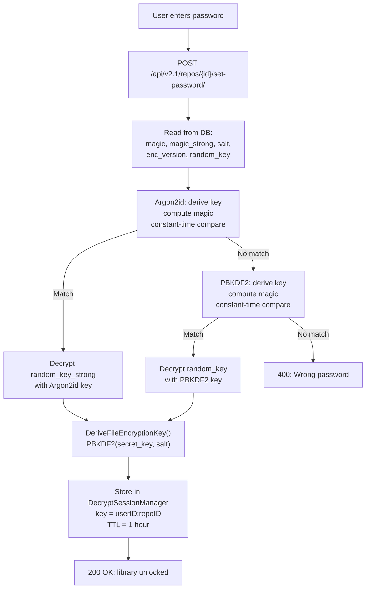

# Encryption & Encrypted Libraries Analysis

**Date:** 2026-04-14
**Scope:** Application-level encryption for libraries — key derivation, block
encryption/decryption, decrypt sessions, Seafile client compatibility, and
compromise resilience.

**Note:** This covers application-level encryption (user password → file key → AES per block).
S3 server-side encryption is a separate concern covered in the security assessment.

---

## Encryption modes

SesameFS supports two encryption modes, both active simultaneously on dual-mode
libraries (enc_version=12):

| Mode | KDF | Iterations | Memory | Who uses it |
|------|-----|-----------|--------|-------------|
| **Seafile compat** | PBKDF2-HMAC-SHA256 | 1,000 | Negligible | Desktop/mobile sync clients |
| **SesameFS strong** | Argon2id | 3 | 64 MB | Web UI, REST API |

Both modes protect the same data with the same AES-256 key. The difference is
only in how the password unlocks that key.

---

## Key hierarchy

```
User password
  ↓
  ├─ [PBKDF2 path] ──→ derived_key + IV ──→ decrypt(random_key) ──→ secret_key
  │                                                                       ↓
  ├─ [Argon2id path] ─→ derived_key + IV ──→ decrypt(random_key_strong) ─→ secret_key
  │                                                                       ↓
  │                                                         DeriveFileEncryptionKey()
  │                                                         (second PBKDF2 derivation)
  │                                                               ↓
  │                                                     file_key (32 bytes)
  │                                                     file_iv  (16 bytes)
  │                                                               ↓
  └─ Magic verification (constant-time) ←─────── ComputeMagic() for password check
```

**Three layers of key derivation:**

1. **Password → derived key:** PBKDF2 or Argon2id, using password + salt
2. **Derived key → secret key:** AES-256-CBC decrypt of the stored `random_key`
3. **Secret key → file key + IV:** A second PBKDF2 pass (Seafile protocol requirement)

The final file_key and file_iv are what encrypt/decrypt every block in the library.

### Critical subtlety: different inputs for different operations

| Operation | Input to KDF | Salt | Why |
|-----------|-------------|------|-----|
| Magic (password check) | `repo_id + password` | Static (v2) or random (v4+) | Seafile protocol |
| Random_key decryption | `password` only | Same salt | Seafile protocol (different function) |
| File key derivation | `secret_key` (raw bytes) | Same salt | Second derivation step |

This inconsistency (repo_id+password for magic, password-only for random_key) is
required by the Seafile protocol and is the most common source of implementation bugs.

---

## Decrypt session lifecycle

When a user "unlocks" an encrypted library, the server derives the file key and
holds it in memory for 1 hour.

### Unlock flow



### Session storage

```go
// In memory, per user per library
DecryptSessions[userID:repoID] = {
    FileKey:    [32]byte,   // AES-256 key
    FileIV:     [16]byte,   // CBC IV (derived, not random)
    UnlockedAt: time.Now(), // TTL check on every access
}
```

- **Isolation:** Each user has their own session. User A unlocking repo X
  does not affect User B's access to repo X.
- **Expiry:** Checked on every `GetFileKey()` call. After 1 hour, returns nil.
- **No persistence:** Sessions are lost on server restart. Users must re-enter password.
- **No distributed sharing:** In multi-node deployment, each node has its own sessions.
  User must unlock on each node they're routed to.

---

## Block encryption: two formats

### Seafile format (EncryptBlockSeafile)

Used by desktop/mobile sync clients. The IV is **derived from the password**, not
random per block.

```
Plaintext → PKCS7 pad → AES-256-CBC(file_key, derived_IV) → Ciphertext
```

Stored as: `[ciphertext only]` — no IV prepended (receiver derives same IV from password).

### SesameFS format (EncryptBlock)

Used by OnlyOffice document saves and internal operations. The IV is **random per block**.

```
Plaintext → PKCS7 pad → AES-256-CBC(file_key, random_IV) → [random_IV | Ciphertext]
```

Stored as: `[16-byte random IV | ciphertext]` — IV prepended for self-contained decryption.

### Decryption (DecryptBlock) — handles both formats

```go
func DecryptBlock(encrypted, fileKey []byte) ([]byte, error) {
    // Check: is this actually encrypted?
    if len(encrypted) < 32 || len(encrypted-16) % 16 != 0 {
        return encrypted, nil  // Return as-is (legacy unencrypted block)
    }

    // Extract IV from first 16 bytes, decrypt rest
    iv := encrypted[:16]
    ciphertext := encrypted[16:]
    // AES-256-CBC decrypt...

    // If padding is invalid, assume unencrypted (legacy fallback)
}
```

This handles: SesameFS blocks (random IV prepended), Seafile blocks (when using
`DecryptBlockSeafile` with derived IV), and legacy unencrypted blocks (returned as-is).

---

## Scenarios

### Scenario 1: User uploads a file to an encrypted library

| Step | What happens | Where |
|------|-------------|-------|
| 1 | User already unlocked library (decrypt session active) | `set-password` endpoint |
| 2 | Upload request checks decrypt session exists | `seafhttp.go HandleUpload` |
| 3 | Read file content into memory | `seafhttp.go` |
| 4 | SHA-1(plaintext) → block ID for fs_object | `seafhttp.go` |
| 5 | `EncryptBlockSeafile(plaintext, fileKey, fileIV)` | `crypto.go` |
| 6 | SHA-256(ciphertext) → S3 storage key | `seafhttp.go` |
| 7 | Store encrypted block in S3 | `blocks.go` |
| 8 | Create SHA-1 ↔ SHA-256 mapping | Both mapping tables |
| 9 | Create fs_object with SHA-1 block_ids | `fs_helpers.go` |

**Key point:** The fs_object stores SHA-1 hashes of the **plaintext**. S3 stores
blocks keyed by SHA-256 of the **ciphertext**. The mapping table bridges them.

### Scenario 2: User downloads a file from an encrypted library

| Step | What happens | Where |
|------|-------------|-------|
| 1 | Check decrypt session active | `seafhttp.go HandleDownload` |
| 2 | Get fileKey from session | `GetDecryptSessions().GetFileKey(userID, repoID)` |
| 3 | Navigate commit tree to fs_object | `lookupFileBlocks()` |
| 4 | Get SHA-1 block_ids from fs_object | Cassandra |
| 5 | Resolve SHA-1 → SHA-256 | `BatchResolveBlockIDs()` |
| 6 | For each block: S3 Get (encrypted bytes) | `blockStore.GetBlock()` |
| 7 | `DecryptBlock(encrypted, fileKey)` → plaintext | `crypto.go` |
| 8 | Write plaintext to HTTP response | `streaming.StreamBlocks()` |

**Memory:** One block at a time in RAM. Prefetching loads the next block while
the current one is being written.

### Scenario 3: Decrypt session expires mid-download

| Step | What happens | Risk |
|------|-------------|------|
| 1 | Download starts, fileKey captured by streaming goroutine | OK |
| 2 | Streaming prefetches blocks using the captured fileKey reference | OK |
| 3 | 1 hour passes, session expires in DecryptSessionManager | Session gone |
| 4 | New block prefetch still uses captured fileKey (Go closure) | **Still works** |
| 5 | If client starts a NEW download, GetFileKey() returns nil | **403 error** |

**Verdict:** An in-progress download will complete successfully even if the session
expires mid-stream, because the fileKey is captured by value in the streaming goroutine.
Only new download requests will fail.

### Scenario 4: Wrong password

| Step | What happens |
|------|-------------|
| 1 | User enters wrong password |
| 2 | Server derives key, computes magic |
| 3 | `subtle.ConstantTimeCompare(computed, stored)` returns 0 |
| 4 | Falls back to PBKDF2 path, also fails |
| 5 | Returns 400: "Wrong password" |
| 6 | No decrypt session created |
| 7 | All subsequent file operations return 403: "library is encrypted" |

**No lockout mechanism.** Client can retry indefinitely. Rate limiting is at the
API gateway level only (per-IP token bucket).

### Scenario 5: Password change

| Step | What happens |
|------|-------------|
| 1 | Verify old password (same flow as unlock) |
| 2 | Decrypt file key using old password |
| 3 | Generate new random salt (32 bytes) |
| 4 | Derive new keys from new password (both PBKDF2 + Argon2id) |
| 5 | Re-encrypt the SAME file key with new keys |
| 6 | Compute new magic tokens (both weak + strong) |
| 7 | Store updated encryption params in DB |

**Key point:** The file key itself never changes — only the encryption wrapping it
changes. All existing encrypted blocks remain valid. No re-encryption of data needed.

### Scenario 6: S3 compromised, attacker gets encrypted blocks

| What attacker has | Can they read the data? |
|-------------------|------------------------|
| Encrypted block content | No — AES-256-CBC, need file key |
| S3 block keys (SHA-256 hashes) | No — these are content hashes, not encryption keys |
| Block sizes | Yes — reveals file size patterns |

To decrypt, attacker needs: `file_key` which requires `password` + `random_key` from DB.

### Scenario 7: Cassandra compromised, attacker gets encryption params

| What attacker has | Risk |
|-------------------|------|
| `magic` (PBKDF2 password verifier) | Offline brute-force at 1000 PBKDF2 iterations — **feasible for weak passwords** |
| `magic_strong` (Argon2id verifier) | Offline brute-force at 64MB/3iter — **hard even for moderate passwords** |
| `random_key` (encrypted file key, PBKDF2) | Can decrypt if password is cracked via magic |
| `random_key_strong` (encrypted file key, Argon2id) | Same — decrypt if Argon2id magic cracked |
| `salt` (32 bytes random) | Not a secret, but needed for key derivation |

**Bottom line:** The PBKDF2 path (1000 iterations) is the weak link. If attacker gets
DB access AND the user has a weak password (dictionary word), the library can be decrypted.
The Argon2id path provides strong protection.

### Scenario 8: Application server compromised

| What attacker has | Risk |
|-------------------|------|
| Decrypt sessions in memory (fileKey + fileIV) | **All currently-unlocked libraries decryptable** |
| S3 credentials (env vars) | Can download encrypted blocks |
| Cassandra credentials | Can read encryption params |

**All unlocked libraries are fully compromised.** Locked libraries require password.

---

## What's NOT encrypted

| Data | Encrypted? | Where stored |
|------|-----------|-------------|
| File content (blocks) | Yes (if library encrypted) | S3 |
| File names | **No** | Cassandra (fs_objects, commit tree) |
| Directory structure | **No** | Cassandra |
| File sizes | **No** | Cassandra |
| File modification times | **No** | Cassandra |
| Share links | **No** | Cassandra |
| User data (email, name) | **No** | Cassandra |
| Block ID mappings | **No** | Cassandra |
| Commit messages | **No** | Cassandra |

This is a design choice inherited from Seafile: only block content is encrypted.
Metadata (filenames, sizes, structure) is stored in plaintext for search and navigation.

---

## Security properties summary

| Property | Status | Notes |
|----------|--------|-------|
| Password verification timing-safe | Yes | `subtle.ConstantTimeCompare` |
| File key never stored in plaintext | Yes | Always encrypted with password-derived key |
| Keys cleared from memory on session expiry | **Partial** | Session removed from map, but Go GC determines when memory is actually freed |
| Key material in logs | No | Checked — no keys, passwords, or magic logged |
| Per-library random salt | Yes | 32 bytes via `crypto/rand` |
| Per-block random IV (SesameFS mode) | Yes | Fresh `crypto/rand` IV per block |
| Per-block derived IV (Seafile mode) | Static per library | Derived from password — same IV for all blocks in library |
| Password change re-encrypts blocks | No | Only re-wraps the file key (correct design) |
| Brute-force protection (Argon2id) | Strong | 64MB memory-hard, 3 iterations |
| Brute-force protection (PBKDF2) | **Weak** | 1000 iterations — feasible offline |
| No password lockout | **Gap** | Unlimited retries at app level |
