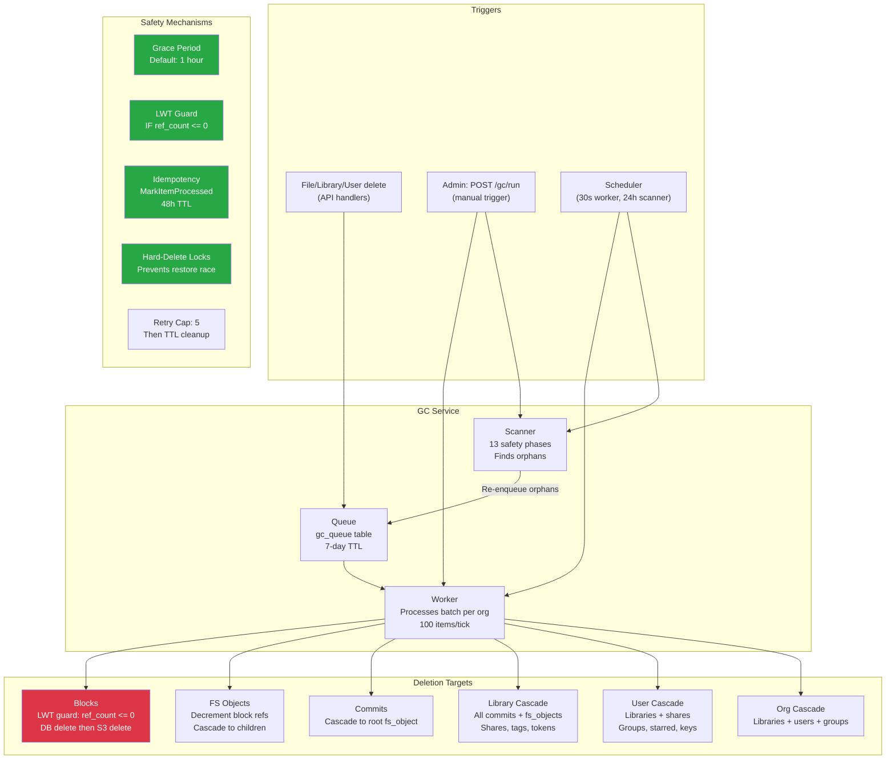

# GC Service Analysis

**Date:** 2026-04-14
**Scope:** `internal/gc/` — 9,940 lines across 9 files + 3,380 lines of tests.
**Goal:** Evaluate correctness, test coverage, identify potential data-loss bugs, and
plan integration tests for long-running monitoring.

---

## Architecture Overview



---

## Deletion Flow: The Critical Path

### Block deletion (the most dangerous operation)

```
processBlock(item):
  1. LWT: UPDATE blocks SET ref_count = -999
         WHERE org_id = ? AND block_id = ?
         IF ref_count <= 0
     └─ If NOT applied (ref_count > 0): SKIP, delete GC candidate, done.
     └─ If applied:
  2. DELETE FROM blocks (unconditional)
  3. S3 DeleteBlock(blockID)
     └─ If S3 fails: LOG WARNING, return error → retry
     └─ If S3 succeeds:
  4. Delete block mappings (SHA-1 → SHA-256)
  5. Delete GC candidate record
  6. Increment stats
```

**The LWT guard at step 1 is the core safety mechanism.** Even if a block is enqueued
for deletion while simultaneously being referenced by a new upload, the LWT check
(`IF ref_count <= 0`) prevents deletion of live data. This was verified in
`worker_regression_test.go:TestWorker_StorageLeak_LWTSkipsLiveBlock`.

### FS Object deletion (cascade trigger)

```
processFSObject(item):
  1. Get fs_object from DB
     └─ Not found: assume already deleted, done.
  2. If directory: enqueue all children (skip grace period)
  3. If file with blocks:
     a. Create deterministic taskID (fs_id + timestamp)
     b. MarkItemProcessed(taskID) — IF NOT EXISTS
        └─ Already processed: skip decrement (idempotent)
        └─ First time:
     c. For each block: DecrementRefCount, check if now 0
     d. Enqueue zero-ref blocks for deletion
  4. Delete fs_object from DB
```

**The idempotency mechanism at step 3b prevents double-decrement on retry.**
If the worker crashes after decrementing but before completing the queue item,
the retry will see the task is already processed and skip the decrement.

---

## What's working well

These are deliberate safety mechanisms that are correctly implemented and tested:

1. **LWT-based block deletion** — Cassandra lightweight transactions ensure blocks with
   `ref_count > 0` are never deleted from S3, even under concurrent upload.
2. **Grace period** (default 1h) — Recently enqueued items can't be processed. Gives
   time for concurrent operations to increment ref counts.
3. **Idempotent decrement** — `MarkItemProcessed` with deterministic task IDs prevents
   double-decrement on worker retry. 48h TTL auto-cleans the tracking table.
4. **Cascade ordering** — Commit → root fs_object → children → blocks. If any step fails,
   the parent is not deleted, and the scanner will re-discover it.
5. **Hard-delete locks** — User and library cascade deletes acquire a lock that blocks
   concurrent `restore` operations.
6. **Scanner as safety net** — 13 phases catch orphaned items that inline enqueue missed.
   Runs on startup + every 24h.
7. **Retry with cap** — Failed items get retried up to 5 times with HOL-blocking prevention
   (requeued to back of queue). After 5 retries, TTL cleanup removes the item.
8. **Audit logging** — Cascade deletes write to `gc_audit_log` for compliance traceability.

---

## Potential bugs and risks

### HIGH: S3 orphan on delete failure (worker.go:164-169)

**Scenario:** LWT succeeds → DB record deleted → S3 delete fails (network error, timeout).

**Result:** Block is gone from the database but remains in S3. The scanner cannot find
it because there's no DB record with `ref_count <= 0` to scan. The orphan persists
forever, costing storage.

**Current handling:** Logs a WARNING, returns error (triggers retry). But the retry
will also fail because the DB record is already gone — the LWT step will return
"not applied" (row doesn't exist), and the block skips S3 deletion.

**Impact:** Storage leak. Not data loss (the data is still in S3, just unreachable).
Over time this could accumulate meaningful cost.

**Recommendation:**
1. Add a pre-delete S3 check: verify block exists in S3 before deleting from DB
2. Or: reverse the order — delete from S3 first, then DB (if S3 fails, DB record
   remains and scanner re-discovers it). This is safer but loses the LWT atomicity.
3. Or: add a separate "S3 orphan recovery" scan that lists S3 keys and cross-references
   with the blocks table. This is the most robust but most expensive.
4. Simplest: add retry with exponential backoff on S3 delete failure BEFORE returning
   the error (3 attempts, 1s/2s/4s).

### MEDIUM: Decrement-then-read race (worker.go:672-685)

```go
w.store.DecrementBlockRefCount(orgID, blockID)  // step 1
refCount, _ := w.store.GetBlockRefCount(orgID, blockID)  // step 2
if refCount <= 0 { /* enqueue for deletion */ }
```

Between step 1 and step 2, another operation could increment the ref count (new file
upload referencing the same block). The decrement would bring it to 0, but by the time
the read executes, the count could be back at 1.

**In practice this is safe** because:
- The grace period (1h) means the block won't be deleted for another hour
- During that hour, the upload will complete and the ref count will be stable
- At deletion time, the LWT checks again (`IF ref_count <= 0`)
- If the ref count is now 1, the LWT won't apply

So this is a false-positive enqueue (block enqueued for deletion but LWT skips it),
not a data loss scenario. The cost is a wasted queue entry that gets cleaned up.

### MEDIUM: Counter drift (store_cassandra.go queue stats)

The `gc_queue_stats` counter is updated in a separate Cassandra batch from the
queue insert. If the counter batch fails, stats become inaccurate. This affects
the admin status endpoint's `queue_size` number but not deletion correctness.

**Recommendation:** Log counter failures prominently. Add periodic reconciliation
(count actual rows vs counter value) in the scanner.

### LOW: Cascade partial failure

If a user cascade deletes 100 shares and fails on share #50, the function returns
an error. The queue item gets retried. On retry, shares 1-50 are already gone,
so the retry completes shares 51-100. This is correct behavior — the cascade is
idempotent for most operations. But if the failure is persistent (e.g., a specific
share has a corrupt record), the cascade will hit the 5-retry cap and stall.

**Recommendation:** Skip individual failures within a cascade and continue processing
the remaining items. Log the skipped items for manual review.

---

## Test Coverage Assessment

### What's covered (107 unit tests + 4 integration)

| Area | Tests | Verdict |
|------|-------|---------|
| Service lifecycle (start/stop/concurrent) | 20 | Solid |
| Queue operations (enqueue/dequeue/grace/retry) | 14 | Solid |
| Block deletion (LWT guard, dry run, S3) | 6 | Solid |
| Commit cascade → fs_object | 3 | Adequate |
| FS Object → block decrement + directory recursion | 5 | Adequate |
| User cascade (full, dry run, skip restored) | 6 | Solid |
| Library cascade (full, dry run, skip restored) | 5 | Solid |
| Org cascade (full, dry run) | 4 | Adequate |
| Grace period regressions | 2 | Solid |
| HOL blocking + retry cap | 3 | Solid |
| LWT race condition regression | 1 | Critical test, exists |
| Scanner (13 phases) | 33 | Comprehensive |
| Integration (batch-delete → GC flow) | 4 | Good for happy path |

### What's NOT covered (critical gaps)

| Gap | Risk | Why it matters |
|-----|------|----------------|
| **S3 failure during block delete** | High | The #1 data integrity risk — no test verifies behavior when S3 is unreachable |
| **Concurrent worker + scanner on same org** | Medium | Could cause duplicate processing or missed items |
| **Queue recovery after service restart** | Medium | Verifies items survive crash |
| **ShareLink/Share/RestoreJob worker processing** | Medium | Only enqueue is tested, not actual deletion handlers |
| **Very deep directory cascade (100+ levels)** | Medium | Stack depth / timeout risk |
| **Real Cassandra LWT behavior** | Medium | All tests use MockStore — LWT semantics may differ |
| **Cascade partial failure + retry** | Medium | What happens when share #50 of 100 fails |
| **Scanner + concurrent writes** | Low | Scanner enqueues while API writes new data |
| **Grace period boundary (±1ms)** | Low | Timing-sensitive edge case |

---

## Integration Test Plan

The goal is to create tests that can run in a loop for long-duration monitoring,
validating GC correctness under realistic conditions.

### Test 1: Block lifecycle — upload, delete, GC, verify gone

**What it tests:** The complete happy path from file upload through GC deletion.

```
1. Upload a file with unique content (creates blocks with ref_count=1)
2. Record the block IDs (from fs_objects table)
3. Delete the file (ref_count drops to 0, blocks enqueued for GC)
4. Wait for grace period (or trigger GC manually with grace=0)
5. Trigger GC worker
6. Verify: blocks are gone from DB (SELECT returns empty)
7. Verify: blocks are gone from S3 (GET returns 404)
8. Verify: GC candidate records are cleaned up
9. Verify: gc_processed_items has the task IDs (idempotency records)
```

**Loop mode:** Run continuously with random file sizes. Track success/failure rate.
Alert on any iteration where blocks remain after GC.

### Test 2: Deduplication safety — shared blocks survive partial delete

**What it tests:** When two files share the same blocks, deleting one file does NOT
delete the shared blocks.

```
1. Upload file A (creates blocks, ref_count=1 each)
2. Upload file B with identical content (same blocks, ref_count=2)
3. Delete file A (ref_count drops to 1)
4. Trigger GC worker
5. Verify: blocks still exist in DB (ref_count=1)
6. Verify: blocks still exist in S3
7. Download file B — content must match original
8. Delete file B (ref_count drops to 0)
9. Trigger GC worker
10. Verify: blocks now deleted from DB and S3
```

**Loop mode:** Run with varying file sizes and dedup patterns.

### Test 3: Concurrent upload during GC — no data loss

**What it tests:** The LWT guard prevents deletion of blocks being actively uploaded.

```
1. Upload file A (blocks get ref_count=1)
2. Delete file A (ref_count=0, blocks enqueued for GC)
3. Immediately upload file B with same content (ref_count back to 1)
4. Trigger GC worker (should see ref_count=1, LWT fails)
5. Verify: blocks still exist (LWT skipped them)
6. Download file B — content must match
```

**Loop mode:** Tighten the timing between steps 2-3 across iterations. This is the
race condition stress test.

### Test 4: Library cascade — complete cleanup

**What it tests:** Deleting a library cascades through commits, fs_objects, and blocks.

```
1. Create a library
2. Upload 10 files of varying sizes
3. Create 3 commits (upload more files to generate commit history)
4. Soft-delete the library
5. Wait for trash retention period (or set to 0 for test)
6. Trigger scanner (finds expired deleted library)
7. Trigger worker repeatedly until queue is empty
8. Verify: no commits remain for this library
9. Verify: no fs_objects remain
10. Verify: all blocks with ref_count=0 are deleted from DB + S3
11. Verify: library record is hard-deleted
12. Verify: all shares, tags, tokens for this library are gone
```

**Loop mode:** Run with varying library sizes (1 file to 1000 files).

### Test 5: User cascade — complete cleanup

**What it tests:** Deactivating and deleting a user cascades through all owned data.

```
1. Create a user
2. Create libraries, upload files, create shares, star files
3. Soft-delete the user
4. Wait for user grace period (or set to 0)
5. Trigger scanner + worker
6. Verify: user's libraries are soft-deleted
7. Verify: user is removed from all groups
8. Verify: user's shares are deleted
9. Verify: user's starred files are deleted
10. Verify: user's API keys are deleted
11. Verify: user record is hard-deleted
12. Verify: email lookup is gone
```

### Test 6: S3 failure resilience

**What it tests:** What happens when S3 is temporarily unavailable during GC.

```
1. Upload a file, delete it, trigger GC
2. Before GC processes the block: make S3 unreachable (stop MinIO)
3. Trigger GC worker — should fail on S3 delete
4. Verify: block is retried (retry_count incremented)
5. Restart MinIO
6. Trigger GC worker again
7. Verify: block is now deleted from both DB and S3
```

**Loop mode:** Randomly kill/restart MinIO during GC processing.

### Test 7: Scanner orphan recovery

**What it tests:** The scanner finds items that were missed by inline enqueue.

```
1. Directly insert a block with ref_count=0 into DB (bypassing normal enqueue)
2. Verify it's NOT in the GC queue
3. Run scanner
4. Verify: block is now in the GC queue
5. Run worker
6. Verify: block is deleted
```

### Test 8: Long-running stability (soak test)

**What it tests:** GC operates correctly over hours of continuous operation.

```
Loop for N hours:
  1. Create a library, upload 5 random files
  2. Delete 2-3 of them randomly
  3. Create shares, then delete some
  4. Every 10 iterations: soft-delete a library
  5. Every 50 iterations: soft-delete a user
  6. Let GC run normally (30s worker interval)
  
  Assertions (checked every minute):
  - Queue size is bounded (not growing indefinitely)
  - No blocks with ref_count=0 older than grace_period + 5min
  - No S3 orphans (blocks in S3 not in DB)
  - All active files are downloadable with correct content
  - Memory usage of sesamefs container is stable
  - No error log entries containing "data loss" or "panic"
```

**This is the most important test** — it simulates real customer behavior over time.

---

## Monitoring recommendations

For running these tests in production-like environments:

### Metrics to watch

| Metric | Normal range | Alert threshold |
|--------|-------------|-----------------|
| `gc_queue_size` | 0–1000 | > 10,000 (backlog growing) |
| `gc_items_processed_total` | Increasing | Flatline for > 1h (worker stuck) |
| `gc_errors_total` | 0 | > 10/min (systematic failure) |
| `gc_blocks_deleted_total` | Increasing | Flatline after items processed |
| `gc_items_skipped_total` | Low | Sudden spike (ref count races) |
| sesamefs memory | 74–150 MB | > 500 MB (memory leak) |
| S3 bucket object count | Stable or decreasing | Monotonic increase (orphan leak) |

### Log patterns to alert on

```
"Failed to delete block from S3"   → S3 orphan created
"LWT delete not applied"           → Normal (race prevented), but high rate = concern
"Failed to check idempotency"      → Cassandra issue
"failed to hard-delete"            → Cascade stuck
"unknown item type"                → Code bug
```

---

## Performance characteristics

| Operation | Throughput | Bottleneck |
|-----------|-----------|------------|
| Worker tick (30s) | 100 items/org/tick | Cassandra query latency |
| Block delete (LWT) | ~20ms/block | Cassandra LWT round-trip |
| S3 delete | ~50ms/block | S3 API latency |
| Full library cascade (100 files) | ~5s | Sequential commit → fs_object → block |
| Scanner full sweep | Minutes to hours | Depends on total data volume |

**Throughput ceiling:** At 100 items per 30s tick, the worker processes ~12,000 items/hour.
For a deployment with millions of blocks, this may not keep up with deletion rate.

**Scaling recommendations:**
- Increase `batch_size` (e.g., 500) for faster processing
- Reduce `worker_interval` (e.g., 10s) for more frequent ticks
- For multi-node: only one node should run GC (no leader election exists yet)

---

## Summary

| Aspect | Rating | Notes |
|--------|--------|-------|
| **Safety mechanisms** | Excellent | LWT, grace period, idempotency, locks, scanner safety net |
| **Cascade correctness** | Good | Ordering is correct; partial failure handling could improve |
| **Test coverage** | Good | 107 unit + 4 integration; key gaps in S3 failure and concurrent access |
| **Error handling** | Adequate | Retries with cap; S3 orphan is the main gap |
| **Performance** | Adequate | 12K items/hour; may need tuning for large deployments |
| **Monitoring** | Basic | Prometheus metrics exist; alerting rules not defined |
| **Code quality** | Good | Clean interface (GCStore), well-documented, audit logging |
