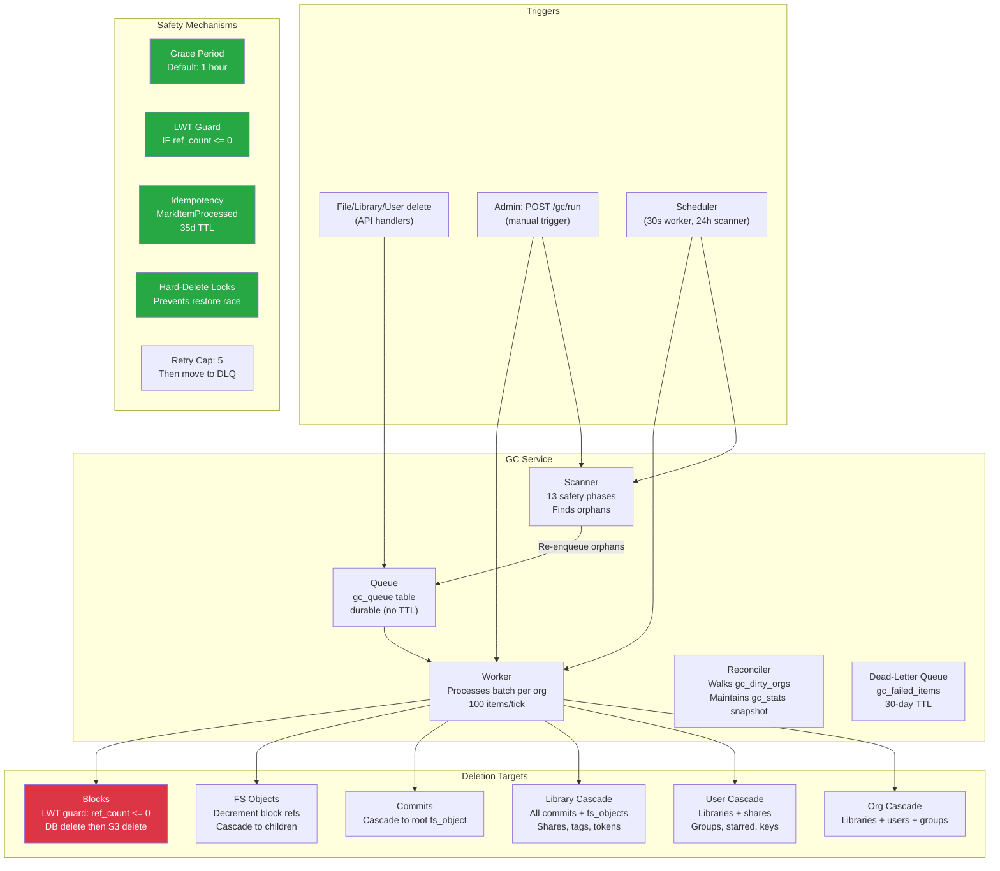

# GC Service Analysis

**Date:** 2026-04-14
**Scope:** `internal/gc/` — 9,940 lines across 9 files + 3,380 lines of tests.
**Goal:** Evaluate correctness, test coverage, identify potential data-loss bugs, and
plan integration tests for long-running monitoring.

---

## Architecture Overview



---

## Deletion Flow: The Critical Path

## Operational Runbook: Organizations Stuck in `purging`

Org hard delete uses a three-step lifecycle: `deleted -> purging -> hard deleted`.
The `purging` state means GC has claimed the soft-delete identity and restore/reactivate
must remain blocked while destructive cleanup is in progress or awaiting retry.

If an org remains in `purging` longer than expected:

1. Check the GC failed-items view/API for an `org_cascade` item with the org ID.
2. Inspect the item error before taking action; common causes are live child rows,
   library/user/group cleanup failures, or a failed dependency during cascade cleanup.
3. Requeue the failed GC item after fixing the underlying cause. Retries are safe:
   `GetOrgDeletedAt` accepts both `deleted` and `purging`, and the worker resumes the
   purge rather than treating it as stale.
4. If the worker process died after taking `gc_org_hard_delete_locks`, wait for the
   lock TTL (`default_time_to_live = 3600`) or delete the lock row only after verifying
   no GC worker is actively processing that org.
5. Do not manually restore an org from `purging` unless you have first proven that no
   destructive child cleanup ran. The supported recovery path is to fix/requeue the GC
   cascade until it completes.

`HardDeleteOrg` performs a child preflight before entering `purging`; worker-owned org
cascades call `HardDeleteOrgLocked` only after child cleanup has already completed.

### Block deletion (the most dangerous operation)

```
processBlock(item):
  1. LWT: UPDATE blocks SET ref_count = -999
         WHERE org_id = ? AND block_id = ?
         IF ref_count <= 0
     └─ If NOT applied (ref_count > 0): SKIP, delete GC candidate, done.
     └─ If applied:
  2. DELETE FROM blocks (unconditional)
  3. S3 DeleteBlock(blockID)
     └─ If S3 fails: LOG WARNING, return error → retry
     └─ If S3 succeeds:
  4. Delete block mappings (SHA-1 → SHA-256)
  5. Delete GC candidate record
  6. Increment stats
```

**The LWT guard at step 1 is the core safety mechanism.** Even if a block is enqueued
for deletion while simultaneously being referenced by a new upload, the LWT check
(`IF ref_count <= 0`) prevents deletion of live data. This was verified in
`worker_regression_test.go:TestWorker_StorageLeak_LWTSkipsLiveBlock`.

### FS Object deletion (cascade trigger)

```
processFSObject(item):
  1. Get fs_object from DB
     └─ Not found: assume already deleted, done.
  2. If directory: enqueue all children (skip grace period)
  3. If file with blocks:
     a. Resolve block IDs once for the object
     b. For each block occurrence, create deterministic taskID
        (fs_id + identity_at + block position + resolved block ID)
     c. MarkItemProcessed(taskID) — IF NOT EXISTS
        └─ Already processed: verify whether this block occurrence's
           decrement is reflected; repair only the missing recorded
           decrement if the marker was written before the decrement landed
        └─ First time: DecrementRefCount, check if now 0
     d. Enqueue zero-ref blocks for deletion
  4. Delete fs_object from DB
```

**The idempotency mechanism at step 3b prevents double-decrement on retry.**
Each block occurrence in the `fs_object` has its own deterministic marker. After
a crash, the worker continues unrecorded block decrements and checks recorded
ones against live references. If a marker was written before its decrement
landed, the worker repairs that missing decrement instead of deleting the
`fs_object` with an inflated block refcount.

Block deletion also re-checks live `fs_object` references before claiming a
zero-ref block. The worker caches the org's live block-reference set during a
batch, so deleting N block items does not rescan every `fs_object` N times.

---

## What's working well

These are deliberate safety mechanisms that are correctly implemented and tested:

1. **LWT-based block deletion** — Cassandra lightweight transactions ensure blocks with
   `ref_count > 0` are never deleted from S3, even under concurrent upload. The
   worker also scans live fs_object references before claiming a zero-ref block
   so partial fs_object decrement recovery cannot remove referenced content.
2. **Grace period** (default 1h) — Recently enqueued items can't be processed. Gives
   time for concurrent operations to increment ref counts.
3. **Idempotent decrement** — `MarkItemProcessed` with deterministic per-block task IDs
   prevents double-decrement across worker retries and delayed DLQ requeues inside the
   30-day failed-item retention window, while retry repair handles markers that
   were persisted immediately before a crash. The tracking table now uses a 35-day TTL.
4. **Cascade ordering** — Commit → root fs_object → children → blocks. If any step fails,
   the parent is not deleted, and the scanner will re-discover it.
5. **Hard-delete locks** — User, library, and org cascades acquire a tokenized,
   renewable lease plus a second stale-check that blocks the restore race at
   cascade start and keeps the guard alive for long-running hard deletes. If a
   worker crashes, a later worker can take over after the heartbeat becomes
   stale; active lock contention is postponed without consuming retry budget.
6. **Scanner as safety net** — 13 phases catch orphaned items that inline enqueue missed.
   Runs on startup + every 24h, and the auto-delete keep-tree walk now fails closed
   for a library if any `GetFSObject` read needed to build the keep-set fails.
7. **Retry with cap** — Failed items get retried up to 5 times with HOL-blocking prevention
   (requeued to back of queue). After 5 retries, TTL cleanup removes the item.
8. **Audit logging** — Cascade deletes write to `gc_audit_log` for compliance traceability.

---

## Potential bugs and risks

### HIGH: S3 orphan on delete failure (worker.go:164-169)

**Scenario:** LWT succeeds → DB record deleted → S3 delete fails (network error, timeout).

**Result:** Block is gone from the database but remains in S3. The scanner cannot find
it because there's no DB record with `ref_count <= 0` to scan. The orphan persists
forever, costing storage.

**Current handling:** Logs a WARNING, returns error (triggers retry). But the retry
will also fail because the DB record is already gone — the LWT step will return
"not applied" (row doesn't exist), and the block skips S3 deletion.

**Impact:** Storage leak. Not data loss (the data is still in S3, just unreachable).
Over time this could accumulate meaningful cost.

**Recommendation:**
1. Add a pre-delete S3 check: verify block exists in S3 before deleting from DB
2. Or: reverse the order — delete from S3 first, then DB (if S3 fails, DB record
   remains and scanner re-discovers it). This is safer but loses the LWT atomicity.
3. Or: add a separate "S3 orphan recovery" scan that lists S3 keys and cross-references
   with the blocks table. This is the most robust but most expensive.
4. Simplest: add retry with exponential backoff on S3 delete failure BEFORE returning
   the error (3 attempts, 1s/2s/4s).

### MEDIUM: Decrement-then-read race (worker.go:672-685)

```go
w.store.DecrementBlockRefCount(orgID, blockID)  // step 1
refCount, _ := w.store.GetBlockRefCount(orgID, blockID)  // step 2
if refCount <= 0 { /* enqueue for deletion */ }
```

Between step 1 and step 2, another operation could increment the ref count (new file
upload referencing the same block). The decrement would bring it to 0, but by the time
the read executes, the count could be back at 1.

**In practice this is safe** because:
- The grace period (1h) means the block won't be deleted for another hour
- During that hour, the upload will complete and the ref count will be stable
- At deletion time, the LWT checks again (`IF ref_count <= 0`)
- If the ref count is now 1, the LWT won't apply

So this is a false-positive enqueue (block enqueued for deletion but LWT skips it),
not a data loss scenario. The cost is a wasted queue entry that gets cleaned up.

### RESOLVED: Counter drift (was MEDIUM)

**Resolved:** 2026-04-28 in the baseline schema (`001_initial_schema.cql`) and the
accompanying GC service redesign.

**Original problem:** the `gc_queue_stats` Cassandra counter table was updated
in a separate batch from queue mutations. Drift accumulated whenever (a) the
counter batch failed silently, (b) `gc_queue` rows were TTL-expired (no DELETE
fired), or (c) Cassandra coordinator retries doubled the increment (counter
writes are non-idempotent). In production this manifested as
`/api/v2.1/admin/gc/status/` reporting `queue_size: 2757` while the live table
held 0 rows.

**New design:**
- `gc_queue_stats` is dropped. Snapshots live in `gc_stats` (per-key) and
  `gc_org_stats` (per-org).
- Mutations write to `gc_dirty_orgs`. A serialized reconciler iterates dirty
  orgs each worker/scanner tick, recomputes per-org depth via `SELECT COUNT(*)
  FROM gc_queue WHERE org_id = ?` (partition-bounded), saves the per-org row,
  and applies the delta to the global `gc_stats` totals.
- Every 10 reconciler passes a full `SUM(queue_depth) FROM gc_org_stats` runs
  as a drift safety net; mismatches overwrite the totals and bump
  `gc_snapshot_drift_corrected_total`.
- Admin DLQ mutations require leadership and serialize through `dlqOpsMu` so
  the non-atomic `RequeueFailedItem` cannot duplicate queue rows under
  concurrent admin requests.

**New Prometheus metrics:** `gc_failed_items_total`, `gc_dirty_orgs_total`,
`gc_snapshot_age_seconds`, `gc_snapshot_drift_corrected_total`,
`gc_reconcile_duration_seconds`.

`/api/v2.1/admin/gc/status/` now exposes `queue_size`, `failed_items_total`,
`dirty_orgs_total`, `snapshot_age_seconds` (-1 when no reconcile has run yet),
and `last_reconcile_run`.

### LOW: Cascade partial failure

If a user cascade deletes 100 shares and fails on share #50, the function returns
an error. The queue item gets retried. On retry, shares 1-50 are already gone,
so the retry completes shares 51-100. This is correct behavior — the cascade is
idempotent for most operations. But if the failure is persistent (e.g., a specific
share has a corrupt record), the cascade will hit the 5-retry cap and stall.

**Recommendation:** Skip individual failures within a cascade and continue processing
the remaining items. Log the skipped items for manual review.

---

## Cleanup Scenarios Reference

This section answers: **"When X happens, what gets cleaned up, when, and how do I test it?"**

### How deduplication works

Blocks are identified by SHA-256 hash and scoped to an **org** (partition key = `org_id`).
When two users in the same org upload identical files, only one copy of each block is
stored in S3. The `blocks` table tracks a `ref_count` — how many fs_objects reference
that block within the org.

```
User A uploads report.pdf (3 blocks: B1, B2, B3)  →  ref_count: B1=1, B2=1, B3=1
User B uploads report.pdf (same content)           →  ref_count: B1=2, B2=2, B3=2
                                                       (no new S3 upload — dedup)
User A copies report.pdf to another folder         →  ref_count: B1=3, B2=3, B3=3
```

Ref counts are modified with **Cassandra LWT (lightweight transactions)** to prevent
race conditions:

- **Increment** (`IncrementBlockRefCounts`): on upload and copy. Uses `UPDATE ... IF ref_count = ? SET ref_count = ?` with CAS retry.
- **Decrement** (`DecrementBlockRefCountsOnce`): on file delete. Same CAS pattern. Returns `true` if the decrement caused ref_count to hit 0.
- **Idempotency**: Each block decrement operation has a stable key derived from `library_id`, `fs_object_id`, block position, resolved block ID, and GC `identity_at`. Processed operations are recorded in `gc_processed_items` (35d TTL) to prevent double-decrement on retry and delayed DLQ replay while allowing partially completed fs_objects to resume. If a marker exists but the current refcount still includes that fs_object occurrence, retry repair applies the missing decrement before deleting the fs_object.

Blocks are **never shared across orgs** — the `blocks` primary key is `(org_id, block_id)`.

### Scenario 1: User deletes a file

| Step | What happens | When | Tested by |
|------|-------------|------|-----------|
| User clicks "delete" | API creates new commit without the file | Immediate | — |
| Ref count decrement | Background goroutine decrements block ref_counts via LWT | Immediate (async) | `TestGC_BlockLifecycle` |
| Blocks still referenced | If ref_count > 0 (other files use same blocks): nothing more happens | — | `TestGC_DeduplicationSafety` |
| Blocks reach ref_count=0 | `EnsureBlockGCCandidate` inserts into `gc_block_candidates` | Immediate | `TestGC_BlockLifecycle` |
| Enqueue for GC | Block inserted into `gc_queue` with current timestamp | Immediate | `TestGC_BlockLifecycle` |
| Grace period | Worker won't process until `queued_at + grace_period` (default 1h) | 1 hour | `TestGC_GracePeriodEnforcement` |
| LWT deletion | Worker: `UPDATE blocks SET ref_count=-999 IF ref_count <= 0` | After grace period | `TestGC_ConcurrentUploadDuringGC` |
| S3 deletion | Worker: `DeleteBlock` from S3 | After LWT succeeds | `TestGC_BlockLifecycle` |
| Cleanup | Delete block mappings + GC candidate record | After S3 delete | `TestGC_BlockLifecycle` |

**Dedup safety:** If User B still has the same file, the blocks have ref_count >= 1.
The LWT at deletion time (`IF ref_count <= 0`) will NOT apply, and the block is
skipped. User B's file remains intact.

**What if User A deletes, then User B re-uploads the same file before GC runs?**
The re-upload increments ref_count back to 1. The LWT check at GC time sees
ref_count=1 and skips. No data loss. Tested by `TestGC_ConcurrentUploadDuringGC`.

### Scenario 2: Two users delete the same deduplicated file

```
Before: User A and User B both have report.pdf → block ref_count=2
```

| Step | What happens | ref_count | Tested by |
|------|-------------|-----------|-----------|
| User A deletes report.pdf | Decrement via LWT | 1 | `TestBatchDeleteItems_DeduplicatedFilesDecrementSharedBlockTwice` |
| GC enqueue? | No — ref_count is 1, not 0 | 1 | `TestGC_DeduplicationSafety` |
| User B deletes report.pdf | Decrement via LWT | 0 | Same test |
| GC enqueue | Yes — ref_count hit 0, block candidate created | 0 | Same test |
| After grace period | Worker LWT confirms ref_count=0, deletes from S3 | -999 → deleted | `TestGC_BlockLifecycle` |

**Both deletions happen in the same API call (batch delete)?**
The batch-delete handler collects all block IDs (including duplicates if the same block
appears in multiple files) and passes them to `DecrementBlockRefCountsOnce`. Each
block ID is decremented once per occurrence. A block appearing twice in the list
gets decremented twice (ref_count 2 → 0). Tested by
`TestBatchDeleteItems_DeduplicatedFilesDecrementSharedBlockTwice`.

### Scenario 3: File deleted, then same content uploaded by different user

```
Before: Only User A has report.pdf → ref_count=1
```

| Step | What happens | ref_count | Safe? |
|------|-------------|-----------|-------|
| User A deletes report.pdf | Decrement | 0 | — |
| Block enqueued for GC | `gc_block_candidates` + `gc_queue` | 0 | — |
| User B uploads same file (within grace period) | `IncrementBlockRefCounts` | 1 | — |
| GC worker runs after grace period | LWT: `IF ref_count <= 0` — NOT applied | 1 | Yes |
| Block stays in S3 | Worker logs "LWT not applied, skipping" | 1 | Yes |
| GC candidate cleaned up | Worker deletes stale candidate | — | Yes |

**This is the most critical race condition.** The LWT guard is the only thing
preventing data loss here. It was verified against real Cassandra in
`TestGC_ConcurrentUploadDuringGC`.

### Scenario 4: Library soft-deleted (moved to trash)

| Step | What happens | When | Tested by |
|------|-------------|------|-----------|
| User/admin deletes library | Library moved to `deleted_libraries` table | Immediate | `TestGC_LibraryCascade` |
| Trash retention period | Default 30 days (configurable `trash_retention_days`) | 30 days | `TestGC_LibraryCascade` (uses server's configured period) |
| Scanner finds expired library | `scanExpiredDeletedLibraries` enqueues `ItemLibraryCascade` | Next scanner sweep (24h or manual) | `TestGC_LibraryCascade` |
| Worker cascade | Acquires hard-delete lock → enqueues all commits + fs_objects → deletes shares, tags, tokens → hard-deletes library | After scanner enqueues | `TestGC_LibraryCascade` |
| Commit processing | Each commit enqueues its root fs_object | Cascaded | Not separately tested |
| FS object processing | Files: decrement block refs. Dirs: enqueue children | Cascaded | Not separately tested |
| Block processing | LWT → S3 delete (only for blocks with ref_count=0) | After grace period | `TestGC_BlockLifecycle` |

**What if the library is restored from trash before GC runs?**
The worker does a stale-check: reads `deleted_at` timestamp and compares with the
queue item's timestamp. If the library was restored (deleted_at is now null), the
cascade is skipped. A hard-delete lock prevents concurrent restore while cascade
is running.

### Scenario 5: User account deleted

| Step | What happens | When | Tested by |
|------|-------------|------|-----------|
| Admin deactivates/deletes user | User marked with `deleted_at` timestamp | Immediate | **Pending** |
| Grace period | Default 7 days (`user_grace_days`) | 7 days | **Pending** |
| Scanner finds expired user | `scanExpiredDeletedUsers` enqueues `ItemUserCascade` | Next scanner sweep | **Pending** |
| Worker cascade | Lock → soft-delete all owned libraries → remove from groups → delete shares → delete starred/monitored/API keys → hard-delete user | Cascaded | **Pending (unit tested with mocks only)** |
| Library cascade | Each soft-deleted library follows Scenario 4 timeline | +30 days | `TestGC_LibraryCascade` |

**Note:** User cascade is tested in unit tests with mocks but has **no integration test
against real Cassandra** yet. This is a gap.

### Scenario 6: Organization deleted

| Step | What happens | When | Tested by |
|------|-------------|------|-----------|
| Platform admin deletes org | Org marked with `deleted_at` | Immediate | **Pending** |
| Grace period | Default 30 days (`org_grace_days`) | 30 days | **Pending** |
| Scanner finds expired org | Enqueues `ItemOrgCascade` | Next scanner sweep | **Pending** |
| Worker cascade | For each library: cascade-delete. For each user: delete. For each group: delete. Hard-delete org. | Cascaded | **Pending (unit tested with mocks only)** |

### Scenario 7: Share link expires

| Step | What happens | When | Tested by |
|------|-------------|------|-----------|
| Share link past `expires_at` | Scanner phase 2 finds it | Next scanner sweep | Unit test (scanner) |
| Deletion | Share link record deleted from DB | Immediate in scanner | **Pending integration test** |

**Note:** Share link expiry does NOT delete the underlying file or library. It only
removes the public access link.

### Scenario 8: Version TTL expires (old commits pruned)

| Step | What happens | When | Tested by |
|------|-------------|------|-----------|
| Library has `version_ttl_days` set | Scanner phase 5 finds old commits | Next scanner sweep | Unit test (scanner) |
| HEAD chain preserved | Scanner walks the HEAD→parent chain, never deletes those | — | Unit test |
| Old commits enqueued | Commits outside HEAD chain + older than TTL enqueued | — | Unit test |
| Cascade | Commit → fs_objects → blocks (only if ref_count=0) | Normal GC flow | **Pending integration test** |

### Scenario 9: Scanner finds orphaned blocks (missed enqueue)

| Step | What happens | When | Tested by |
|------|-------------|------|-----------|
| Block has ref_count=0 but no GC candidate | Scanner phase 1 finds it | Next scanner sweep | `TestGC_ScannerOrphanRecovery` |
| Re-enqueue | Scanner creates GC candidate + queue entry | Immediate | `TestGC_ScannerOrphanRecovery` |
| Normal GC flow | Worker processes after grace period | Normal flow | `TestGC_BlockLifecycle` |

### Summary: Dedup-safe deletion guarantees

| Guarantee | Mechanism | Integration-tested? |
|-----------|-----------|-------------------|
| Block never deleted while ref_count > 0 | LWT: `IF ref_count <= 0` | **Yes** (`TestGC_ConcurrentUploadDuringGC`) |
| Ref count never double-decremented within the supported replay window | Stable idempotent operation key + `gc_processed_items` | **Yes** (unit + `TestBatchDeleteItems_DeduplicatedFilesDecrementSharedBlockTwice`) |
| Re-uploaded content survives pending GC | Grace period + LWT re-check at deletion time | **Yes** (`TestGC_ConcurrentUploadDuringGC`) |
| Shared block survives partial file delete | Ref count tracks all references | **Yes** (`TestGC_DeduplicationSafety`) |
| Cascade respects restore from trash | Stale-check + hard-delete lock | Unit tests only (**pending integration**) |
| Orphaned blocks eventually cleaned up | Scanner phase 1 re-discovers and re-enqueues | **Yes** (`TestGC_ScannerOrphanRecovery`) |

## Test Coverage Assessment

### What's covered (107 unit tests + 4 prior integration + 7 new GC integration)

| Area | Tests | Type | Verdict |
|------|-------|------|---------|
| Service lifecycle (start/stop/concurrent) | 20 | Unit (mock) | Solid |
| Queue operations (enqueue/dequeue/grace/retry) | 14 | Unit (mock) | Solid |
| Block deletion (LWT guard, dry run, S3) | 6 | Unit (mock) | Solid |
| Commit cascade → fs_object | 3 | Unit (mock) | Adequate |
| FS Object → block decrement + directory recursion | 5 | Unit (mock) | Adequate |
| User cascade (full, dry run, skip restored) | 6 | Unit (mock) | Solid |
| Library cascade (full, dry run, skip restored) | 5 | Unit (mock) | Solid |
| Org cascade (full, dry run) | 4 | Unit (mock) | Adequate |
| Grace period regressions | 2 | Unit (mock) | Solid |
| HOL blocking + retry cap | 3 | Unit (mock) | Solid |
| LWT race condition regression | 1 | Unit (mock) | Critical test, exists |
| Scanner (13 phases) | 33 | Unit (mock) | Comprehensive |
| Batch-delete → refcount → GC enqueue | 4 | Integration (real Cassandra) | Good |
| **Block lifecycle end-to-end** | 1 | **Integration (real Cassandra + S3)** | **Done** |
| **Deduplication safety** | 1 | **Integration (real Cassandra + S3)** | **Done** |
| **LWT guard with real Cassandra** | 1 | **Integration (real Cassandra + S3)** | **Done** |
| **Library cascade (scanner → worker)** | 1 | **Integration (real Cassandra + S3)** | **Done** |
| **Scanner orphan recovery** | 1 | **Integration (real Cassandra + S3)** | **Done** |
| **Grace period enforcement (real)** | 1 | **Integration (real Cassandra + S3)** | **Done** |
| **Queue size tracking (admin API)** | 1 | **Integration (real Cassandra + S3)** | **Done** |
| **Long-running soak test** | 1 | **Integration (gcsoak tag)** | **Code written, not yet run** |

### Test gaps

| Gap | Risk | Status | Notes |
|-----|------|--------|-------|
| **S3 failure during block delete** | High | **Pending** | Needs MinIO stop/start during GC. Soak test framework supports this but it's not wired up. |
| **Concurrent worker + scanner on same org** | Medium | **Pending** | Needs to trigger both simultaneously and verify no duplicate processing or missed items. |
| **Queue recovery after service restart** | Medium | **Pending** | Needs to restart the sesamefs container mid-queue and verify items survive. |
| **ShareLink/Share/RestoreJob worker processing** | Medium | **Pending** | Only enqueue is tested (unit). No integration test creates and deletes share links through GC. |
| **Very deep directory cascade (100+ levels)** | Medium | **Pending** | `TestGC_LibraryCascade` tests 3 files (flat). No deep nesting test. |
| **Real Cassandra LWT behavior** | Medium | **Done** | `TestGC_ConcurrentUploadDuringGC` validates the LWT guard against real Cassandra. |
| **Cascade partial failure + retry** | Medium | **Pending** | No test simulates a mid-cascade failure (e.g., corrupt share record). |
| **Scanner + concurrent writes** | Low | **Partially done** | Soak test exercises this implicitly (uploads happen while GC runs), but doesn't assert specifically on concurrent scanner behavior. |
| **Grace period boundary (±1ms)** | Low | **Partially done** | `TestGC_GracePeriodEnforcement` tests the concept with real timing but not the exact ±1ms boundary. |
| **User cascade end-to-end** | Medium | **Pending** | No integration test creates a user, soft-deletes them, and verifies full cascade through GC. |
| **Soak test validation** | Medium | **Code written, needs run** | `TestGC_Soak` is implemented but hasn't been executed against the live stack yet. |

---

## Integration Test Plan

Tests are in `internal/integration/gc_integration_test.go` (core) and
`internal/integration/gc_soak_test.go` (soak). Run independently with:

```bash
# Core GC tests only (7 tests, ~20s)
go test -tags integration -v -run "TestGC_" -timeout 10m ./internal/integration/...

# Soak test (default 5 min, configure with GC_SOAK_DURATION)
go test -tags 'integration gcsoak' -v -run "TestGC_Soak" -timeout 30m ./internal/integration/...
```

### Implemented tests

| # | Test | File | Status | Run time |
|---|------|------|--------|----------|
| 1 | `TestGC_BlockLifecycle` | gc_integration_test.go | **Passing** | 3s |
| 2 | `TestGC_DeduplicationSafety` | gc_integration_test.go | **Passing** | 2s |
| 3 | `TestGC_ConcurrentUploadDuringGC` | gc_integration_test.go | **Passing** | 3s |
| 4 | `TestGC_LibraryCascade` | gc_integration_test.go | **Passing** | 9s |
| 5 | `TestGC_ScannerOrphanRecovery` | gc_integration_test.go | **Passing** | 1–12s |
| 6 | `TestGC_GracePeriodEnforcement` | gc_integration_test.go | **Passing** | 1s |
| 7 | `TestGC_QueueSizeTracking` | gc_integration_test.go | **Passing** | <1s |
| 8 | `TestGC_Soak` | gc_soak_test.go | **Code written, needs run** | 5 min+ |

### Planned tests (not yet implemented)

| # | Test | What it covers | Blocked by |
|---|------|---------------|------------|
| 9 | S3 failure resilience | Stop MinIO mid-GC, verify retry + recovery | Needs container orchestration from test |
| 10 | User cascade end-to-end | Soft-delete user → verify full cascade | Needs ability to create/delete users via API |
| 11 | Deep directory cascade (100+ levels) | Stack depth / timeout under deep nesting | Time to implement |
| 12 | Concurrent worker + scanner | Trigger both on same org simultaneously | Needs careful timing + assertions |
| 13 | Queue recovery after restart | Restart sesamefs mid-queue, verify items survive | Needs container restart from test |
| 14 | Cascade partial failure | Corrupt record mid-cascade, verify retry behavior | Needs direct DB manipulation |
| 15 | ShareLink/Share/RestoreJob through worker | Create + expire share links, verify GC deletes them | Time to implement |

### What each implemented test validates

**Test 1 — Block lifecycle:** Upload → delete → ref_count=0 → GC candidate created →
worker processes. Validates the complete happy path with real Cassandra and real S3.

**Test 2 — Deduplication safety:** Two files, same content, ref_count=2. Delete one →
ref_count=1 → GC skips block → second file still downloadable. Validates that shared
blocks are never deleted while referenced.

**Test 3 — Concurrent upload during GC:** Delete file → re-upload same content → trigger
GC → LWT guard prevents deletion → re-uploaded file intact. Validates the core safety
mechanism against real Cassandra LWT behavior (not mocks).

**Test 4 — Library cascade:** Upload files → soft-delete library → trigger scanner
(finds expired library) → trigger worker (cascades through commits, fs_objects, blocks).
Validates the multi-step cascade with real infrastructure.

**Test 5 — Scanner orphan recovery:** Upload file → delete → wait for ref_count=0 →
delete GC candidate directly from DB → trigger scanner → verify block re-discovered
and re-enqueued. Validates the scanner safety net with real Cassandra.

**Test 6 — Grace period enforcement:** Upload → delete → trigger GC immediately →
verify block still exists (grace period holds). Validates timing-based safety.

**Test 7 — Queue size tracking:** Upload → delete → check admin API reports queue
size change. Validates admin monitoring endpoint.

**Test 8 — Soak test (code written, needs run):** Continuous loop: create libraries,
upload files, delete some, soft-delete libraries, while GC runs. Invariant checks
every 30s: all active files downloadable, queue bounded, GC responsive.

---

## Monitoring recommendations

For running these tests in production-like environments:

### Metrics to watch

| Metric | Normal range | Alert threshold |
|--------|-------------|-----------------|
| `gc_queue_size` | 0–1000 | > 10,000 (backlog growing) |
| `gc_items_processed_total` | Increasing | Flatline for > 1h (worker stuck) |
| `gc_errors_total` | 0 | > 10/min (systematic failure) |
| `gc_blocks_deleted_total` | Increasing | Flatline after items processed |
| `gc_items_skipped_total` | Low | Sudden spike (ref count races) |
| sesamefs memory | 74–150 MB | > 500 MB (memory leak) |
| S3 bucket object count | Stable or decreasing | Monotonic increase (orphan leak) |

### Log patterns to alert on

```
"Failed to delete block from S3"   → S3 orphan created
"LWT delete not applied"           → Normal (race prevented), but high rate = concern
"Failed to check idempotency"      → Cassandra issue
"failed to hard-delete"            → Cascade stuck
"unknown item type"                → Code bug
```

---

## Performance characteristics

| Operation | Throughput | Bottleneck |
|-----------|-----------|------------|
| Worker tick (30s) | 100 items/org/tick | Cassandra query latency |
| Block delete (LWT) | ~20ms/block | Cassandra LWT round-trip |
| S3 delete | ~50ms/block | S3 API latency |
| Full library cascade (100 files) | ~5s | Sequential commit → fs_object → block |
| Scanner full sweep | Minutes to hours | Depends on total data volume |

**Throughput ceiling:** At 100 items per 30s tick, the worker processes ~12,000 items/hour.
For a deployment with millions of blocks, this may not keep up with deletion rate.

**Scaling recommendations:**
- Increase `batch_size` (e.g., 500) for faster processing
- Reduce `worker_interval` (e.g., 10s) for more frequent ticks
- For multi-node: only one node should run GC (no leader election exists yet)

---

## Summary

| Aspect | Rating | Notes |
|--------|--------|-------|
| **Safety mechanisms** | Excellent | LWT, grace period, idempotency, locks, scanner safety net |
| **Cascade correctness** | Good | Ordering is correct; partial failure handling could improve |
| **Test coverage** | Good | 107 unit + 4 integration; key gaps in S3 failure and concurrent access |
| **Error handling** | Adequate | Retries with cap; S3 orphan is the main gap |
| **Performance** | Adequate | 12K items/hour; may need tuning for large deployments |
| **Monitoring** | Basic | Prometheus metrics exist; alerting rules not defined |
| **Code quality** | Good | Clean interface (GCStore), well-documented, audit logging |
