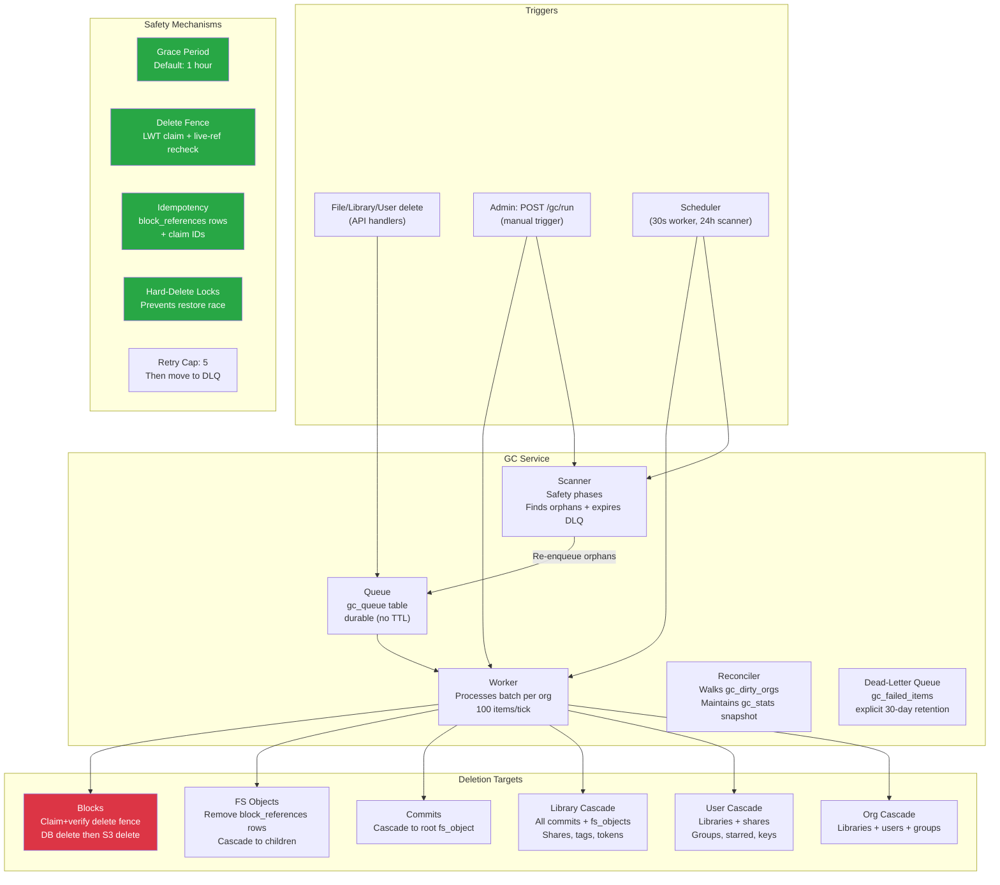

# GC Service Analysis

**Date:** 2026-04-14 · **Corrected against `main` 4333be1b3:** 2026-07-10 · **Status refresh:** 2026-07-16
**Scope:** `internal/gc/` — 9,940 lines across 9 files + 3,380 lines of tests.
**Goal:** Evaluate correctness, test coverage, identify potential data-loss bugs, and
plan integration tests for long-running monitoring.

> **See also (delete-path audit, refreshed 2026-07-16):** P10's proven pre-fix
> cross-org live-content deletion bug is **fixed by the org-scoped-key series through PR-3**.
> API reads/writes, normal GC deletion, and S3 orphan recovery now resolve
> `blocks/<org_id>/...`; org-less block-store APIs have been removed. A real
> Cassandra+MinIO E2E uploads identical bytes into two dedicated, test-exclusive tenant orgs,
> drains only one, and proves the sibling row, reference, object, and byte-for-byte
> download survive. An API-level test proves distinct physical keys across the default and
> platform orgs, and an adapter unit test pins `PlatformOrgID` handling in GC.
> See `ISSUE-GC-CROSS-ORG-BLOCK-DELETE-01`.
> The previous "no open known issue can delete live content" verdict is **retracted**: it only ever
> reasoned about liveness *within* an org. The physical block-delete claim/recovery
> protocol is conservative. P6a (existence-read failures interpreted as "missing", enqueuing
> destructive work for live libraries on a transient error) is **fixed** (branch 1D): existence
> reads fail closed and Phases 3/4/9 surface the error. P6b is **fixed**: queued orphan work is
> revalidated by canonical `(org_id, library_id)` point read under the existing library lock,
> with synchronous fencing before destructive mutations. P1/P1b/P2 (durable purge marker +
> cascade on every wired permanent-delete path) are **fixed** on `main` (PR #129), and P9
> (`gc_pending_items` block-row leak) is fixed for new work.
>
> The remaining debt is **storage retention in edge cases, observability, test
> hygiene, and scale** — not live-data safety: P4 (`pub:` zero-ref transition), P5 (Phase 13 error visibility), P7
> (markerless commit/fs_object partitions invisible to orphan discovery — reachable on any
> cluster via terminal child-work loss/DLQ expiry, so 8D stays open), P8 (Phase 9
> `shares_by_group` global scan). Reconcile/backfill (8A–8C) repairs *pre-existing* residue only
> and is **out of scope for the planned greenfield prod deploy**.
> Full audit (P1–P10, invariants, branch roadmap):
> [GC-DELETE-CLEANUP-INVESTIGATION.md](GC-DELETE-CLEANUP-INVESTIGATION.md);
> per-item issues: `ISSUE-GC-*` in [KNOWN_ISSUES.md](KNOWN_ISSUES.md).
>
> **Production activation gate (updated 2026-08-14):** X1 physical-delete ABA
> remains open; X2 cross-DC reference visibility is closed under its stable-topology
> operational contract. Keep `GC_ENABLED=false` on every replica in every DC. The
> leader lease does not close X1. Only after X1 closes may designated replicas in one
> DC participate under the lease, and a replication DC-set or RF change with existing
> reference state requires a separately certified migration.

---

## Architecture Overview



---

## Deletion Flow: The Critical Path

## Operational Runbook: Organizations Stuck in `purging`

Org hard delete uses a three-step lifecycle: `deleted -> purging -> hard deleted`.
The `purging` state means GC has claimed the soft-delete identity and restore/reactivate
must remain blocked while destructive cleanup is in progress or awaiting retry.

If an org remains in `purging` longer than expected:

1. Check the GC failed-items view/API for an `org_cascade` item with the org ID.
2. Inspect the item error before taking action; common causes are live child rows,
   library/user/group cleanup failures, or a failed dependency during cascade cleanup.
3. Requeue the failed GC item after fixing the underlying cause. Retries are safe:
   `GetOrgDeletedAt` accepts both `deleted` and `purging`, and the worker resumes the
   purge rather than treating it as stale.
4. If the worker process died after taking `gc_org_hard_delete_locks`, wait for the
   lock TTL (`default_time_to_live = 3600`) or delete the lock row only after verifying
   no GC worker is actively processing that org.
5. Do not manually restore an org from `purging` unless you have first proven that no
   destructive child cleanup ran. The supported recovery path is to fix/requeue the GC
   cascade until it completes.

`HardDeleteOrg` performs a child preflight before entering `purging`; worker-owned org
cascades call `HardDeleteOrgLocked` only after child cleanup has already completed.

### Block deletion (the most dangerous operation)

```
processBlock(item):
  1. Point-read live block_references / provisional refs
     └─ If any ref exists: skip, delete GC candidate, done.
  2. ClaimBlockDelete(blockID) via LWT delete fence
     └─ If claim fails: another worker or a new live ref won; skip.
  3. Re-check live references after the claim
     └─ If any ref exists: release claim, skip.
  4. Record S3 orphan fence + DELETE block metadata/mappings
  5. Resolve BlockStore by (item.org_id, canonical storage_class), without health failover
  6. S3 DeleteBlock(blockID) at blocks/<org_id>/...
     └─ If S3 fails: LOG WARNING, return error → retry
  7. Delete GC candidate record and clear the fence/claim state
  8. Increment stats
```

**The claim+verify fence is the core safety mechanism.** Even if a block is enqueued
for deletion while simultaneously being referenced by a new upload, the worker
point-reads live references before and after the LWT claim, and releases the
claim if a concurrent writer reintroduces liveness before S3 deletion.
The physical delete is bound to the same org partition used by those checks and to
the block row's normalized canonical storage class. GC deliberately ignores backend
health failover because deleting from a fallback backend would target a different
physical location.

### FS Object deletion (cascade trigger)

```
processFSObject(item):
  1. Get fs_object from DB
     └─ Not found: assume already deleted, done.
  2. If directory: enqueue all children (skip grace period)
  3. If file with blocks:
     a. Resolve block IDs once for the object
     b. Delete this fs_object's row-per-reference block_references
     c. If a block now has no live refs, record/enqueue gc_block_candidates
  4. Delete fs_object from DB
```

**The idempotency mechanism at step 3 is row-per-reference liveness.** Retrying
the fs_object cleanup deletes the same keyed `block_references` rows again, which
is safe, and zero-ref discovery is re-derived from current live references rather
than replaying decrement markers.

Block deletion also re-checks live `fs_object` references before claiming a
zero-ref block. The worker caches the org's live block-reference set during a
batch, so deleting N block items does not rescan every `fs_object` N times.

---

## What's working well

These are deliberate safety mechanisms that are correctly implemented and tested:

1. **Claim-then-verify block deletion** — Cassandra lightweight transactions only guard
   the delete claim, and the worker re-checks live `block_references` at `EACH_QUORUM`
   (`BlockHasReferencesGlobal`) before authorizing the S3 delete. It does not close X1:
   Cassandra claims/generations cannot revoke an S3 DELETE already in flight; only
   never-reused physical keys close that ABA component, but that is not the whole X1
   workstream. This mechanism must not be
   treated as production-safe activation while X1 is open.
2. **Grace period** (default 1h) — Recently enqueued items can't be processed. Gives
   time for concurrent operations to finish registering or promoting references.
3. **Idempotent cleanup by liveness rows** — keyed `block_references` rows replace the
   retired decrement-marker table. Upload/publish retries are safe because repeated
   deletes hit the same keys, and block-delete retries are guarded by claim IDs plus
   a second live-reference check before finalization.
4. **Cascade ordering** — Commit → root fs_object → children → blocks. If child enqueue fails,
   the parent is retained/retried. Do not claim universal scanner rediscovery: P7 proves that
   markerless artifact partitions can become invisible.
5. **Hard-delete locks** — User, library, and org cascades acquire a tokenized,
   renewable lease plus a second stale-check that blocks the restore race at
   cascade start and keeps the guard alive for long-running hard deletes. If a
   worker crashes, a later worker can take over after the heartbeat becomes
   stale; active lock contention is postponed without consuming retry budget.
6. **Scanner safety nets are partial** — phases recover discoverable candidates/markers and
   run on startup + every 24h. P6a (transient-error fail-open) is fixed, so a transient
   existence read no longer misclassifies a live library; P6b execution-time canonical
   revalidation is fixed; Phase 13 now makes permanently-deleted libraries eligible via the
   durable `purge_requested_at` marker (migration 012). P7 durable markerless discovery and
   P5 Phase 13 error propagation remain.
7. **Retry with cap** — Failed items retry up to 5 times with HOL-blocking prevention, then
   move to `gc_failed_items`; explicit expiry later removes DLQ + pending projection together.
8. **Audit logging** — Cascade deletes write to `audit_log`.

---

## Potential bugs and risks

### RESOLVED: S3 orphan on delete failure

The old leak window after `FinalizeBlockDelete` is now closed by an explicit
recovery path:

1. `processBlock` records `gc_s3_orphans` plus the `gc_s3_orphans_by_day`
   discovery row before it removes the claimed canonical block row.
2. If the later S3 delete fails, the worker updates the orphan attempt metadata
   and leaves the recovery row behind instead of depending on the original block
   row to rediscover the leak.
3. Scanner phase `s3_orphan_recovery` walks `gc_s3_orphans_by_day` from a
   persisted UTC-day cursor across all discovery buckets; on cold start it scans
   the full 90-day TTL horizon so old orphan rows are still recoverable.
4. Recovery resolves the `BlockStore` from the orphan row's exact `(org_id,
   storage_class)`. Empty classes and invalid org IDs fail closed; the orphan and
   cursor position are retained rather than guessing a default backend.

This turns the old permanent storage leak into an operational retry path. The
remaining tradeoff is intentionally conservative cursor advancement: if the
canonical block row still exists (for example claimed but not yet finalized),
recovery defers that row to a later pass instead of touching S3 early.

### RESOLVED (High): Existence checks failed open before destructive orphan cleanup

`CassandraStore.LibraryExists` and `GroupExists` returned "missing" for any Cassandra error,
not only `ErrNotFound`, so Phases 3/4 could enqueue live commits/fs_objects without
`RequiresLibraryDeletedCheck` and Phase 9 could delete a valid group share. **Fixed 2026-07-10
(branch 1D):** existence reads return `(false,nil)` only for `gocql.ErrNotFound` and propagate
all other errors; Phases 3/4/9 fail closed and surface the error; regression tests added. See
`ISSUE-GC-EXISTENCE-CHECK-FAILOPEN-01`.

### MEDIUM: Markerless artifacts are not discoverable

The methods named `ListDistinctCommitLibraries` and `ListDistinctFSObjectLibraries` enumerate
only `libraries_by_id` + `deleted_libraries`. If both indexes are gone, surviving artifact
partitions cannot be found by Phases 3/4. Observed in the dev-cluster audit snapshot (test drift)
and **not reproduced on the live delete path**, so it is not a normal-flow gap — but it is not
brownfield-only either: the cascade enqueues children before `HardDeleteLibrary` drops canonical +
marker, so terminal child-work loss (retry exhaustion → DLQ → DLQ expiry) strands artifacts on a
fresh cluster too. Under-reclamation, never incorrect deletion. Not a launch blocker; 8D stays
open. See `ISSUE-GC-ORPHAN-ARTIFACT-DISCOVERY-01`.

### RESOLVED: Hot exact recounts removed without Cassandra COUNTER

**Status:** Hot `COUNT(*)` reads are removed from normal status/reconcile paths,
and the baseline schema no longer depends on Cassandra `COUNTER` tables for
GC queue/DLQ depth snapshots.

**Original problem:** the `gc_queue_stats` Cassandra counter table was updated
in a separate batch from queue mutations. Drift accumulated whenever (a) the
counter batch failed silently, (b) `gc_queue` rows were TTL-expired (no DELETE
fired), or (c) Cassandra coordinator retries doubled the increment (counter
writes are non-idempotent). In production this manifested as
`/api/v2.1/admin/gc/status/` reporting `queue_size: 2757` while the live table
held 0 rows.

**New design:**
- `gc_queue_stats` is dropped. Snapshots live in `gc_stats` (per-key) and
  `gc_org_stats` (per-org, with `recalculated_at` for throttling).
- `gc_failed_items` no longer relies on Cassandra TTL. Failed items carry
  `expires_at` and are discovered through `gc_failed_items_by_expiry`; the
  scanner deletes expired rows through the GC store so DLQ rows and
  `gc_pending_items` markers move together.
- Mutations write only canonical rows plus `gc_active_orgs` / `gc_dirty_orgs`.
  A serialized refresh pass exact-recalculates a limited dirty-org batch from
  canonical `gc_queue` / `gc_failed_items` rows, saves the per-org snapshot,
  and applies the delta to the global `gc_stats` totals.
- Worker drain decisions do not trust snapshots destructively. The worker uses
  `GetOldestQueuedAt` as the real confirmation before removing an org from
  `gc_active_orgs`.
- Every 10 reconciler passes a full `SUM(queue_depth) FROM gc_org_stats` runs
  as a snapshot safety net; mismatches overwrite the totals and bump
  `gc_snapshot_drift_corrected_total`. This does not compare snapshots against
  live queue/DLQ rows.
- Admin DLQ mutations require leadership and serialize through `dlqOpsMu` so
  the non-atomic `RequeueFailedItem` cannot duplicate queue rows under
  concurrent admin requests.

**New Prometheus metrics:** `gc_failed_items_total`, `gc_dirty_orgs_total`,
`gc_snapshot_age_seconds`, `gc_snapshot_drift_corrected_total`,
`gc_reconcile_duration_seconds`.

`/api/v2.1/admin/gc/status/` now exposes `queue_size`, `failed_items_total`,
`dirty_orgs_total`, `snapshot_age_seconds` (-1 when no reconcile has run yet),
and `last_reconcile_run`.

### LOW: Cascade partial failure

If a user cascade deletes 100 shares and fails on share #50, the function returns
an error. The queue item gets retried. On retry, shares 1-50 are already gone,
so the retry completes shares 51-100. This is correct behavior — the cascade is
idempotent for most operations. But if the failure is persistent (e.g., a specific
share has a corrupt record), the cascade will hit the 5-retry cap and stall.

**Recommendation:** Skip individual failures within a cascade and continue processing
the remaining items. Log the skipped items for manual review.

---

## Cleanup Scenarios Reference (row-per-reference model)

> The pre-2026-05 `blocks.ref_count` scenarios were removed from this live document because
> that column/protocol no longer exists. Git history preserves them. Current liveness is one row
> per `(org_id, block_id, referrer)` in `block_references`.

### How deduplication works now

- A committed file owns `fs:<library_id>:<fs_id>` rows for each internal block.
- An upload owns expiring `up:<operation_id>` rows until publish promotion.
- A publish attempt owns expiring `pub:<attempt_id>` rows.
- A block is live while **any** reference row exists. Adding/removing the same keyed row is
  idempotent; there is no shared mutable counter.

### Scenario 1: File/fs_object cleanup

1. The worker resolves the object's external IDs into the stamped representation domain.
2. It deletes only that object's `fs:<library>:<fs_id>` reference rows.
3. It point-reads each block's remaining references.
4. A zero-ref block becomes `gc_block_candidates`; physical deletion never happens inline.
5. The fs_object is deleted only after reference removal and candidate enqueue succeed.

### Scenario 2: Deduplicated block shared by multiple files/libraries

Deleting one fs_object removes only its referrer rows. Other `fs:`/`up:`/`pub:` rows keep the
block live, so no candidate is created. Retrying cleanup deletes the same keys again and cannot
double-decrement anything.

### Scenario 3: Re-upload races with block GC

Writers probe `gc_state`/S3-orphan fences. The worker pre-checks references, claims the block via
LWT, then re-checks references. If a writer registered liveness, the worker releases the claim and
removes the stale candidate. Before removing the canonical block row it persists S3 recovery.

### Scenario 4: Library soft-delete and purge

Soft-delete keeps the library row and stamps `deleted_libraries.block_representation_id`. Phase 13
queues `ItemLibraryCascade` after retention. Direct permanent-delete paths now stamp the durable
`purge_requested_at` marker and wired paths also issue a best-effort immediate
`ItemLibraryCascade` enqueue. Phase 13 remains the durable recovery path and cleanup is idempotent.

### Scenario 5: User/organization cascades

User/org cascades soft-delete/enqueue owned libraries, hold renewable hard-delete leases, and perform
second stale checks. Child commit/fs_object items created by the canonical cascade carry deletion
identity guards. Org-level processing must stay scoped in integration tests; a nil-storage global
worker must never touch unrelated org work.

### Scenario 6: Scanner recovery boundaries

- Candidate and S3-orphan projections provide durable bounded discovery.
- `up:` expiry has a discovery projection; `pub:` currently does not (P4).
- Phase 13 can recover while `deleted_libraries` remains discoverable.
- Phases 3/4 currently cannot discover artifact partitions after both library indexes disappear
  (P7).
- Existence reads fail **closed** on Cassandra errors (P6a), and already-enqueued Phase 3/4
  orphan work is canonically revalidated under the library lock at execution time (P6b); both are fixed.

### Current safety statement

The physical block claim/recheck/recovery sequence is conservative **given correct classification**.
That statement ends at delete authorization: it does not close X1's in-flight S3 DELETE ABA.
X2's cross-DC visibility gap **is** closed as of 2026-08-14 — the reference check that
authorizes destruction is `BlockHasReferencesGlobal` at `EACH_QUORUM` behind a topology
gate, under the stable-topology operational contract. Cassandra authorization/claim
generations alone cannot close X1; new physical incarnations need never-reused physical keys,
and publication, claim and recovery criteria must also hold. Consequently destructive GC remains
disabled on every replica/DC.
The transient-error fail-open existence read (P6a) and execution-time canonical revalidation gap
(P6b) are fixed. P6b uses durable guard modes, the existing library lock, an O(1) canonical
point read, and synchronous fences before destructive mutations. P8 tracks Phase 9's provisional
global Cassandra scan (streamed and cancellable, but not partition-bounded). P1/P1b/P2 are fixed
(durable `purge_requested_at` + cascade, PR #129) and P3 is downgraded to Low (the durable
cascade's `HardDeleteLibrary` clears the policy rows the direct-delete batch leaves behind). The
remaining P4/P5/P7 issues plus the P8 scale debt primarily retain or delay garbage rather than
deleting referenced blocks.

---

## Test Coverage Assessment

### Coverage snapshot (historical, non-production counts; re-run before using as a release gate)

> These counts were recorded in the original 2026-04 audit and are not a current inventory.
> The 2026-07 audit added P6 fault-injection coverage (done: `TestScanner_ScanOrphaned*_FailClosedOn*Error`)
> and still calls for P7 markerless-discovery and fixture-isolation coverage not represented in the table.

| Area | Tests | Type | Verdict |
|------|-------|------|---------|
| Service lifecycle (start/stop/concurrent) | 20 | Unit (mock) | Solid |
| Queue operations (enqueue/dequeue/grace/retry) | 14 | Unit (mock) | Solid |
| Block deletion (LWT guard, dry run, S3) | 6 | Unit (mock) | Solid |
| Commit cascade → fs_object | 3 | Unit (mock) | Adequate |
| FS Object → keyed ref removal + directory recursion | 5 | Unit (mock) | Adequate |
| User cascade (full, dry run, skip restored) | 6 | Unit (mock) | Solid |
| Library cascade (full, dry run, skip restored) | 5 | Unit (mock) | Solid |
| Org cascade (full, dry run) | 4 | Unit (mock) | Adequate |
| Grace period regressions | 2 | Unit (mock) | Solid |
| HOL blocking + retry cap | 3 | Unit (mock) | Solid |
| LWT race condition regression | 1 | Unit (mock) | Critical test, exists |
| Scanner (13 phases) | 33 | Unit (mock) | Comprehensive |
| Batch-delete → ref removal → GC candidate | 4 | Integration (real Cassandra) | Good |
| **Block lifecycle end-to-end** | 1 | **Integration (real Cassandra + S3)** | **Done** |
| **Deduplication safety** | 1 | **Integration (real Cassandra + S3)** | **Done** |
| **Cross-org identical-block delete isolation** | 1 | **Integration (real Cassandra + S3)** | **Done** |
| **Cross-org S3-orphan recovery isolation** | 1 | **Integration (real Cassandra + S3)** | **Done** |
| **LWT guard with real Cassandra** | 1 | **Integration (real Cassandra + S3)** | **Done** |
| **Library cascade (scanner → worker)** | 1 | **Integration (real Cassandra + S3)** | **Done** |
| **Scanner orphan recovery** | 1 | **Integration (real Cassandra + S3)** | **Done** |
| **Grace period enforcement (real)** | 1 | **Integration (real Cassandra + S3)** | **Done** |
| **Queue size tracking (admin API)** | 1 | **Integration (real Cassandra + S3)** | **Done** |
| **Long-running soak test** | 1 | **Integration (gcsoak tag)** | **Code written, not yet run** |

### Test gaps

| Gap | Risk | Status | Notes |
|-----|------|--------|-------|
| **S3 failure during block delete** | High | **Pending** | Needs MinIO stop/start during GC. Soak test framework supports this but it's not wired up. |
| **Concurrent worker + scanner on same org** | Medium | **Pending** | Needs to trigger both simultaneously and verify no duplicate processing or missed items. |
| **Queue recovery after service restart** | Medium | **Pending** | Needs to restart the sesamefs container mid-queue and verify items survive. |
| **ShareLink/Share/RestoreJob worker processing** | Medium | **Pending** | Only enqueue is tested (unit). No integration test creates and deletes share links through GC. |
| **Very deep directory cascade (100+ levels)** | Medium | **Pending** | `TestGC_LibraryCascade` tests 3 files (flat). No deep nesting test. |
| **Real Cassandra LWT behavior** | Medium | **Done** | `TestGC_ConcurrentUploadDuringGC` validates the LWT guard against real Cassandra. |
| **Cascade partial failure + retry** | Medium | **Pending** | No test simulates a mid-cascade failure (e.g., corrupt share record). |
| **Scanner + concurrent writes** | Low | **Partially done** | Soak test exercises this implicitly (uploads happen while GC runs), but doesn't assert specifically on concurrent scanner behavior. |
| **Grace period boundary (±1ms)** | Low | **Partially done** | `TestGC_GracePeriodEnforcement` tests the concept with real timing but not the exact ±1ms boundary. |
| **User cascade end-to-end** | Medium | **Pending** | No integration test creates a user, soft-deletes them, and verifies full cascade through GC. |
| **Soak test validation** | Medium | **Code written, needs run** | `TestGC_Soak` is implemented but hasn't been executed against the live stack yet. |
| **Existence read failure → no live deletion (P6)** | **High** | **Done** | `TestScanner_ScanOrphaned{Commits,FSObjects}_FailClosedOnLibraryExistsError` and `TestScanner_ScanOrphanedGroupShares_FailClosedOnGroupExistsError` fault-inject `LibraryExists`/`GroupExists` and prove no live commit/fs_object is enqueued and no valid share is deleted. |
| **Markerless artifact discovery (P7)** | Med | **Missing** | Remove both library indexes while retaining fixture commits/fs_objects; prove bounded discovery/reconcile. Also cover the fresh-cluster trigger: drive a cascade child to DLQ, expire it, assert the artifact stays discoverable. |
| **No global cross-test GC** | Medium | **Done** | Direct integration-worker fan-out uses `ProcessOrgOnce`; an untagged guard prevents reintroduction. |

---

## Integration Test Plan

Tests are in `internal/integration/gc_integration_test.go` (core) and
`internal/integration/gc_soak_test.go` (soak). Run independently with:

```bash
# Core GC tests
go test -tags integration -v -run "TestGC_" -timeout 10m ./internal/integration/...

# Soak test (default 5 min, configure with GC_SOAK_DURATION)
go test -tags 'integration gcsoak' -v -run "TestGC_Soak" -timeout 30m ./internal/integration/...
```

### Selected foundational tests

This is a representative historical list, not the complete current `TestGC_` inventory.

| # | Test | File | Status | Run time |
|---|------|------|--------|----------|
| 1 | `TestGC_BlockLifecycle` | gc_integration_test.go | **Passing** | 3s |
| 2 | `TestGC_DeduplicationSafety` | gc_integration_test.go | **Passing** | 2s |
| 3 | `TestGC_ConcurrentUploadDuringGC` | gc_integration_test.go | **Passing** | 3s |
| 4 | `TestGC_LibraryCascade` | gc_integration_test.go | **Passing** | 9s |
| 5 | `TestGC_ScannerOrphanRecovery` | gc_integration_test.go | **Passing** | 1–12s |
| 6 | `TestGC_GracePeriodEnforcement` | gc_integration_test.go | **Passing** | 1s |
| 7 | `TestGC_QueueSizeTracking` | gc_integration_test.go | **Passing** | <1s |
| 8 | `TestGC_Soak` | gc_soak_test.go | **Code written, needs run** | 5 min+ |

### Planned tests (not yet implemented)

| # | Test | What it covers | Blocked by |
|---|------|---------------|------------|
| 9 | S3 failure resilience | Stop MinIO mid-GC, verify retry + recovery | Needs container orchestration from test |
| 10 | User cascade end-to-end | Soft-delete user → verify full cascade | Needs ability to create/delete users via API |
| 11 | Deep directory cascade (100+ levels) | Stack depth / timeout under deep nesting | Time to implement |
| 12 | Concurrent worker + scanner | Trigger both on same org simultaneously | Needs careful timing + assertions |
| 13 | Queue recovery after restart | Restart sesamefs mid-queue, verify items survive | Needs container restart from test |
| 14 | Cascade partial failure | Corrupt record mid-cascade, verify retry behavior | Needs direct DB manipulation |
| 15 | ShareLink/Share/RestoreJob through worker | Create + expire share links, verify GC deletes them | Time to implement |

### What each implemented test validates

**Test 1 — Block lifecycle:** Upload → delete the fixture's final `fs:` ref → candidate created →
worker processes. Validates the complete happy path with real Cassandra and real S3.

**Test 2 — Deduplication safety:** Two files share content through distinct keyed refs. Delete
one → the other ref remains → no destructive candidate wins → second file stays downloadable.
Validates that shared
blocks are never deleted while referenced.

**Historical non-production Test 3 — Concurrent upload during GC:** Delete file → re-upload
same content → trigger GC → LWT guard prevents deletion → re-uploaded file intact. This validates
the observed Cassandra LWT path (not mocks), but does not reproduce X1's delayed in-flight S3
DELETE ABA or X2's multi-DC visibility gap and is not a production activation gate.

**Test 4 — Library cascade:** Upload files → soft-delete library → trigger scanner
(finds expired library) → trigger worker (cascades through commits, fs_objects, blocks).
Validates the multi-step cascade with real infrastructure.

**Test 5 — Candidate projection recovery:** Create an unreferenced fixture block/candidate,
remove its queue item, trigger scanner, and verify the existing candidate is re-enqueued. This
does **not** prove markerless commit/fs_object discovery (P7).

**Test 6 — Grace period enforcement:** Upload → delete → trigger GC immediately →
verify block still exists (grace period holds). Validates timing-based safety.

**Test 7 — Queue size tracking:** Upload → delete → check admin API reports queue
size change. Validates admin monitoring endpoint.

**Test 8 — Soak test (code written, needs run):** Continuous loop: create libraries,
upload files, delete some, soft-delete libraries, while GC runs. Invariant checks
every 30s: all active files downloadable, queue bounded, GC responsive.

---

## Monitoring recommendations

For running these tests in production-like environments:

### Metrics to watch

| Metric | Normal range | Alert threshold |
|--------|-------------|-----------------|
| `gc_queue_size` | 0–1000 | > 10,000 (backlog growing) |
| `gc_items_processed_total` | Increasing | Flatline for > 1h (worker stuck) |
| `gc_errors_total` | 0 | > 10/min (systematic failure) |
| `gc_blocks_deleted_total` | Increasing | Flatline after items processed |
| `gc_items_skipped_total` | Low | Sudden spike (ref count races) |
| sesamefs memory | 74–150 MB | > 500 MB (memory leak) |
| S3 bucket object count | Stable or decreasing | Monotonic increase (orphan leak) |

### Log patterns to alert on

```
"Failed to delete block from S3"   → S3 orphan created
"LWT delete not applied"           → Normal (race prevented), but high rate = concern
"Failed to check idempotency"      → Cassandra issue
"failed to hard-delete"            → Cascade stuck
"unknown item type"                → Code bug
```

---

## Performance characteristics

| Operation | Throughput | Bottleneck |
|-----------|-----------|------------|
| Worker tick (30s) | 100 items/org/tick | Cassandra query latency |
| Block delete (LWT) | ~20ms/block | Cassandra LWT round-trip |
| S3 delete | ~50ms/block | S3 API latency |
| Full library cascade (100 files) | ~5s | Sequential commit → fs_object → block |
| Scanner full sweep | Minutes to hours | Depends on total data volume |

**Throughput ceiling:** At 100 items per 30s tick, the worker processes ~12,000 items/hour.
For a deployment with millions of blocks, this may not keep up with deletion rate.

**Scaling recommendations:**
- Increase `batch_size` (e.g., 500) for faster processing
- Reduce `worker_interval` (e.g., 10s) for more frequent ticks
- Production: keep GC disabled on every node/DC while X1 remains open. X2 is closed
  under the stable-topology operational contract. After X1 closes, designated replicas
  in one DC may participate under the existing LWT lease; a replication DC-set or RF
  change with existing reference state requires a separately certified migration.

---

## Summary

| Aspect | Rating | Notes |
|--------|--------|-------|
| **Safety mechanisms** | Production-blocked | LWT, grace period, idempotency, locks, and scanner safety nets exist; X1 still blocks destructive GC |
| **Cascade correctness** | Good | Ordering is correct; partial failure handling could improve |
| **Test coverage** | Good | Unit, race, and Docker integration suites cover the GC lifecycle; failure and concurrency coverage should continue expanding |
| **Error handling** | Adequate | Retries with cap; S3 orphan is the main gap |
| **Performance** | Adequate | 12K items/hour; may need tuning for large deployments |
| **Monitoring** | Basic | Prometheus metrics exist; alerting rules not defined |
| **Code quality** | Good | Clean interface (GCStore), well-documented, audit logging |
