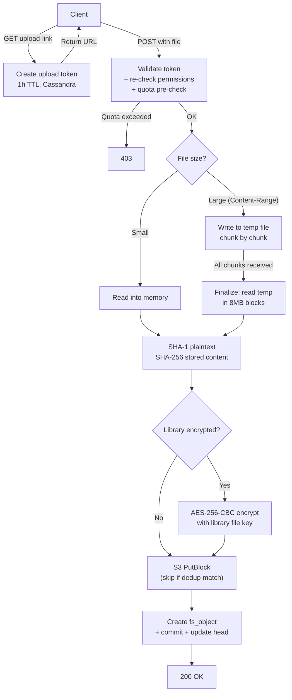
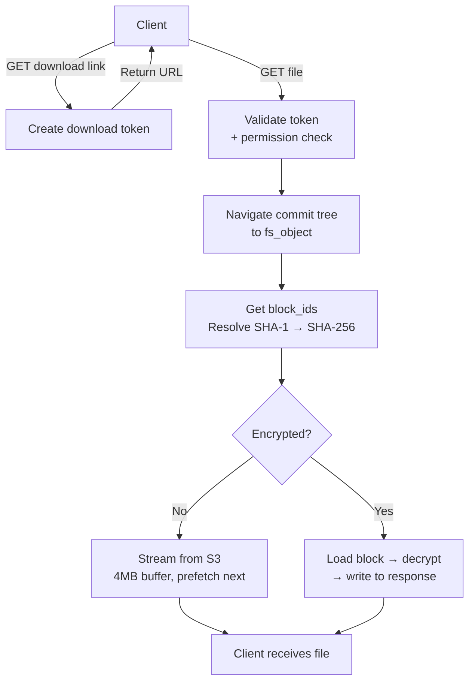

# Upload & Download Analysis

**Date:** 2026-04-14
**Scope:** All upload and download code paths — web UI, Seafile sync, mobile API,
share links, ZIP downloads, and Range requests.

---

## How uploads work

### Step 1: Get an upload token

```
GET /api2/repos/{repo_id}/upload-link/?p=/target/dir
Authorization: Token {user-token}

Response: "https://server/seafhttp/upload-api/{32-char-token}"
```

The server creates a random 16-byte token stored in Cassandra with a 1-hour TTL.
The token encodes: org_id, repo_id, target path, user_id, source (web/link).

**Checks at this step:**
- User authenticated
- User has write permission + upload flag on the library
- If library is encrypted: decrypt session must be active

### Step 2: Upload the file

```
POST /seafhttp/upload-api/{token}
Content-Type: multipart/form-data

file=@myfile.txt
parent_dir=/target/dir
```

**Checks at this step (re-validated):**
- Token exists and hasn't expired
- User still has write permission
- Storage quota not exceeded (checked BEFORE reading body — fail fast)
- Traffic quota not exceeded

**Two paths depending on file size:**

#### Small files (single request, no Content-Range)

```
Client → [full file in multipart form] → Server
Server:
  1. Read file into memory
  2. SHA-1(plaintext) → block ID for fs_object
  3. If encrypted: AES-256-CBC encrypt with library's file key
  4. SHA-256(stored content) → S3 storage key
  5. Store block in S3 (if not already there — dedup)
  6. Create block ID mapping (SHA-1 ↔ SHA-256)
  7. Increment block ref_count via LWT
  8. Create fs_object with block_ids list
  9. Add to parent directory, create commit
  10. Update library head
```

#### Large files (chunked, Content-Range header)

```
Client → [chunk 1: bytes 0-8388607] → Server (writes to temp file)
Client → [chunk 2: bytes 8388608-16777215] → Server (appends to temp file)
...
Client → [final chunk] → Server (temp file complete)

Server finalization:
  1. Read temp file in 8MB blocks
  2. For each block: SHA-1, encrypt (if needed), SHA-256, store in S3
  3. Accumulate block_ids list
  4. Create fs_object, commit, update library head
  5. Delete temp file
```

**Temp file location:** `/tmp/sesamefs_upload_{token}_{filename}`
**Temp file permissions:** 0600 (owner only)
**Temp file cleanup:** Explicit on success. On failure/crash: **left on disk** (no cleanup job).

### Upload flow diagram



---

## How downloads work

### Step 1: Get a download link

```
GET /api2/repos/{repo_id}/file/?p=/path/to/file
Authorization: Token {user-token}

Response: "https://server/seafhttp/files/{32-char-token}/filename.txt"
```

Same token pattern as upload: random 16-byte, 1h TTL, encodes org/repo/path/user.

**Checks:** Auth, read permission, download flag, decrypt session (if encrypted).

### Step 2: Fetch the file

```
GET /seafhttp/files/{token}/filename.txt
```

**Server flow:**
1. Validate token (type = download)
2. Re-check read permission
3. Navigate commit tree to find file's fs_object
4. Get block_ids from fs_object
5. Resolve SHA-1 → SHA-256 via mapping table
6. Stream blocks from S3 one at a time

### Download streaming (memory-efficient)

```
Block 0: [prefetch from S3] → [write to HTTP response] → [start prefetch block 1]
Block 1: [prefetch from S3] → [write to HTTP response] → [start prefetch block 2]
...
```

**Memory usage:** O(2 blocks) — one being written, one being prefetched.
Uses a pooled 4MB copy buffer for unencrypted blocks.

For **encrypted libraries**: each block is loaded fully into memory, decrypted,
then written. Memory = O(1 block) per block, typically 8–16 MB.

### Download flow diagram



---

## Range requests (video/audio seeking)

For video and audio files, the server supports HTTP 206 Partial Content via
`BlockReadSeeker`:

1. Client sends `Range: bytes=1000000-2000000`
2. Server builds an index of cumulative block offsets
3. Binary search to find which block contains byte 1,000,000
4. Load that one block, seek within it, stream from there
5. **Memory: O(1 block)** — only the needed block is in RAM

For encrypted files: the entire block must be decrypted before seeking within it.
Can't seek within an encrypted block.

---

## Share link downloads (public, no auth)

```
GET /d/{share-token}/files/?p=/filename&dl=1
```

No user authentication needed. The share link token grants implicit read permission.
Traffic is counted against the share link **creator** (not the downloader).

Same block-streaming logic as regular downloads. Supports Range requests for video.

---

## ZIP directory downloads

```
GET /seafhttp/zip/{token}
```

Recursively adds all files in a directory to a ZIP archive streamed to the client.

**Limits (configurable):**
- Max files: 100,000
- Max depth: 64 levels
- Max uncompressed size: 10 GB

Uses `zip.Store` (no compression) for maximum throughput. Encrypted blocks are
decrypted during ZIP creation.

---

## Cleanup scenarios

| Scenario | What happens | When | Risk |
|----------|-------------|------|------|
| Upload succeeds | Temp file deleted, blocks in S3 | Immediate | None |
| Upload fails mid-chunk | Temp file left on disk | Until manual cleanup | Disk leak |
| Client abandons chunked upload | Temp file persists, token expires in 1h | Token expires | Disk leak |
| Permission revoked during upload | Upload completes (token still valid) | Token TTL | 1h window |
| Decrypt session expires mid-download | Prefetched blocks use captured key; new blocks fail | During stream | Partial file |
| S3 unavailable during download | HTTP 500 to client | Immediate | Retry needed |
| Network drop during download | Partial file received | Immediate | Client retries |

---

## Edge cases and known issues

1. **Zombie temp files:** Chunked uploads that never complete leave files in `/tmp`.
   No server-side cleanup job exists. Recommendation: add a periodic sweeper for
   files older than token TTL (1h).

2. **Dedup doesn't save bandwidth:** If a block already exists in S3, the upload
   still transfers the full content over the network before checking. The dedup
   check only saves S3 storage, not network bandwidth. For network savings, use
   the check-blocks endpoint first (Seafile sync protocol does this).

3. **Encrypted file Content-Length:** Omitted for encrypted files because the
   decrypted size may differ from stored size. Clients can't show progress bars.

4. **No upload resume after token expiry:** If a chunked upload takes >1h, the
   token expires. The temp file is orphaned. Client must restart from scratch.

---

## Memory usage summary

| Operation | Max RAM | Notes |
|-----------|---------|-------|
| Small file upload | File size | Read fully into memory |
| Chunked upload (receiving) | ~8 MB | Per chunk, written to disk |
| Chunked upload (finalizing) | ~8 MB | Processes temp file in 8MB blocks |
| File download (unencrypted) | ~8 MB | 4MB buffer + 1 prefetched block |
| File download (encrypted) | ~32 MB | 2 blocks in flight (decrypt requires full block) |
| Range request | ~16 MB | 1 block loaded for seeking |
| ZIP download | ~16 MB | 1 block at a time per file |
