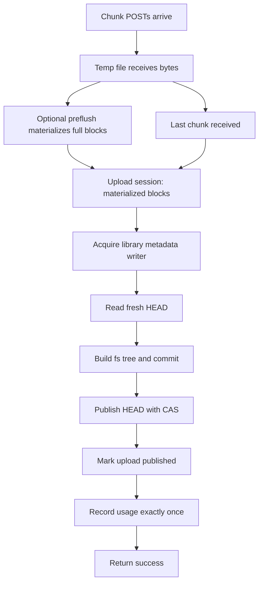

# Upload Performance PR 58 Audit

**Status:** Do not merge as-is
**Audit date:** 2026-05-13
**Branch audited:** `feat/uploadperformance`
**Base:** `origin/main` at `50a8346a`
**Related origin document:** [UPLOAD-S3-RELAY-BOTTLENECK.md](./UPLOAD-S3-RELAY-BOTTLENECK.md)

---

## Executive Summary

PR 58 started from a valid problem: browser uploads reach 100% while the API
server still has to push the assembled file to object storage and publish file
metadata. The branch proved several useful ideas, especially async preflush of
completed chunk blocks and better staging visibility. It also exposed a deeper
reliability problem: upload finalization is not just an S3 bottleneck. It is a
metadata serialization problem.

The current branch should not be merged as a production fix. It is valuable as
research, tests, and design evidence, but it mixes a latency optimization with a
large reliability refactor and still leaves users exposed to `failed to finalize
upload` under concurrent finalization bursts.

The most important lesson is:

> Upload bytes can be parallelized, but library metadata publication must be
> serialized per library, or rebuilt as a durable write pipeline with explicit
> conflict resolution.

The retry added in the current working diff (`uploadHeadConflictRetries = 3`)
does not make the design reliable. It only reduces the probability of failure
under small contention. With many files finishing near the same time, several
finalizers can still exhaust retries after repeatedly preparing commits from
stale HEAD values.

---

## What PR 58 Implemented

### 1. Root analysis document

The branch added [UPLOAD-S3-RELAY-BOTTLENECK.md](./UPLOAD-S3-RELAY-BOTTLENECK.md),
which correctly identified the first visible symptom:

- The UI progress bar reaches 100% when browser-to-API transfer is done.
- The final HTTP request stays open while the API server pushes blocks to S3.
- Total user wait time is roughly ingress time plus API-to-S3 egress time.
- The existing API node is a store-and-forward relay.

This analysis is still useful. It explains the "100% but still saving" symptom,
but it does not fully explain the later `failed to finalize upload` failures
seen under concurrent large uploads.

### 2. Chunk temp-file hardening

The branch expanded `ChunkUpload` and `ChunkManager` in
`internal/api/seafhttp.go`:

- `AttemptID` is included in temp filenames so cleanup from an older upload
  attempt cannot delete a recreated upload with the same token and filename.
- `WriteChunkFromReader` streams chunk bodies directly to the temp file instead
  of requiring full in-memory reads.
- `TryStartFinalization` prevents more than one finalizer from running for the
  same upload attempt.
- `ResetFinalization` lets a failed finalizer allow a later client retry.
- The janitor cleans stale trackers and disk orphans.
- Cleanup waits for in-flight preflush workers before deleting temp files.

Useful lesson: per-attempt identity is necessary. Token plus filename is not
enough once retry, cleanup, and upload-link reuse are allowed.

### 3. Async preflush of contiguous chunk blocks

The branch added a preflush path:

- After each chunk write, completed contiguous 8 MiB blocks can be read from
  the temp file and uploaded to object storage before the final chunk arrives.
- `NextFlushableContiguousBlock` reserves preflush indexes so parallel chunk
  handlers do not race on the same block.
- `preflushGlobalConcurrency = 8` bounds detached work per process.
- `preflushPerUploadConcurrency = 1` prevents one large upload from consuming
  the whole global budget.
- Finalize calls `ResolvePreflushedBlock` and waits for in-flight preflush
  metadata before deciding whether to reuse or upload a block.

This is one of the best parts of the branch. It attacks the original latency
problem without changing the client protocol.

Important limitation: preflush reduces the amount of S3 work left for the last
chunk, but it does not solve HEAD conflicts or commit serialization.

### 4. Upload staging schema and state machine

The branch added `internal/api/upload_staging.go` and migration
`003_upload_staging.cql`:

- `upload_sessions`
- `upload_sessions_by_state`
- `upload_session_blocks`
- `upload_session_blocks_by_sha256`
- `upload_block_promotions`

The modeled session states include:

- `receiving`
- `promoting`
- `closed`
- `cleanup_pending`
- `aborted`

Block states include:

- `registered`
- `preflushed`
- `uploaded`
- `promoted`
- `cleanup_pending`
- `cleaned`

Useful lesson: durable upload state is the right direction. Without it, the
system cannot distinguish "client retry after success", "server crashed after
S3 PUT", "promotion partially applied", and "upload abandoned".

Main concern: the state model ties block promotion markers to a specific commit.
That makes HEAD conflict recovery expensive and brittle because the same blocks
may be rolled back and re-promoted when a rebase creates a new commit.

### 5. Block materialization and promotion

The branch separates object storage materialization from canonical block
refcount promotion:

- Blocks are uploaded by SHA-256 internal ID.
- Forward SHA-1 to SHA-256 mapping is critical for download compatibility.
- Reverse mapping and some metadata writes are treated as best effort.
- S3 orphan rows are recorded when a block is uploaded but cannot be mapped.
- Block refcounts are incremented later via `IncrementOrCreateBlockOnce`.
- Promotion markers attempt to make block refcount changes retry-safe.

This separation is conceptually good. It prevents staged blocks from appearing
as canonical live blocks before the commit is ready.

Risk: promotion currently happens before HEAD publication. If HEAD publication
fails, the branch rolls promoted blocks back. That rollback path is complicated,
adds more LWT pressure during failure, and creates hard-to-reason-about crash
windows.

### 6. Prepared commit and CAS HEAD publication

The upload path now prepares a commit first and publishes it separately:

- `prepareUploadedFileCommit`
- `prepareUploadedFileCommitMultiBlock`
- `publishPreparedUpload`
- `UpdateLibraryHeadWithExpected`

`UpdateLibraryHeadWithExpected` uses Cassandra LWT:

```sql
UPDATE libraries
SET head_commit_id = ?, size_bytes = ?, file_count = ?, updated_at = ?
WHERE org_id = ? AND library_id = ?
IF head_commit_id = ?
```

This prevents silent lost updates. That is good.

It also exposes the actual production conflict: many concurrent uploads can
prepare commits from the same old HEAD. Cassandra correctly lets one commit win
and rejects the others.

The current local diff adds `publishPreparedUploadWithHeadRetry`, which retries
on `LibraryHeadConflictError` by preparing a new commit against the fresh HEAD.
This improves small races but is not reliable under bursts. If 17 files reach
finalize together, they can form repeated conflict waves. A fixed retry count
cannot provide a correctness guarantee.

### 7. Recovery and cleanup

The branch added recovery helpers:

- `recoverPreparedUploadIfPossible`
- `recoverPromotingUploadSession`
- `recoverPromotingUploadsForOrg`
- `cleanupPendingUploadSession`
- `cleanupPendingUploadsForOrg`

Good ideas:

- Closed sessions can be recognized as already successful.
- Promoting sessions with applied block markers can be republished.
- `cleanup_pending` sessions can roll back promoted refs and delete unpromoted
  staged blocks.
- Cleanup checks whether another active upload still owns the same staged
  block before deleting it.

Concerns:

- Recovery is best-effort and request-triggered in parts of the flow.
- Durable cleanup exists but is not a complete independent service with clear
  leases and backoff.
- Sessions in `cleanup_pending` can accumulate if cleanup depends on storage
  class resolution or object store availability.
- Recovery on HEAD conflict marks sessions cleanup-pending instead of queuing a
  deterministic metadata rebase.

### 8. Library head projection repair

The branch added durable repair tables and worker logic:

- `004_library_head_projection_repairs.cql`
- `library_head_projection_repairs`
- `library_head_projection_repair_orgs_by_bucket`
- `LibraryHeadProjectionRepairWorker`
- `server.library_head_projection_repair_interval`

This solves a real secondary projection risk: canonical `libraries.head_commit_id`
can be updated while `libraries_by_id` or admin read models fail to refresh.

Useful lesson: canonical-first plus durable projection repair is a good pattern.

Concern: this belongs in a separate, smaller PR or should be part of a shared
write model. It is valuable, but it is orthogonal to the upload latency fix and
made PR 58 much harder to review.

### 9. Quota and traffic handling

The branch added shared helpers in `internal/traffic/request_helpers.go` and
contract tests:

- storage quota precheck before reading upload bodies
- upload traffic quota precheck
- chunked uploads use declared `Content-Range` total instead of multipart
  request body length
- checked traffic recording uses the quota period resolved at precheck time
- v2 block upload and seafhttp upload contracts are better aligned

Useful lesson: chunked quota must use declared total size. Per-chunk
`Content-Length` underestimates the eventual upload and allows quota bypass.

Concern: accounting idempotency across upload retry/recovery remains unresolved.
If a publish succeeds but the HTTP response is lost, a retry must not double
record storage or traffic. PR 58 starts to model this but does not close the
problem completely.

### 10. Frontend finalization behavior

The branch includes frontend-side logic in `upload-finalization.js` and the
file uploaders:

- Detect chunks that have transferred bytes but are still waiting for server
  finalize.
- Mark files as finalizing/saving.
- Allow one additional queued upload to start while another file is finalizing.

This improves perceived progress, but it also increases the chance that
multiple files reach finalize together. That is acceptable only if backend
metadata publication is serialized or otherwise made deterministic.

### 11. Integration tests and benchmarks

The branch added many useful tests:

- chunked upload link reuse
- preflush of large revisions
- out-of-order chunk completion
- path-scope validation
- filename path sanitization
- quota contracts
- staged cleanup ownership
- projection repair
- concurrent chunked uploads to same path / same directory in the current
  working diff

The benchmark script also gained optional `docker stats` sampling.
During this audit it was further extended with `--concurrent-size` and
`--concurrent-max-time`, because the previous concurrent phase was hardcoded to
`1MB` and understated the real finalize pressure from large files.

Useful lesson: the tests are valuable, but the concurrency coverage is still too
small. Passing 2 or 3 concurrent uploads does not prove safety for the UI case
where many files complete together.

---

## Root Cause of `failed to finalize upload`

The screenshots show many files failing in finalization after upload bytes were
already sent. The failure is consistent with HEAD publication contention:

1. Several files upload chunks successfully.
2. Preflush/finalize materializes blocks.
3. Each finalizer reads the current library HEAD.
4. Each finalizer creates a commit whose parent is that HEAD.
5. One finalizer publishes HEAD successfully.
6. The others fail CAS because HEAD changed.
7. A fixed retry count may help a few, but under a burst some continue losing
   the race and surface `failed to finalize upload`.

This is not a frontend retry problem. It is not fully an S3 throughput problem.
It is a write serialization problem for repository metadata.

The correct invariant should be:

> For each library, metadata-changing operations must be applied in a total
> order, and every accepted upload must either publish exactly once or remain in
> a durable state that a worker can safely finish.

PR 58 does not provide that invariant.

---

## Current Workspace Revalidation

The current workspace diff adds a local mitigation in
`internal/api/seafhttp.go`:

- `uploadHeadConflictRetries = 3`
- `publishPreparedUploadWithHeadRetry(...)`

That mitigation matters, but it does not change the merge decision.

What it proves:

- the `failed to finalize upload` error was reproducible as a library HEAD CAS
  conflict during finalization
- reparing a commit against a fresh HEAD can rescue small conflict bursts
- the current local integration tests for same-path and same-directory
  concurrent chunked uploads can pass with this retry in place

What it does not prove:

- reliability for many files finishing together in the real upload dialog
- a correctness guarantee across repeated conflict waves
- bounded CPU and memory cost under high concurrent finalize load

This is why the report still says `Do not merge as-is` even after the local
retry fix.

---

## Local Performance Characterization

Environment notes:

- measurements were taken against the local Docker Compose stack on one Windows
  workstation using `http://localhost:3000`
- container resource numbers come from `docker stats` sampled every `0.5s`
- results are useful for directionality and hotspot identification, not as a
  production capacity claim

### Transfer timings observed locally

| Scenario | Result |
| --- | --- |
| Single upload 32MB | 617ms, about 414.9 Mbps |
| Single upload 100MB | 1460ms, about 547.9 Mbps |
| Concurrent 32MB uploads x1 | 328ms total, about 780.5 Mbps aggregate |
| Concurrent 32MB uploads x4 | 844ms total, about 1213.3 Mbps aggregate |
| Concurrent 32MB uploads x8 | 1261ms total, about 1624.1 Mbps aggregate |
| Concurrent 32MB uploads x12 | 1693ms total, about 1814.5 Mbps aggregate |
| Concurrent 32MB uploads x20 | 3573ms total, about 1433.0 Mbps aggregate |
| Concurrent 100MB uploads x1 | 617ms total, about 1296.6 Mbps aggregate |
| Concurrent 100MB uploads x2 | 961ms total, about 1664.9 Mbps aggregate |
| Concurrent 100MB uploads x4 | 1405ms total, about 2277.6 Mbps aggregate |

### Resource peaks observed locally

For the `32MB` matrix (`1/4/8/12` concurrent uploads):

- `sesamefs`: peak `630%` CPU, peak `2.2 GiB` memory
- `cassandra`: peak `381%` CPU, peak `1.3 GiB` memory
- `minio`: peak `127%` CPU, peak `164 MiB` memory

For the `100MB` matrix (`1/2/4` concurrent uploads):

- `sesamefs`: peak `241%` CPU, peak `2.2 GiB` memory
- `cassandra`: peak `53%` CPU, peak `1.3 GiB` memory
- `minio`: peak `103%` CPU, peak `275 MiB` memory

For the `20 x 32MB` stress run:

- `sesamefs`: peak `1010%` CPU, peak `4.5 GiB` memory
- `cassandra`: peak `549%` CPU, peak `1.2 GiB` memory
- `minio`: peak memory stayed below `300 MiB` in sampled output

What these measurements support:

- the dominant hot path under concurrent finalize load is the API server plus
  metadata store, not only object storage
- throughput scales at first, but the `20 x 32MB` run shows diminishing returns
  while CPU and memory increase sharply
- this matches the report's main claim that the branch is not just fighting an
  S3 relay problem; it is also fighting metadata publication contention

---

## Documentation Drift Inside This Branch

Some branch documents still read like a closeout or green-light signal, for
example:

- `docs/CHANGELOG.md` (`Upload Performance Phase 1 closeout`)
- `docs/TESTING.md` (`Upload Phase 1 Closeout Checks`)
- `docs/KNOWN_ISSUES.md` references to the same closeout package

Those documents should not be used as merge evidence. The current audit and the
local reproduction data are the more trustworthy source for branch safety.

---

## What We Should Keep

### Keep as design inputs

- The original bottleneck analysis in `UPLOAD-S3-RELAY-BOTTLENECK.md`.
- The observation that UI progress and server finalization are separate phases.
- The need to expose "Saving..." or "Finalizing..." rather than pretending 100%
  means the file is visible.
- The split between staged object materialization and canonical metadata.
- Per-attempt upload IDs.
- Path-scope validation for `parent_dir` and `relative_path`.
- Multipart filename sanitization.
- Fail-closed encryption-state lookup.
- Quota precheck using `Content-Range` total.
- Canonical-head CAS instead of unconditional HEAD overwrite.
- Durable secondary projection repair, as an independent pattern.
- Tests for chunked upload link reuse, out-of-order chunking, and byte-equal
  download verification.
- The benchmark script's optional container stats sampling.

### Keep with redesign

- Async preflush: keep the idea, but treat it as an optimization under a stable
  finalization state machine.
- Upload staging tables: keep the concept, but revise states and markers so
  block materialization and metadata commit are not tangled.
- Promotion markers: keep idempotent markers, but do not key promotion safety to
  a transient commit ID that changes during metadata rebase.
- Cleanup/recovery: keep durable cleanup, but move it into an explicit worker
  with leases, backoff, metrics, and clear terminal states.

---

## What We Should Avoid

- Do not merge PR 58 as-is.
- Do not treat a fixed retry count as reliability.
- Do not hold upload bytes hostage to a commit race that the server knows how
  to serialize.
- Do not roll back and re-promote the same block refs on every HEAD conflict.
- Do not mix upload latency optimization, quota policy, projection repair,
  batch move fixes, and config changes in one production PR.
- Do not use passing low-concurrency integration tests as proof for real upload
  dialog behavior with many files.
- Do not let frontend "start one more while finalizing" increase backend
  finalize concurrency unless the backend has a deterministic commit writer.
- Do not rely on request-triggered recovery as the only recovery mechanism.
- Do not delete staged blocks without checking active staged owners and live
  block metadata.

---

## Recommended New Branch From `main`

Create a clean branch from `main`. Do not continue piling changes onto PR 58.

### Phase 0: Characterization only

Bring over only tests and docs that describe the problem:

- upload-link chunked large file regression
- upload-link reuse regression
- out-of-order chunk regression
- 20-file concurrent finalization regression
- same-directory concurrent upload regression
- same-path concurrent upload regression
- benchmark script resource sampling if desired

Do not bring over the full staging implementation yet.

Acceptance criteria:

- Tests fail on `main` in the expected way, or are marked as characterization
  with clear current behavior.
- The 20-file test must assert zero finalize failures and all files visible.

### Phase 1: Per-library metadata write coordinator

Implement the smallest safe fix first:

- Introduce a `LibraryWriteCoordinator`.
- Serialize only the metadata phase per `(org_id, repo_id)`.
- Do not serialize chunk ingress or S3/object-store upload work.
- Critical section:
  - read fresh HEAD
  - build tree from fresh HEAD
  - create commit
  - publish HEAD
  - close upload session / return visible result

For single process, an in-memory keyed mutex is enough as a first local proof.
For production with multiple API replicas, use a Cassandra-backed lease/LWT or
ensure one writer instance per library. The production design must explicitly
state which one is used.

Acceptance criteria:

- 20-50 concurrent uploads to the same library complete without finalize errors.
- No lost files in directory listing.
- Same-path behavior is deterministic: either last-writer-wins or autorename,
  matching the request's `replace` semantics.

### Phase 2: Durable finalization state

Add a smaller staging model than PR 58:

- `receiving`
- `materialized`
- `committing`
- `published`
- `cleanup_pending`
- `aborted`

Important rule:

> Once upload-owned blocks are materialized and safely recorded, a HEAD conflict
> must rebase metadata, not roll back the blocks.

Acceptance criteria:

- Server crash after S3 PUT can be recovered.
- Server crash after commit create but before HEAD publish can be recovered.
- Server crash after HEAD publish but before HTTP response does not duplicate
  traffic/storage accounting on retry.

### Phase 3: Async preflush as optimization

Only after Phase 1 and 2 are stable:

- Reintroduce preflush of contiguous full blocks.
- Keep bounded concurrency.
- Keep fail-closed encryption checks.
- Add metrics:
  - preflush blocks attempted
  - preflush blocks reused by finalize
  - preflush failures
  - finalization wait time
  - HEAD conflict count
  - metadata queue wait time

Acceptance criteria:

- Latency improves measurably.
- Reliability tests remain green under stress.
- Disabling preflush leaves correctness unchanged.

### Phase 4: Projection repair as separate PR

Durable projection repair is valuable but should be separated:

- canonical `libraries` head remains source of truth
- `libraries_by_id` and admin read models are repaired from canonical state
- worker lifecycle is explicit
- repair backlog metrics are visible

Acceptance criteria:

- Projection failure does not fail an already-published canonical commit.
- Repair worker rebuilds stale projections.
- Tests isolate projection repair from upload finalization.

---

## Proposed Minimal Architecture



The key difference from PR 58: HEAD conflict is handled inside a serialized
metadata writer or durable queue. The user request should not participate in a
best-effort retry race.

---

## Test Plan For The New Branch

Minimum tests before merge:

- `TestChunkedUploadLargeFileByteEqual`
- `TestChunkedUploadOutOfOrderCompletesWhenGapFills`
- `TestUploadLinkReuseCreatesMultipleRevisions`
- `TestConcurrentChunkedUploadsInSameDirectoryPublishAllFiles_20`
- `TestConcurrentChunkedUploadsToSamePathKeepWholeRevision_20`
- crash/recovery simulation after block materialization
- crash/recovery simulation after commit creation
- duplicate client retry after success response loss
- encrypted library transient DB failure must fail closed
- quota precheck with `Content-Range` total
- no double traffic accounting after retry/recovery

Operational checks:

- expose finalize error reason in logs with stable codes
- count HEAD conflicts
- count metadata coordinator queue time
- count cleanup_pending sessions
- count staged bytes by org/repo
- alert on nonzero stale `cleanup_pending` age

---

## Verification Performed During Audit

Commands run locally during this audit:

```bash
go test ./internal/api
go test ./internal/api/v2
go test -tags integration ./internal/integration -run "TestConcurrentChunkedUploads(ToSamePathKeepWholeRevision|InSameDirectoryPublishAllFiles)" -count=1
bash -n docs/benchmarks/benchmark-upload-download.sh
bash docs/benchmarks/benchmark-upload-download.sh --host http://localhost:3000 --token dev-token-admin --repo <temp_repo> --sizes '32 100' --concurrency '1 4 8 12' --concurrent-size 32 --concurrent-max-time 900 --stats-interval 0.5
bash docs/benchmarks/benchmark-upload-download.sh --host http://localhost:3000 --token dev-token-admin --repo <temp_repo> --sizes '100' --concurrency '1 2 4' --concurrent-size 100 --concurrent-max-time 1800 --stats-interval 0.5
bash docs/benchmarks/benchmark-upload-download.sh --host http://localhost:3000 --token dev-token-admin --repo <temp_repo> --sizes '32' --concurrency '20' --concurrent-size 32 --concurrent-max-time 1200 --stats-interval 0.5
```

The integration tests passed after using a workspace-local Go cache on Windows.
The benchmark script syntax check and local benchmark runs also completed
successfully.

This validation only proves that the current code is internally consistent for
the covered cases. It does not prove production reliability for many concurrent
finalizers.

---

## Final Decision

Use PR 58 as research, not as the production branch.

The best path is:

1. Preserve this audit and the original bottleneck analysis.
2. Start a new branch from `main`.
3. Bring over only selected tests/docs first.
4. Implement per-library metadata serialization before reintroducing preflush.
5. Re-add preflush only after correctness is proven under stress.

The valuable lesson is not "preflush is bad". The lesson is that performance
work exposed a missing write-ordering guarantee. Fix the ordering guarantee
first; then optimize upload latency on top of it.
