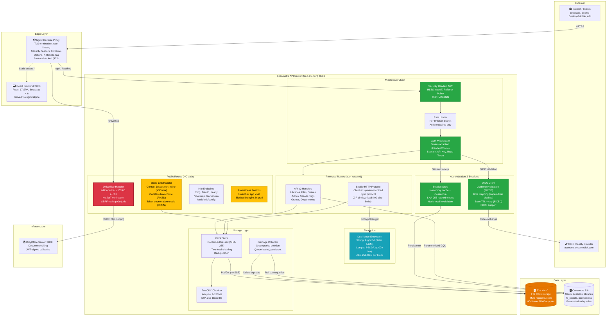

# SesameFS Architecture Overview

### Legend

| Color | Meaning |
|-------|---------|
| Red | Critical vulnerability (must fix) |
| Orange | Security gap (should fix) |
| Yellow | Medium concern |
| Green | Security control working correctly |
| Blue | Encryption / crypto module |
