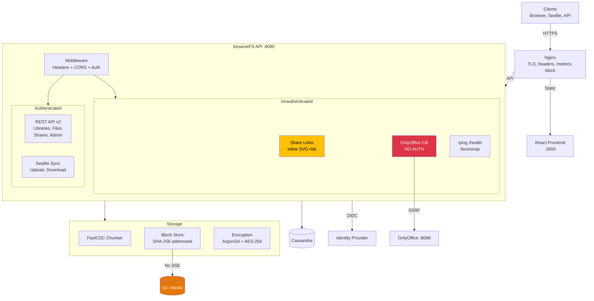

# SesameFS Architecture Overview

## System Components

## Legend

| Color | Meaning |
|-------|---------|
| Red | Critical vulnerability |
| Orange | Security gap |
| Yellow | Medium concern |
| Default | Normal component |
