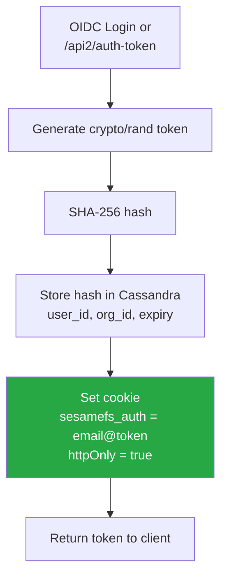
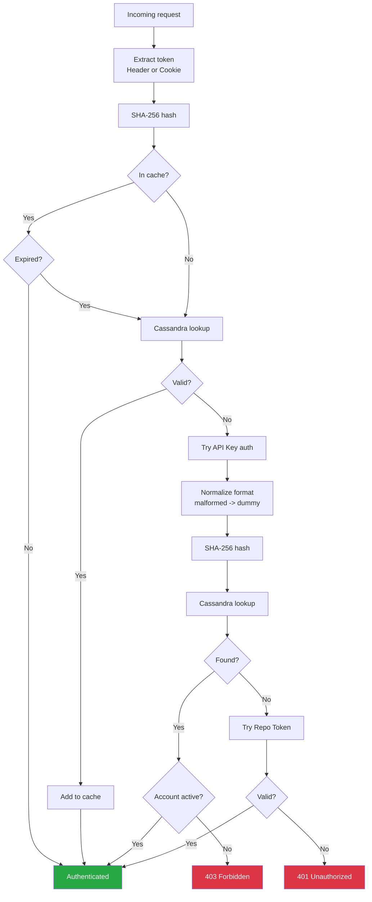
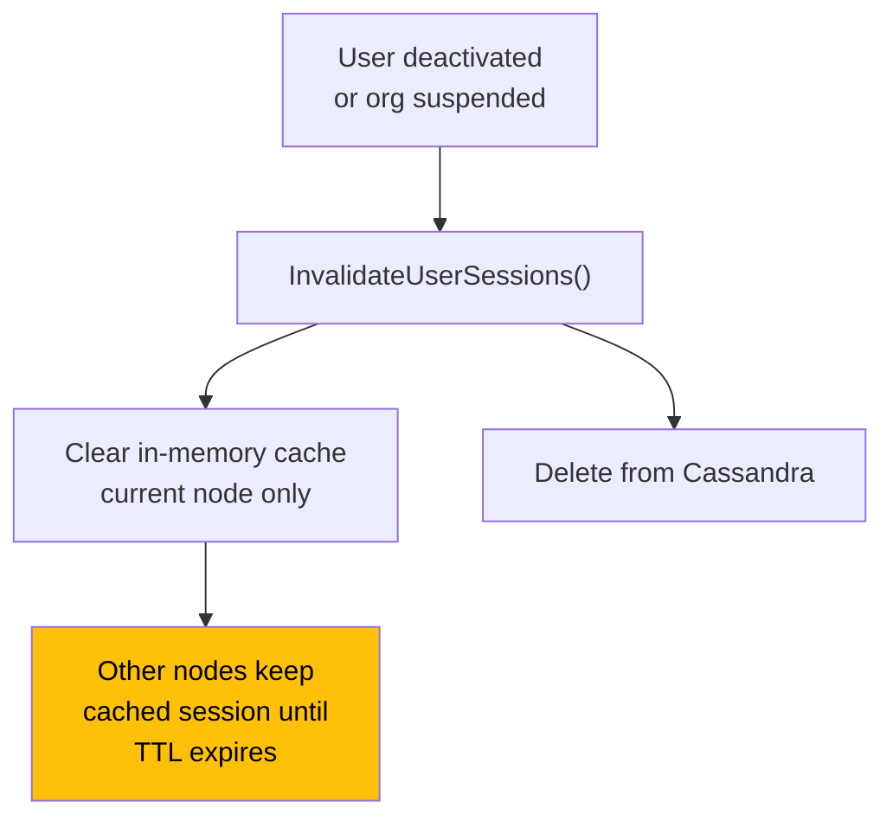
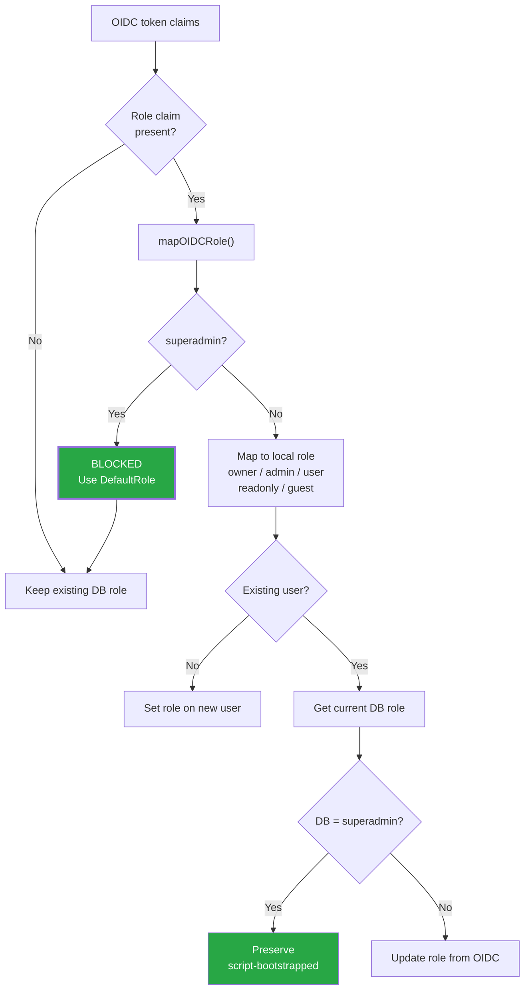
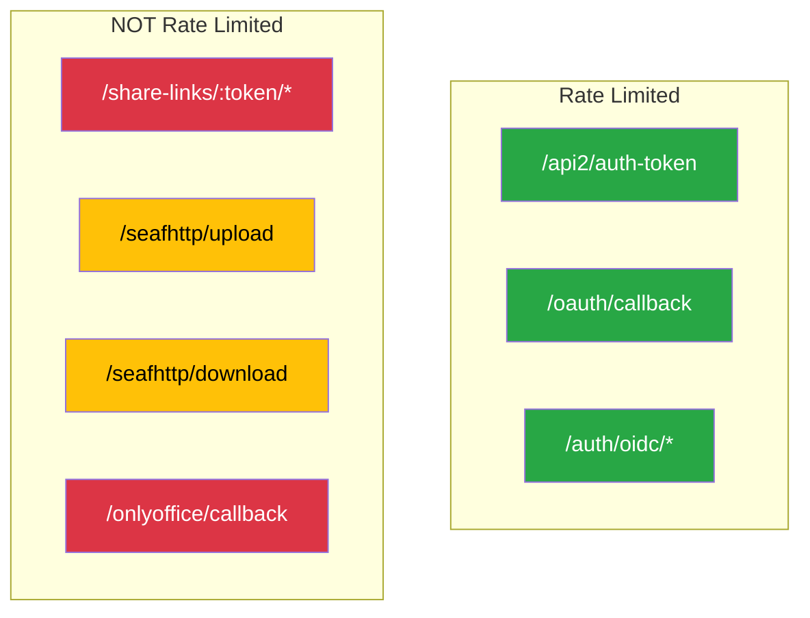

# SesameFS Authentication Layer

> How to read: Each section below is a separate stage of the auth lifecycle. Green = secure outcome, red = rejection, yellow = a gap or concern that needs attention. Diamonds are decision points.

### How to read colors

| Color | Meaning |
|-------|---------|
| **Red** | Auth rejection or critical finding |
| **Yellow** | Security gap (e.g. cookie without httpOnly, node-local invalidation) |
| **Green** | Secure outcome or working control |

---

## Token Creation

**Fixed (`ISSUE-SESSION-COOKIE-NOT-HTTPONLY-01`):** The `sesamefs_auth` cookie is now set with
`httpOnly=true`, so JavaScript (and any XSS) can no longer read it. No code in this repository
was found reading its value from JS; the desktop-client SSO flow gets its token via polling,
not by reading this cookie.

---

## Token Validation

**How it works:** Each request tries session lookup first, then API key, then repo token. API keys use normalized timing to prevent oracle attacks. Account status is enforced on every auth path.

---

## Session Invalidation

**Key issue:** Invalidation only clears the current node's cache. In a multi-node deployment, other nodes will keep serving the revoked session until their cache TTL expires (finding M-7).

---

## OIDC Role Mapping

**Key fix since v1:** `superadmin` / `super_admin` / `platform_admin` claims from OIDC are now explicitly blocked and downgraded. Superadmin can only be set via a manual script in the database.

---

## Rate Limiting Coverage

**Key issue:** Rate limiting is only applied to auth endpoints. Upload, download, share-link enumeration, and the OnlyOffice callback have no rate limiting at all.

