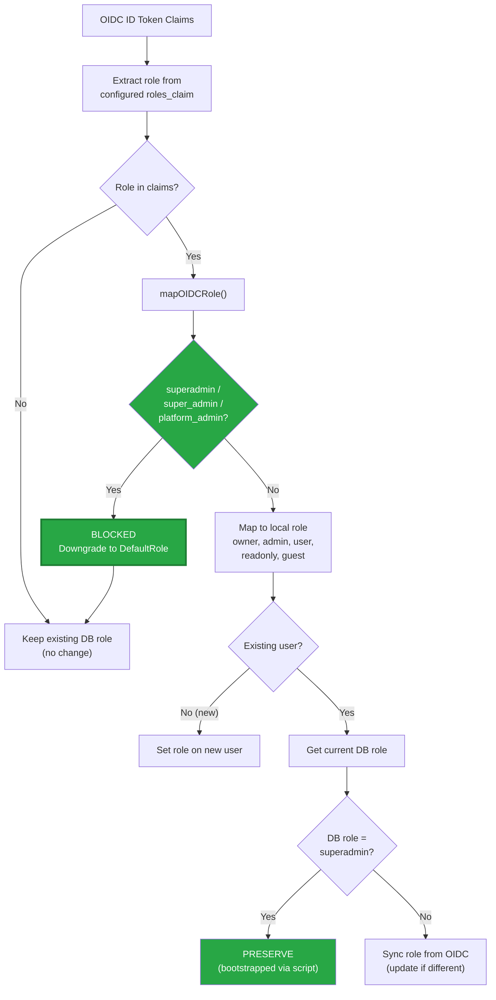
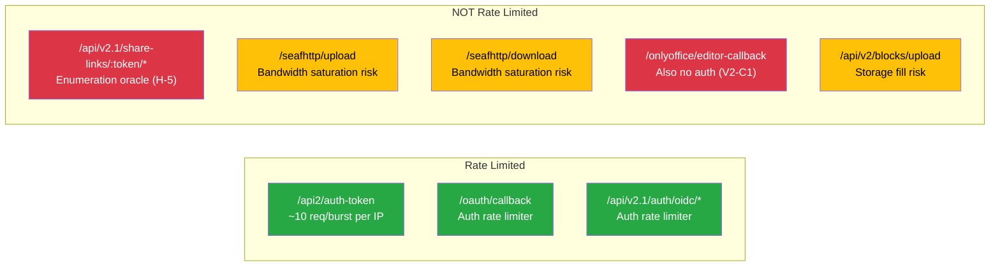

# SesameFS Authentication Layer

## Token Lifecycle

```mermaid
flowchart TD
    subgraph Creation["Token Creation"]
        Login["OIDC Login<br/>or /api2/auth-token"] --> GenToken["Generate crypto/rand token"]
        GenToken --> HashToken["SHA-256(token)"]
        HashToken --> StoreDB["Store hash in Cassandra<br/>+ user_id, org_id, expiry"]
        StoreDB --> SetCookie["Set sesamefs_auth cookie<br/>email@token format<br/>httpOnly=false (XSS risk)"]
        SetCookie --> ReturnToken["Return token to client"]
    end

    subgraph Validation["Token Validation (per request)"]
        IncomingReq["Request with token"] --> ExtractToken["Extract from<br/>Authorization header or cookie"]
        ExtractToken --> HashLookup["SHA-256(token)<br/>lookup in cache"]
        HashLookup --> CacheHit{"Cache hit?"}
        CacheHit -->|"Yes"| CheckTTL{"Within TTL?"}
        CacheHit -->|"No"| DBQuery["Query Cassandra"]
        CheckTTL -->|"Yes"| Valid["Valid session"]
        CheckTTL -->|"No"| Expired["Session expired"]
        DBQuery --> DBFound{"Found + active?"}
        DBFound -->|"Yes"| CacheIt["Cache result"] --> Valid
        DBFound -->|"No"| Invalid["Session invalid"]
    end

    subgraph Invalidation["Session Invalidation"]
        Deactivate["User deactivated<br/>or org suspended"] --> KillSessions["InvalidateUserSessions()"]
        KillSessions --> ClearCache["Clear in-memory cache<br/>(current node only)"]
        KillSessions --> DeleteDB["Delete from Cassandra"]
        ClearCache --> OtherNodes["Other nodes: cache TTL<br/>must expire (M-7)"]
    end

    subgraph APIKeys["API Key Auth"]
        APIKeyReq["Request with API key"] --> NormalizeKey["Normalize format<br/>(malformed -> dummy hash)"]
        NormalizeKey --> HashKey["SHA-256(key)"]
        HashKey --> LookupKey["Cassandra lookup"]
        LookupKey --> KeyFound{"Found?"}
        KeyFound -->|"Yes"| CheckStatus["Enforce account status<br/>(active/deactivated check)"]
        KeyFound -->|"No"| KeyInvalid["401 (timing normalized)"]
        CheckStatus --> KeyValid["Authenticated with scope"]
    end

    style SetCookie fill:#ffc107,color:#000
    style OtherNodes fill:#ffc107,color:#000
    style Valid fill:#28a745,color:#fff
    style KeyValid fill:#28a745,color:#fff
    style Expired fill:#dc3545,color:#fff
    style Invalid fill:#dc3545,color:#fff
    style KeyInvalid fill:#dc3545,color:#fff
```

## OIDC Role Mapping

```mermaid
flowchart TD
    Claims["OIDC ID Token Claims"] --> ExtractRole["Extract role from<br/>configured roles_claim"]

    ExtractRole --> HasRole{"Role in claims?"}
    HasRole -->|"No"| KeepDBRole["Keep existing DB role<br/>(no change)"]
    HasRole -->|"Yes"| MapRole["mapOIDCRole()"]

    MapRole --> IsSuperAdmin{"superadmin /<br/>super_admin /<br/>platform_admin?"}
    IsSuperAdmin -->|"Yes"| BlockEscalation["BLOCKED<br/>Downgrade to DefaultRole"]
    IsSuperAdmin -->|"No"| MapNormal["Map to local role<br/>owner, admin, user,<br/>readonly, guest"]

    MapNormal --> ExistingUser{"Existing user?"}
    ExistingUser -->|"No (new)"| SetRole["Set role on new user"]
    ExistingUser -->|"Yes"| CheckDB["Get current DB role"]

    CheckDB --> DBIsSuperAdmin{"DB role =<br/>superadmin?"}
    DBIsSuperAdmin -->|"Yes"| PreserveSuperAdmin["PRESERVE<br/>(bootstrapped via script)"]
    DBIsSuperAdmin -->|"No"| SyncRole["Sync role from OIDC<br/>(update if different)"]

    BlockEscalation --> KeepDBRole

    style BlockEscalation fill:#28a745,color:#fff,stroke:#1e7e34,stroke-width:3px
    style PreserveSuperAdmin fill:#28a745,color:#fff
    style IsSuperAdmin fill:#28a745,color:#fff
```

## Rate Limiting Coverage

```mermaid
flowchart LR
    subgraph RateLimited["Rate Limited"]
        RL1["/api2/auth-token<br/>~10 req/burst per IP"]
        RL2["/oauth/callback<br/>Auth rate limiter"]
        RL3["/api/v2.1/auth/oidc/*<br/>Auth rate limiter"]
    end

    subgraph NotRateLimited["NOT Rate Limited"]
        NRL1["/api/v2.1/share-links/:token/*<br/>Enumeration oracle (H-5)"]
        NRL2["/seafhttp/upload<br/>Bandwidth saturation risk"]
        NRL3["/seafhttp/download<br/>Bandwidth saturation risk"]
        NRL4["/onlyoffice/editor-callback<br/>Also no auth (V2-C1)"]
        NRL5["/api/v2/blocks/upload<br/>Storage fill risk"]
    end

    style RL1 fill:#28a745,color:#fff
    style RL2 fill:#28a745,color:#fff
    style RL3 fill:#28a745,color:#fff
    style NRL1 fill:#dc3545,color:#fff
    style NRL2 fill:#ffc107,color:#000
    style NRL3 fill:#ffc107,color:#000
    style NRL4 fill:#dc3545,color:#fff
    style NRL5 fill:#ffc107,color:#000
```
