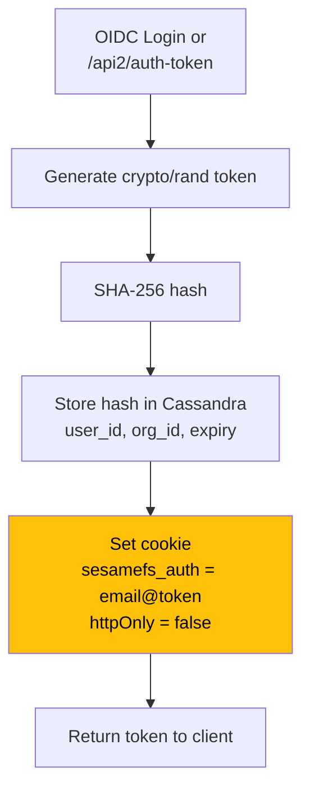
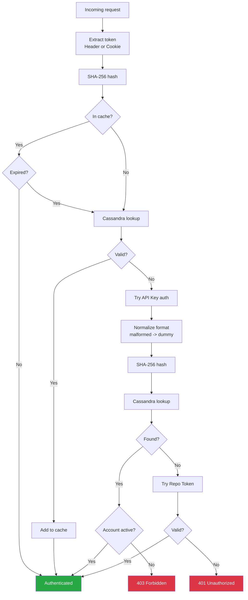
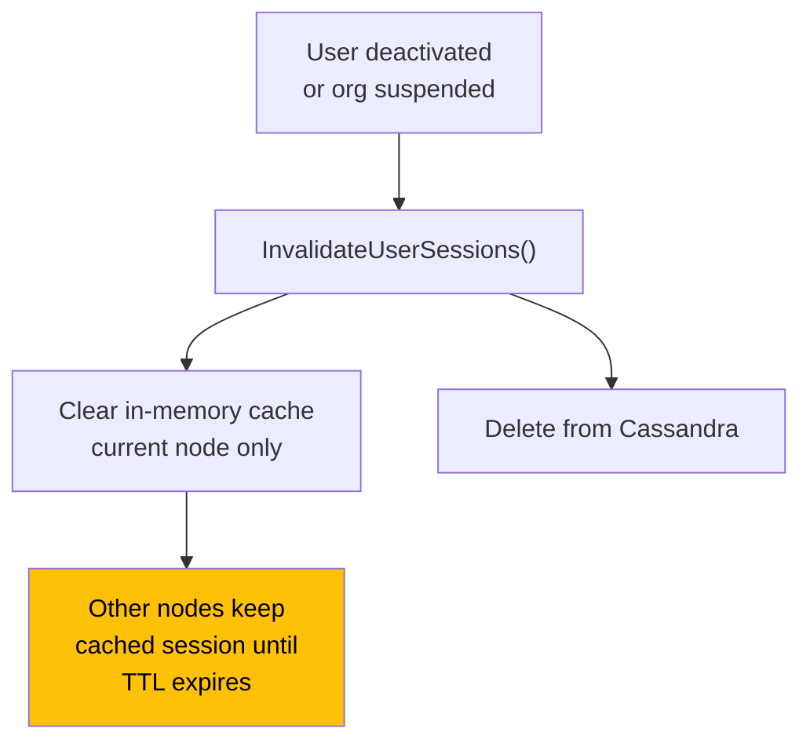
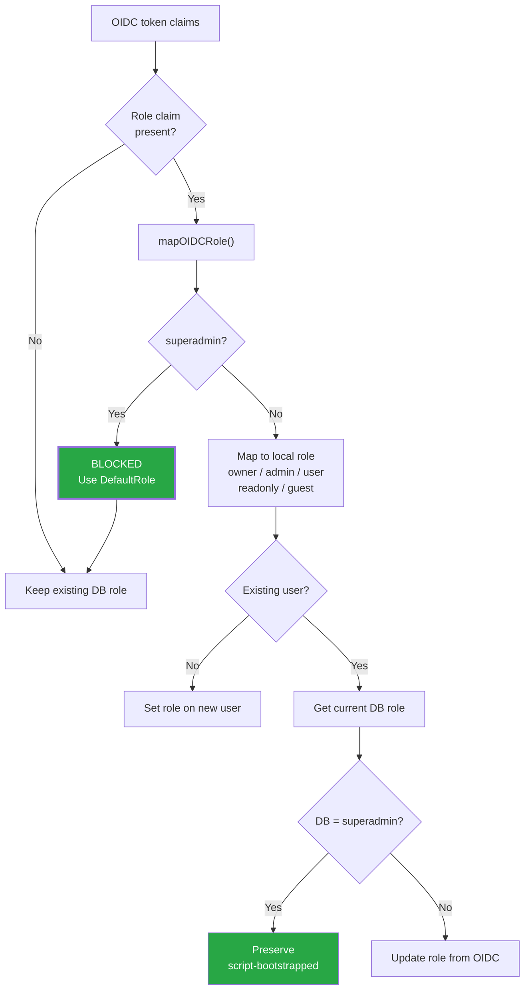
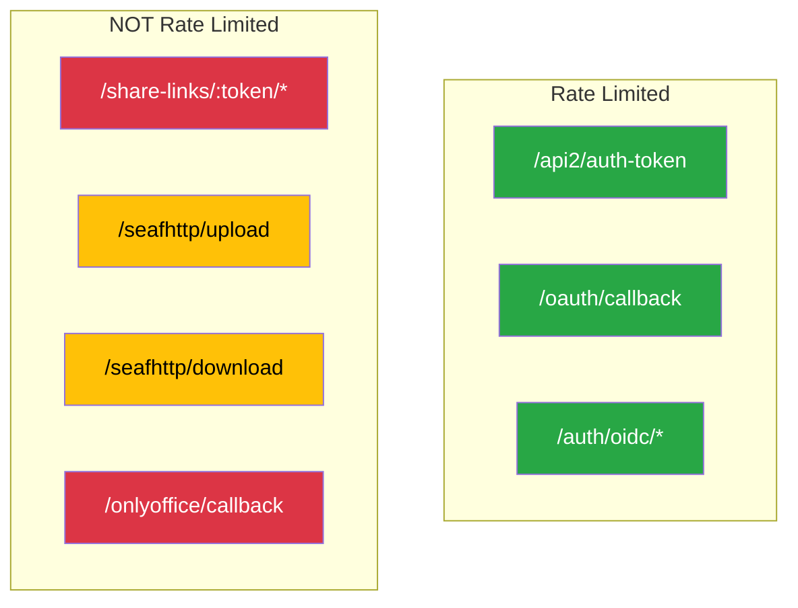

# SesameFS Authentication Layer

## Token Creation

```mermaid
flowchart TD
    Login["OIDC Login or<br/>/api2/auth-token"]
    Login --> GenToken["Generate crypto/rand token"]
    GenToken --> HashToken["SHA-256 hash"]
    HashToken --> StoreDB["Store hash in Cassandra<br/>user_id, org_id, expiry"]
    StoreDB --> SetCookie["Set cookie<br/>sesamefs_auth = email@token<br/>httpOnly = false"]
    SetCookie --> Done["Return token to client"]

    style SetCookie fill:#ffc107,color:#000
```

## Token Validation

```mermaid
flowchart TD
    Req["Incoming request"] --> Extract["Extract token<br/>Header or Cookie"]
    Extract --> Hash["SHA-256 hash"]
    Hash --> Cache{"In cache?"}

    Cache -->|Yes| TTL{"Expired?"}
    TTL -->|No| OK["Authenticated"]
    TTL -->|Yes| DB

    Cache -->|No| DB["Cassandra lookup"]
    DB --> Found{"Valid?"}
    Found -->|Yes| CacheIt["Add to cache"]
    CacheIt --> OK
    Found -->|No| TryKey["Try API Key auth"]

    TryKey --> Normalize["Normalize format<br/>malformed -> dummy"]
    Normalize --> HashKey["SHA-256 hash"]
    HashKey --> LookupKey["Cassandra lookup"]
    LookupKey --> KeyOK{"Found?"}

    KeyOK -->|Yes| Status{"Account active?"}
    Status -->|Yes| OK
    Status -->|No| Reject403["403 Forbidden"]
    KeyOK -->|No| TryRepo["Try Repo Token"]
    TryRepo --> RepoOK{"Valid?"}
    RepoOK -->|Yes| OK
    RepoOK -->|No| Reject401["401 Unauthorized"]

    style OK fill:#28a745,color:#fff
    style Reject401 fill:#dc3545,color:#fff
    style Reject403 fill:#dc3545,color:#fff
```

## Session Invalidation

```mermaid
flowchart TD
    Trigger["User deactivated<br/>or org suspended"]
    Trigger --> Kill["InvalidateUserSessions()"]
    Kill --> ClearLocal["Clear in-memory cache<br/>current node only"]
    Kill --> DeleteDB["Delete from Cassandra"]
    ClearLocal --> Gap["Other nodes keep<br/>cached session until<br/>TTL expires"]

    style Gap fill:#ffc107,color:#000
```

## OIDC Role Mapping

```mermaid
flowchart TD
    Claims["OIDC token claims"]
    Claims --> HasRole{"Role claim<br/>present?"}

    HasRole -->|No| Keep["Keep existing DB role"]

    HasRole -->|Yes| Map["mapOIDCRole()"]
    Map --> Super{"superadmin?"}

    Super -->|Yes| Block["BLOCKED<br/>Use DefaultRole"]
    Super -->|No| Normalize["Map to local role<br/>owner / admin / user<br/>readonly / guest"]

    Normalize --> Existing{"Existing user?"}
    Existing -->|No| SetNew["Set role on new user"]
    Existing -->|Yes| CheckDB["Get current DB role"]

    CheckDB --> DBSuper{"DB = superadmin?"}
    DBSuper -->|Yes| Preserve["Preserve<br/>script-bootstrapped"]
    DBSuper -->|No| Sync["Update role from OIDC"]

    Block --> Keep

    style Block fill:#28a745,color:#fff,stroke-width:3px
    style Preserve fill:#28a745,color:#fff
```

## Rate Limiting Coverage

```mermaid
flowchart TD
    subgraph Protected["Rate Limited"]
        direction LR
        A1["/api2/auth-token"]
        A2["/oauth/callback"]
        A3["/auth/oidc/*"]
    end

    subgraph Unprotected["NOT Rate Limited"]
        direction LR
        B1["/share-links/:token/*"]
        B2["/seafhttp/upload"]
        B3["/seafhttp/download"]
        B4["/onlyoffice/callback"]
    end

    style A1 fill:#28a745,color:#fff
    style A2 fill:#28a745,color:#fff
    style A3 fill:#28a745,color:#fff
    style B1 fill:#dc3545,color:#fff
    style B2 fill:#ffc107,color:#000
    style B3 fill:#ffc107,color:#000
    style B4 fill:#dc3545,color:#fff
```
