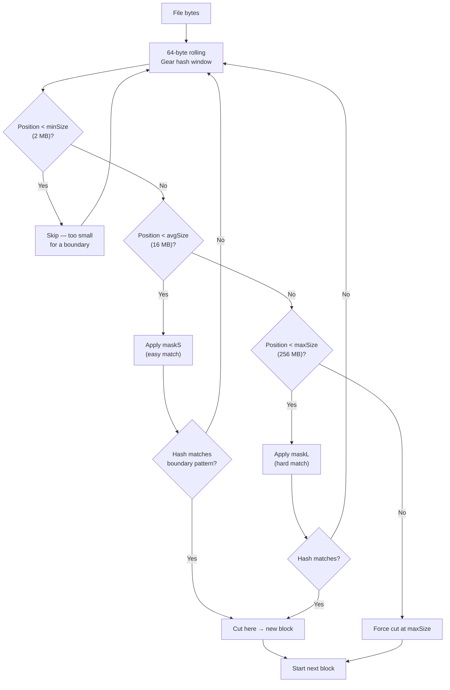
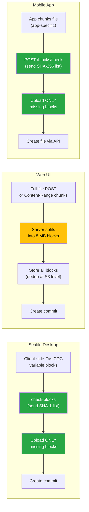
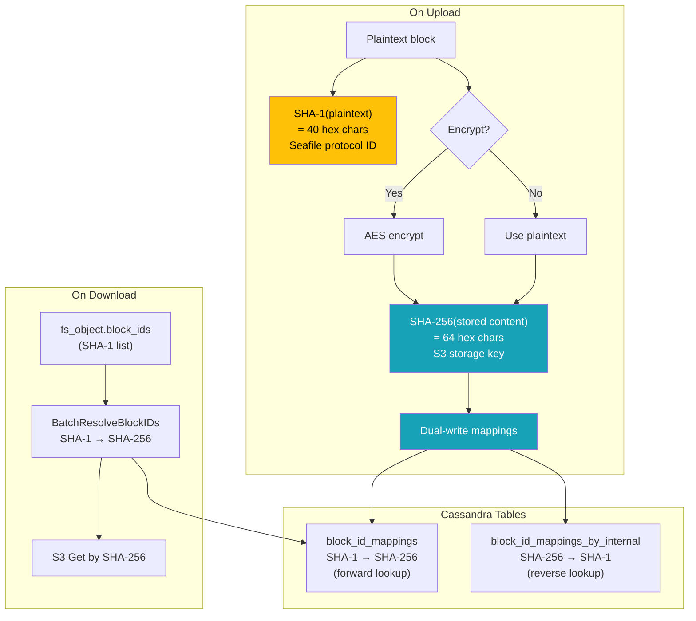
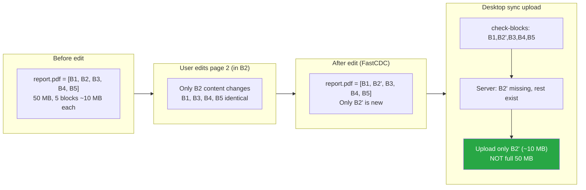
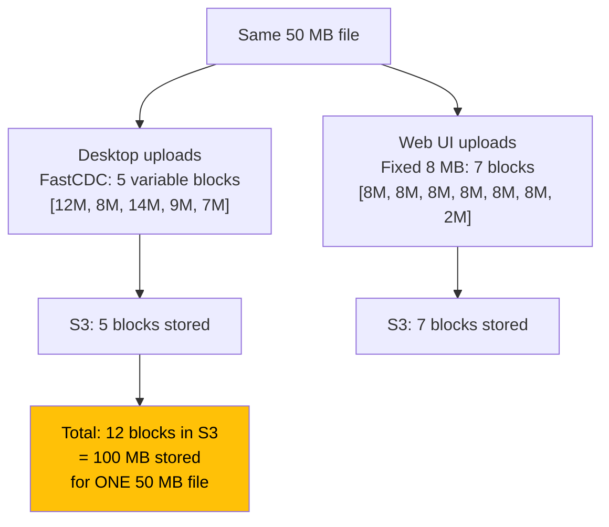

# Chunking & Block Storage Flow Diagrams

> How to read: Blue nodes are storage/hashing operations. Green nodes are
> optimization steps. Yellow nodes are compatibility concerns.

### How to read colors

| Color | Meaning |
|-------|---------|
| **Blue** | Storage or hashing operation |
| **Green** | Optimization (dedup, check-blocks) |
| **Yellow** | Compatibility concern or limitation |
| **Gray** | Client-side operation |

---

## 1. FastCDC Boundary Detection

---

## 2. Three Client Upload Paths

---

## 3. Block Identity: SHA-1 ↔ SHA-256 Mapping

---

## 4. Deduplication Within an Org

```mermaid
flowchart TD
    subgraph UserA["User A uploads report.pdf"]
        A1["3 blocks: B1, B2, B3"]
        A1 --> A2["ref_count:<br/>B1=1, B2=1, B3=1"]
    end

    subgraph UserB["User B uploads same file"]
        B1["Same 3 blocks:<br/>B1, B2, B3"]
        B1 --> B2["Dedup: blocks exist<br/>Skip S3 write"]
        B2 --> B3["ref_count:<br/>B1=2, B2=2, B3=2"]
    end

    subgraph DeleteA["User A deletes file"]
        DA["Decrement refs"]
        DA --> DA2["ref_count:<br/>B1=1, B2=1, B3=1"]
        DA2 --> DA3["ref > 0: no GC"]
    end

    subgraph DeleteB["User B deletes file"]
        DB["Decrement refs"]
        DB --> DB2["ref_count:<br/>B1=0, B2=0, B3=0"]
        DB2 --> DB3["Enqueue for GC<br/>→ delete from S3"]
    end

    style B2 fill:#28a745,color:#fff
    style DA3 fill:#28a745,color:#fff
    style DB3 fill:#dc3545,color:#fff
```

---

## 5. Incremental Change (Why Content-Defined Chunking Matters)

---

## 6. Cross-Method Dedup Limitation

**No cross-method dedup.** Different chunking produces different SHA-256 hashes.
The same file uploaded via web and synced via desktop creates two sets of blocks.
