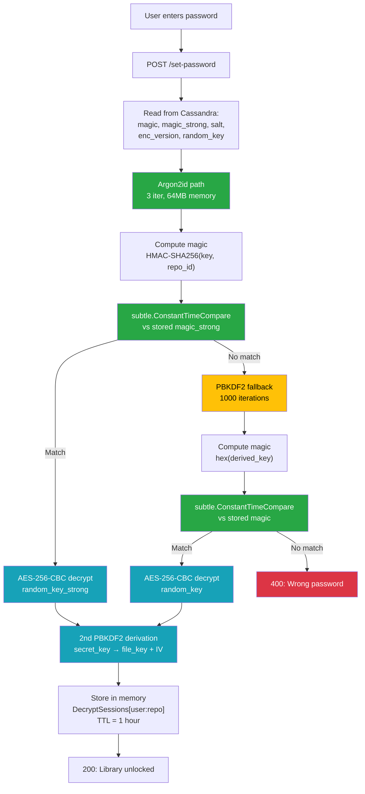
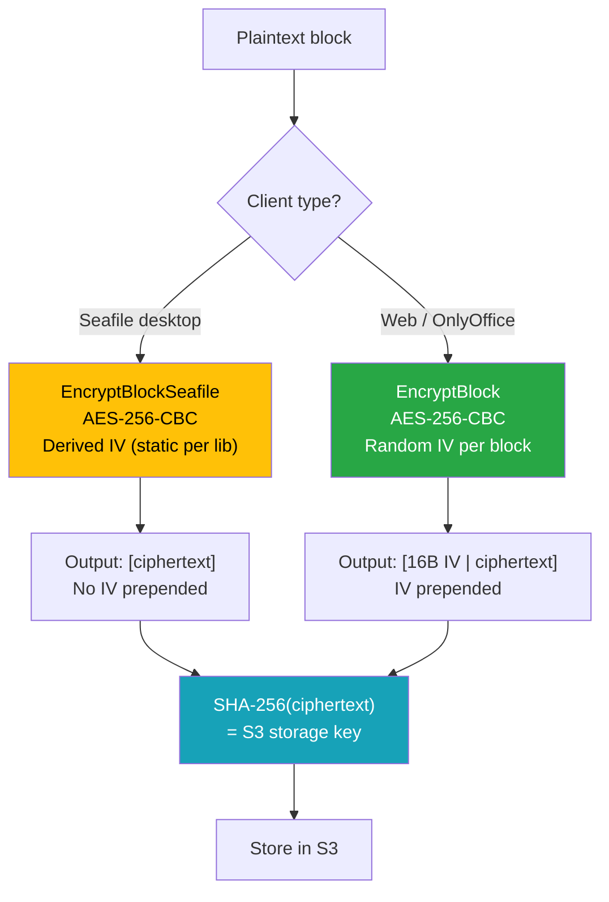
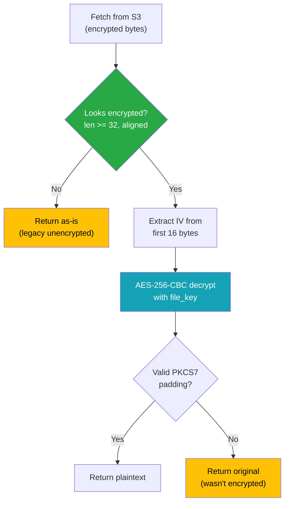
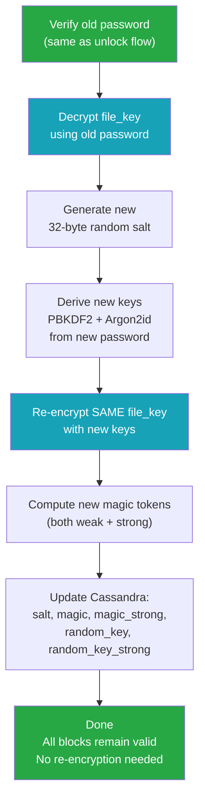
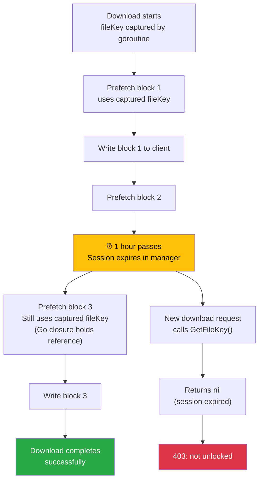
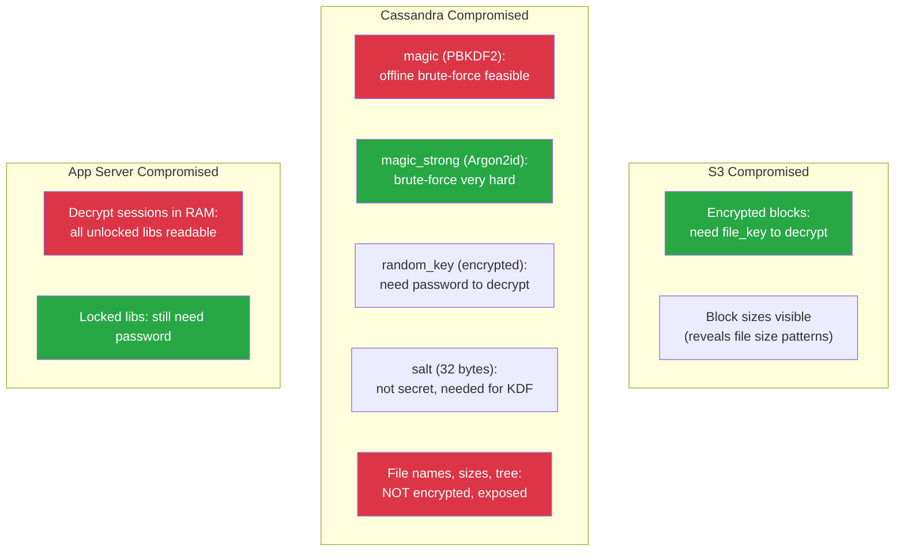

# Encryption Flow Diagrams

> How to read: Green nodes are security mechanisms. Blue nodes are crypto operations.
> Yellow highlights the weak PBKDF2 path. Red indicates data exposure risk.

### How to read colors

| Color | Meaning |
|-------|---------|
| **Green** | Security check or safety mechanism |
| **Blue** | Cryptographic operation |
| **Yellow** | Weak path (PBKDF2 compat) |
| **Red** | Exposed or at-risk data |

---

## 1. Library Unlock (Decrypt Session)

---

## 2. Block Encryption on Upload

---

## 3. Block Decryption on Download

---

## 4. Password Change (No Re-encryption)

---

## 5. Decrypt Session Expiry During Download

---

## 6. Compromise Impact on Encrypted Libraries

