# SesameFS Full Architecture - Security Annotated

```mermaid
flowchart TB
    subgraph External["External Actors"]
        Browser["Browser"]
        SeafileClient["Seafile Desktop/Mobile"]
        APIConsumer["API Consumer"]
        Attacker["Attacker"]
        IdP["OIDC Provider<br/>accounts.sesamedisk.com"]
    end

    subgraph Edge["Edge Layer"]
        Nginx["Nginx Reverse Proxy<br/>TLS termination<br/>X-Frame-Options: SAMEORIGIN<br/>X-Robots-Tag: noindex<br/>HSTS: 63072000; preload<br/>/metrics -> 403"]
    end

    subgraph FE["Frontend Layer"]
        ReactApp["React Frontend :3000<br/>React 17, Bootstrap 4.6"]
    end

    subgraph API["SesameFS Go API Server :8080"]
        direction TB

        subgraph MW["Middleware Stack"]
            SecHeaders["Security Headers<br/>nosniff, HSTS, Referrer-Policy"]
            CORS["CORS Middleware<br/>allowed_origins: * (PROBLEM)<br/>AllowCredentials: true"]
            RateLimit["Rate Limiter<br/>Per-IP token bucket"]
            AuthMW["Auth Middleware<br/>Session / API Key / Repo Token"]
        end

        subgraph OIDC_Module["OIDC Module"]
            OIDCClient["OIDC Client<br/>Code flow + PKCE<br/>Audience + nonce validation"]
            StateStore["State Store<br/>TTL: 10min, Cap: 10k"]
            RoleMapper["Role Mapper<br/>superadmin BLOCKED"]
        end

        subgraph SessionMgmt["Session Management"]
            SessionCache["In-Memory Cache<br/>(node-local)"]
            SessionDB["Cassandra Sessions<br/>SHA-256 hashed tokens"]
        end

        subgraph Handlers["Route Handlers"]
            subgraph AuthRequired["Auth Required"]
                LibraryH["Library CRUD"]
                FileH["File Operations"]
                ShareH["Share Link Management"]
                AdminH["Admin Endpoints"]
                SearchH["Search (SASI)"]
                BlockH["Block Upload/Download"]
            end

            subgraph NoAuth["NO Auth Required"]
                ShareView["Share Link Viewer<br/>/d/:token<br/>inline SVG = XSS"]
                OOCallback["OnlyOffice Callback<br/>ZERO AUTH<br/>ZERO JWT CHECK"]
                InfoEP["Info Endpoints<br/>/ping, /health, /ready<br/>/bootstrap, /server-info"]
                OIDCEndpoints["OIDC Endpoints<br/>/auth/oidc/config (leaks)"]
                MetricsEP["/metrics (unauth)"]
                CSRFLogout["DELETE /auth/session<br/>No auth (M-1)"]
            end
        end

        subgraph Storage["Storage Subsystem"]
            Chunker["FastCDC Chunker<br/>2-256MB, SHA-256"]
            BlockStore["Block Store<br/>Content-addressed<br/>blocks/xx/yy/hash"]
            ZipMod["ZIP Download<br/>NO limits"]
        end

        subgraph CryptoModule["Encryption"]
            Argon2["Argon2id (strong)"]
            PBKDF2["PBKDF2 1000 iter (compat)"]
            AES["AES-256-CBC"]
        end

        subgraph GCSvc["Garbage Collection"]
            GC["GC Scanner + Worker<br/>Grace period, queue-based"]
        end
    end

    subgraph Infra["Infrastructure"]
        OOServer["OnlyOffice Server :8088"]
    end

    subgraph Data["Data Layer"]
        S3[("S3 / MinIO<br/>NO ServerSideEncryption")]
        Cassandra[("Cassandra 5.0<br/>Parameterized queries")]
    end

    Browser -->|"HTTPS"| Nginx
    SeafileClient -->|"HTTPS"| Nginx
    APIConsumer -->|"HTTPS"| Nginx
    Attacker -->|"HTTPS"| Nginx

    Nginx --> ReactApp
    Nginx -->|"/api*, /seafhttp"| SecHeaders
    Nginx -->|"/onlyoffice"| OOCallback

    SecHeaders --> CORS --> RateLimit --> AuthMW
    AuthMW --> AuthRequired
    AuthMW -.-> SessionCache
    AuthMW -.-> OIDCClient
    SessionCache -.-> SessionDB

    OIDCClient -->|"Code exchange"| IdP
    OIDCClient --> StateStore
    OIDCClient --> RoleMapper

    FileH --> BlockStore
    FileH --> Chunker
    BlockH --> BlockStore
    ShareView --> BlockStore

    OOCallback -->|"http.Get(url) SSRF"| OOServer

    BlockStore --> S3
    Chunker --> BlockStore
    ZipMod --> BlockStore
    ZipMod --> AES

    LibraryH --> Cassandra
    FileH --> Cassandra
    ShareH --> Cassandra
    AdminH --> Cassandra

    GC --> S3
    GC --> Cassandra

    style OOCallback fill:#dc3545,color:#fff,stroke:#a71d2a,stroke-width:3px
    style S3 fill:#e67700,color:#fff,stroke:#cc6600,stroke-width:2px
    style ShareView fill:#ffc107,color:#000,stroke:#d4a106,stroke-width:2px
    style CORS fill:#ffc107,color:#000,stroke:#d4a106,stroke-width:2px
    style ZipMod fill:#ffc107,color:#000,stroke:#d4a106,stroke-width:2px
    style CSRFLogout fill:#ffc107,color:#000,stroke:#d4a106
    style MetricsEP fill:#ffc107,color:#000,stroke:#d4a106
    style PBKDF2 fill:#ffc107,color:#000,stroke:#d4a106
    style SecHeaders fill:#28a745,color:#fff,stroke:#1e7e34
    style AuthMW fill:#28a745,color:#fff,stroke:#1e7e34
    style OIDCClient fill:#28a745,color:#fff,stroke:#1e7e34
    style RoleMapper fill:#28a745,color:#fff,stroke:#1e7e34
    style Argon2 fill:#17a2b8,color:#fff,stroke:#138496
    style AES fill:#17a2b8,color:#fff,stroke:#138496
    style Nginx fill:#6c757d,color:#fff
```

## Legend

| Color | Meaning |
|-------|---------|
| **Red** | Critical vulnerability - must fix before production |
| **Orange** | Security gap - should fix soon |
| **Yellow** | Medium concern - defense-in-depth |
| **Green** | Security control working correctly |
| **Blue** | Encryption / cryptographic module |
| **Gray** | Infrastructure component |
