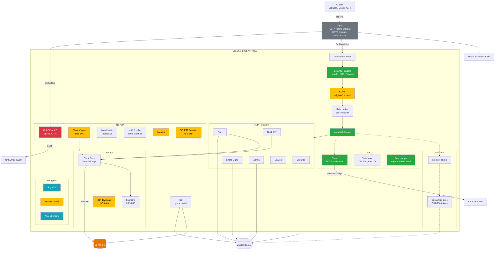
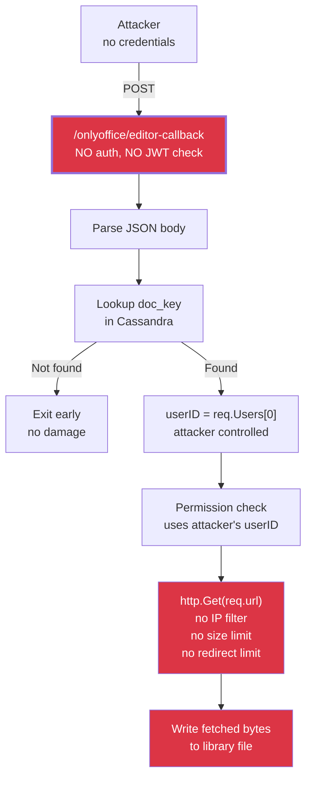

# SesameFS Full Architecture

> How to read: This is the complete system map. Every component, connection, and security finding is shown. Red nodes are critical vulnerabilities, orange are gaps, yellow are medium concerns, green are working controls, blue are encryption modules.

### How to read colors

| Color | Meaning |
|-------|---------|
| **Red** | Critical vulnerability — must fix before production |
| **Orange** | Security gap — should fix soon |
| **Yellow** | Medium concern — defense-in-depth needed |
| **Green** | Security control working correctly |
| **Blue** | Encryption / cryptographic module |
| **Gray** | Infrastructure (no finding) |

---

## System Diagram

**Key issues visible:**
- The OnlyOffice callback (red, thick border) has zero authentication and triggers SSRF.
- S3 (orange) has no server-side encryption on Put calls.
- CORS (yellow) is configured as wildcard `*` even in production.
- ZIP download (yellow) has no file count or size limits.
- /metrics (yellow) is exposed unauthenticated at the app level.

---

## OnlyOffice Attack Chain

**How to read:** Follow the arrows to see what an unauthenticated attacker can do. Red nodes are steps the attacker controls. The only gate is whether a valid `doc_key` exists in Cassandra — if it does, the full SSRF + file write chain executes.

