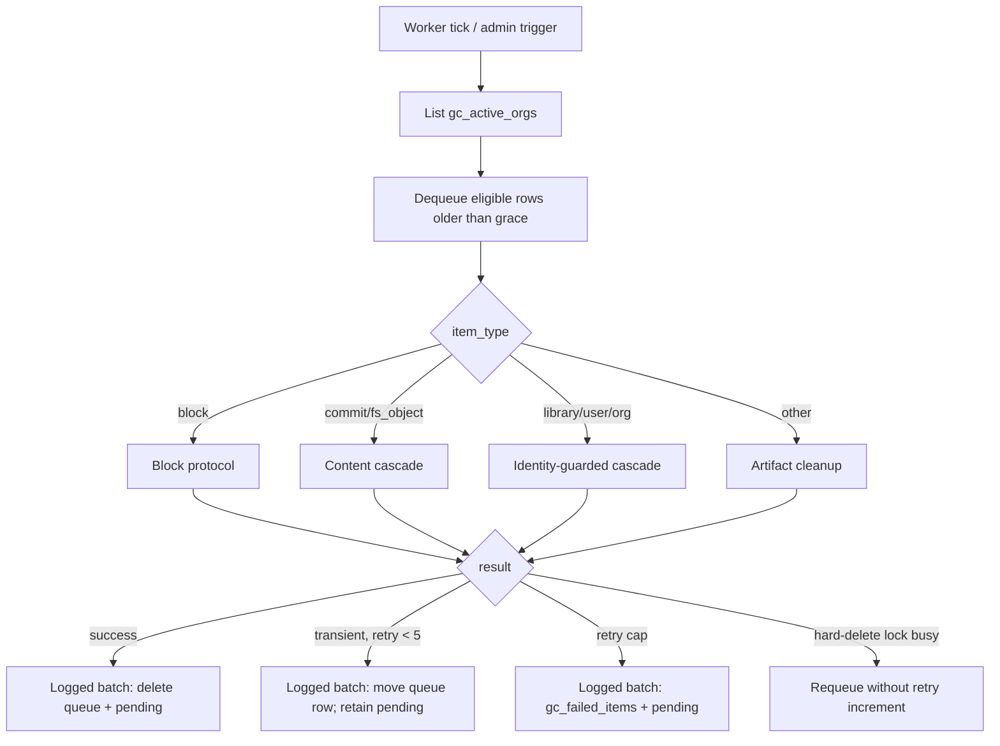
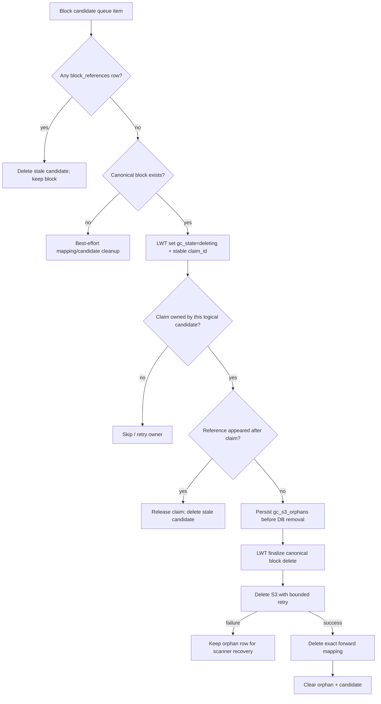
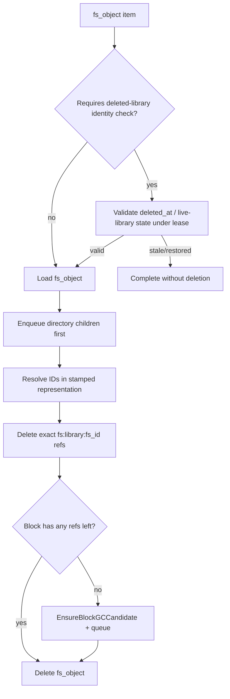
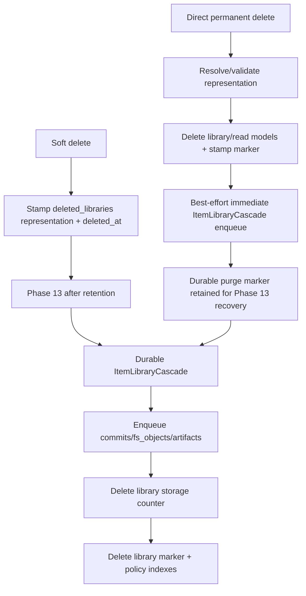

# GC Service Flow Diagrams

**Corrected:** 2026-07-10 · **Code:** `4333be1b3`

> Current model: keyed `block_references`, durable candidates, LWT claim + live-ref recheck,
> and write-ahead `gc_s3_orphans`. The retired `blocks.ref_count = -999` protocol is preserved
> in Git history, not in this live diagram. The physical block-delete sequence is conservative,
> and both the transient-error fail-open (P6a) and execution-time canonical revalidation gap
> (P6b) are fixed. Markerless artifact discovery remains P7. Full audit:
> [../GC-DELETE-CLEANUP-INVESTIGATION.md](../GC-DELETE-CLEANUP-INVESTIGATION.md).
>
> **Operator gate:** keep `GC_ENABLED=false` on every replica in every DC while X1
> physical-delete ABA remains open. X2 cross-DC reference visibility is closed under
> its stable-topology operational contract. The lease does not close X1. Only after
> X1 closes may designated replicas in one DC participate under the lease.

## 1. Worker loop

## 2. Physical block deletion

The sequence above is conservative **up to S3 delete authorization**, given correct upstream classification/reference ownership. It does not close X1: Cassandra authorization/claim generations cannot revoke an S3 DELETE already in flight; only never-reused generational physical keys prevent a stale delete from targeting re-uploaded bytes. The P6
fail-open path that could enqueue live fs_objects (causing GC itself to remove legitimate `fs:`
refs before this block protocol runs) is now fixed: existence reads fail closed (1D).

## 3. FS object cleanup

Scanner-created Phase 3/4 orphan work carries durable guard mode `canonical_absent`. At execution,
the worker takes the library lock, point-reads canonical `libraries[(org_id, library_id)]`, skips a
present library, fails closed on read errors, and synchronously fences destructive mutations. Normal
cascade children use `deleted_at_identity`; legacy true booleans map to that mode. This closes P6b.

## 4. Library delete and purge handoff

Current code stamps `purge_requested_at` so permanent deletes are immediately Phase-13 eligible;
the immediate enqueue is only an accelerator and the durable marker is the recovery path.

## 5. Scanner phases and known boundaries

`ScanOnce` currently runs 17 named phases in this order:

Important limits:

- P3/P4 discovery currently enumerates only `libraries_by_id` + `deleted_libraries`, so
  markerless artifact partitions are invisible (audit P7).
- `LibraryExists`/`GroupExists` fail **closed** on Cassandra errors (P6a), and queued orphan work
  is canonically revalidated at execution time (P6b); both are fixed.
- Phase 9 streams `shares_by_group` with bounded process memory and cancellation, but the
  Cassandra read remains a global scan until bucketed partition discovery lands (audit P8).
- `up:` expiry has durable discovery; `pub:` expiry does not (audit P4).
- Phase 13 currently logs some delivery failures without returning them (audit P5).

## 6. Invariants for follow-up work

1. API handlers never release `fs:` refs; fs_object cleanup is the sole owner.
2. Library cascades never release `pub:` refs; publish/expiry owns them.
3. Zero-ref creates a candidate; only the worker performs physical deletion.
4. Keep claim + post-claim reference recheck + write-ahead S3 recovery.
5. Tests must use exact fixture/org scope; never run a nil-storage global worker over shared data.
6. Never truncate references/mappings as cleanup.
