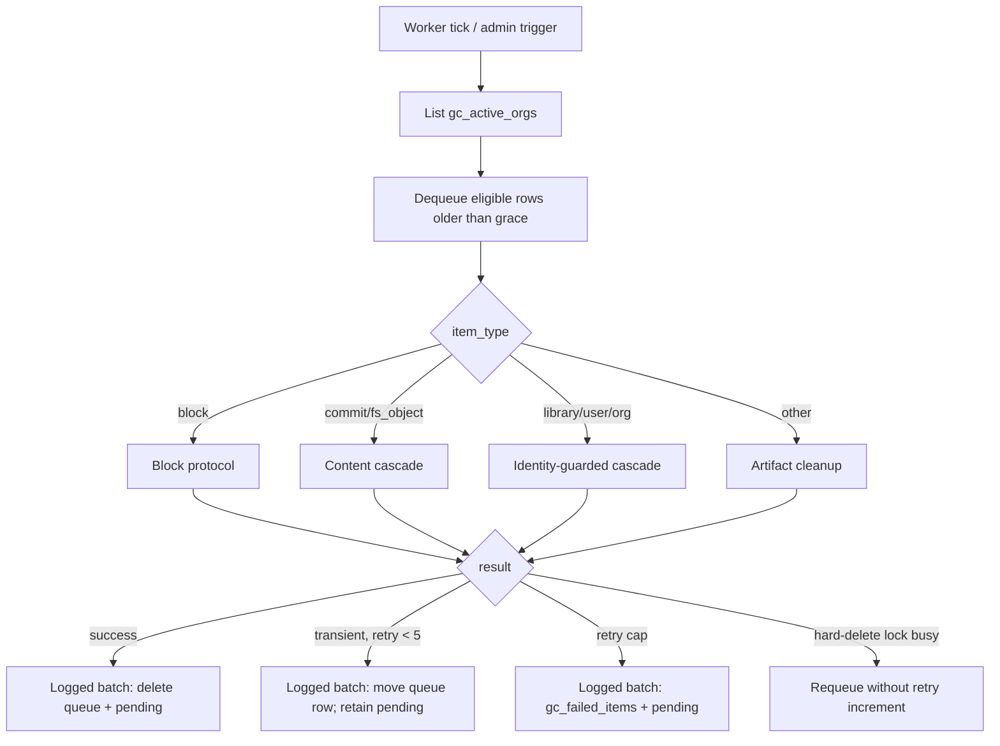
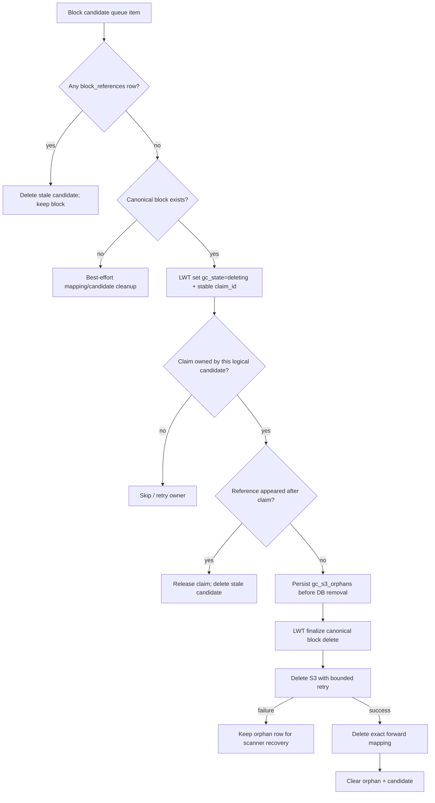
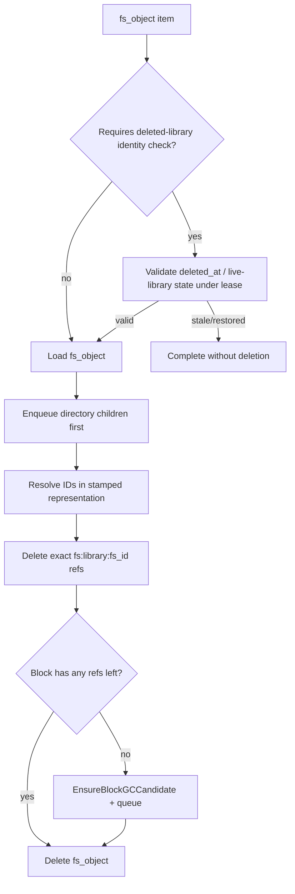
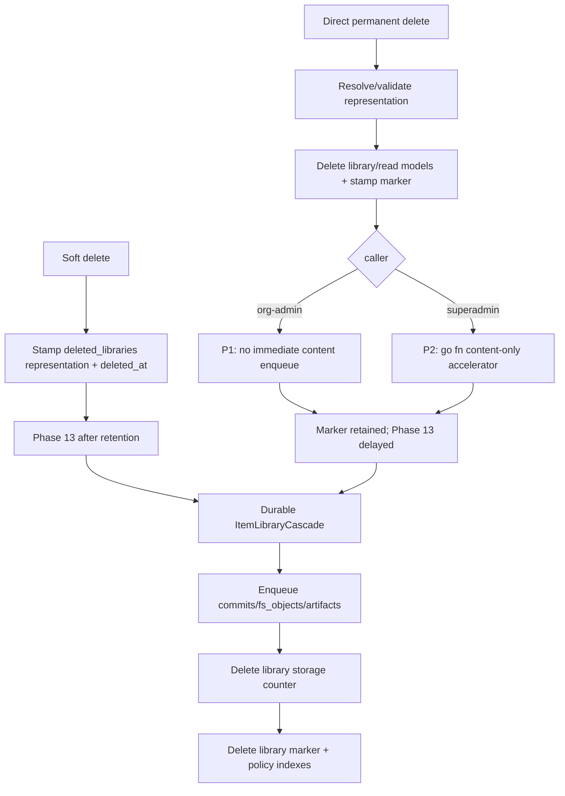

# GC Service Flow Diagrams

**Corrected:** 2026-07-10 · **Code:** `4333be1b3`

> Current model: keyed `block_references`, durable candidates, LWT claim + live-ref recheck,
> and write-ahead `gc_s3_orphans`. The retired `blocks.ref_count = -999` protocol is preserved
> in Git history, not in this live diagram. The physical block-delete sequence is conservative,
> and both live-data classification exposures are now fixed: the transient-error fail-open (P6a, 1D)
> and the execution-time canonical revalidation of orphan work (P6b, 1E). Full audit:
> [../GC-DELETE-CLEANUP-INVESTIGATION.md](../GC-DELETE-CLEANUP-INVESTIGATION.md).

## 1. Worker loop

## 2. Physical block deletion

The sequence above is safe **given correct upstream classification/reference ownership**. The P6
fail-open path that could enqueue live fs_objects (causing GC itself to remove legitimate `fs:`
refs before this block protocol runs) is now fixed: existence reads fail closed (1D).

## 3. FS object cleanup

Scanner-created orphan work uses durable `library_guard_mode=canonical_absent`; normal cascade
children use `deleted_at_identity`. P6a closed the fail-open existence read, and P6b (1E,
`ISSUE-GC-ORPHAN-WORKER-REVALIDATION-01`) makes the worker acquire the shared restore/GC lifecycle
lease and fail closed on an O(1) point read of the canonical `(org_id, library_id)` row before
deletion. Library UUIDs are globally unique and immutable and are never moved between orgs, so the
queue's org partition is authoritative. Projection drift and scanner→worker restore races fail closed.

## 4. Library delete and purge handoff

Roadmap 6A/6B adds `purge_requested_at` so permanent deletes become immediately Phase-13 eligible;
the goroutine remains only an accelerator.

## 5. Scanner phases and known boundaries

`ScanOnce` currently runs 17 named phases in this order:

Important limits:

- P3/P4 discovery currently enumerates only `libraries_by_id` + `deleted_libraries`, so
  markerless artifact partitions are invisible (audit P7).
- `LibraryExists`/`GroupExists` now fail **closed** on Cassandra errors (audit P6a, fixed 1D);
  orphan commit/fs_object work is revalidated against the canonical `libraries` table at worker
  time (audit P6b, fixed 1E).
- Phase 9 streams `shares_by_group` with bounded process memory and cancellation, but the
  Cassandra read remains a global scan until bucketed partition discovery lands (audit P8).
- `up:` expiry has durable discovery; `pub:` expiry does not (audit P4).
- Phase 13 currently logs some delivery failures without returning them (audit P5).

## 6. Invariants for follow-up work

1. API handlers never release `fs:` refs; fs_object cleanup is the sole owner.
2. Library cascades never release `pub:` refs; publish/expiry owns them.
3. Zero-ref creates a candidate; only the worker performs physical deletion.
4. Keep claim + post-claim reference recheck + write-ahead S3 recovery.
5. Tests must use exact fixture/org scope; never run a nil-storage global worker over shared data.
6. Never truncate references/mappings as cleanup.
