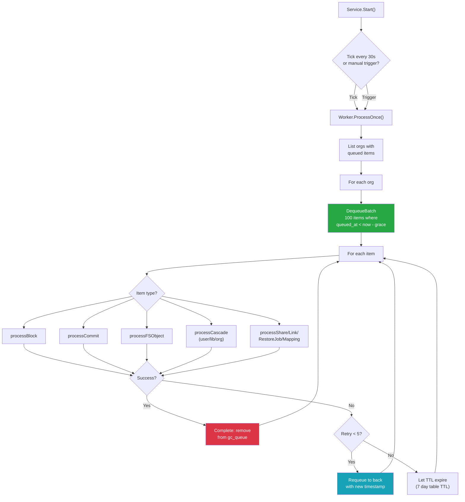
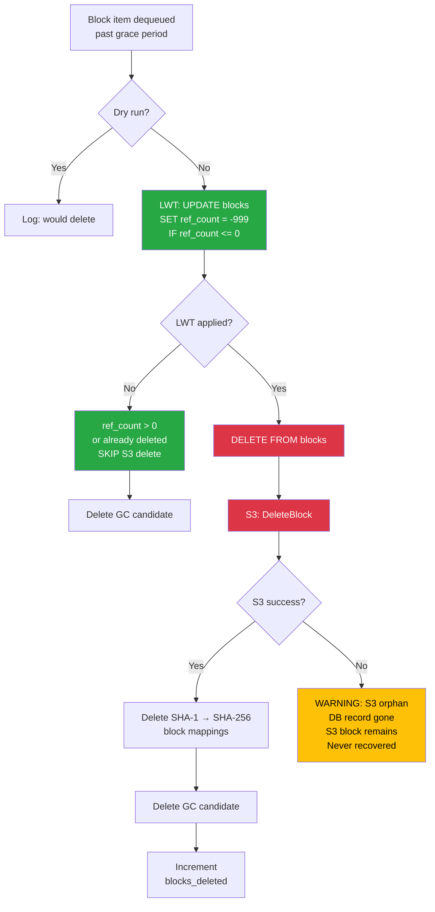
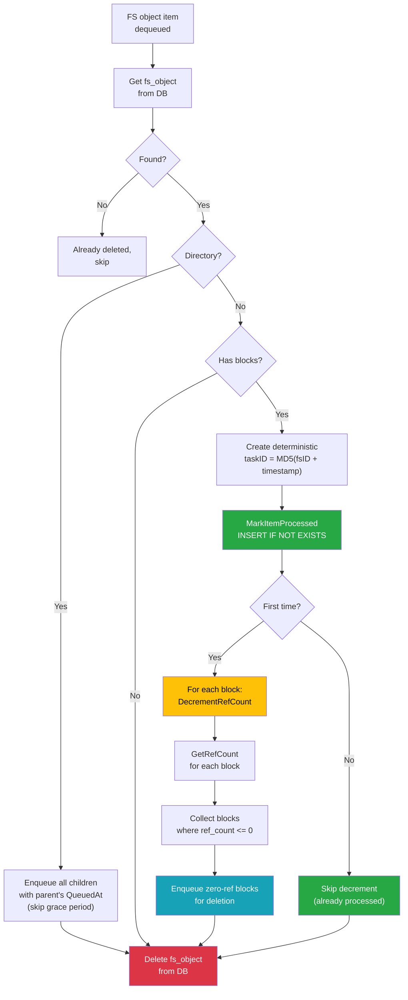
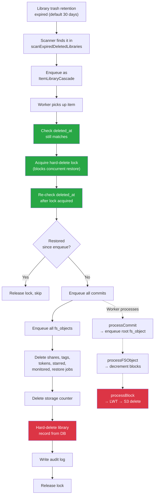
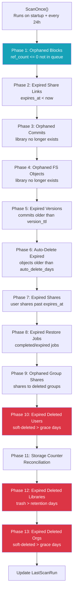
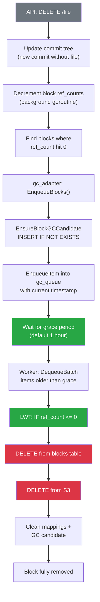

# GC Service Flow Diagrams

> How to read: Follow arrows top-to-bottom. Green nodes are safety mechanisms.
> Red nodes are deletion actions. Yellow nodes are potential risk areas.
> Diamonds are decision points.

### How to read colors

| Color | Meaning |
|-------|---------|
| **Red** | Destructive action (deletion) |
| **Yellow** | Risk area or potential issue |
| **Green** | Safety mechanism |
| **Blue** | Enqueue / scheduling |

---

## 1. Worker Loop

How the worker goroutine runs continuously, processing batches.

---

## 2. Block Deletion (Critical Path)

The most dangerous operation — deleting data from S3.

---

## 3. FS Object Processing (Decrement + Cascade)

How file deletion triggers block cleanup with idempotency protection.

---

## 4. Library Cascade

What happens when a soft-deleted library's retention period expires.

---

## 5. Scanner Phases

The 13-phase safety sweep that catches orphaned items.

---

## 6. End-to-End: File Delete → Block Gone

The complete journey from API call to S3 block removal.

