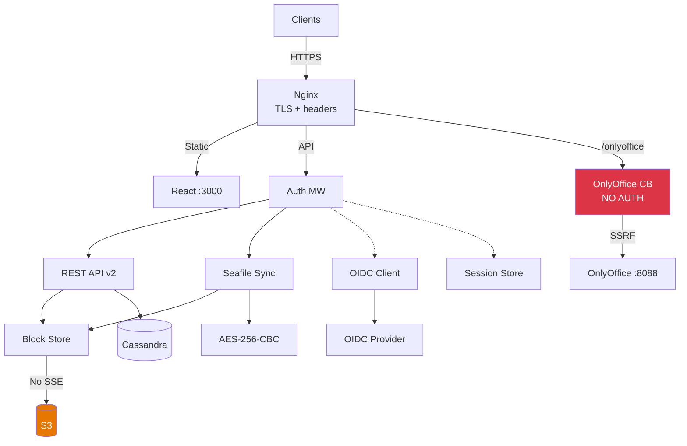
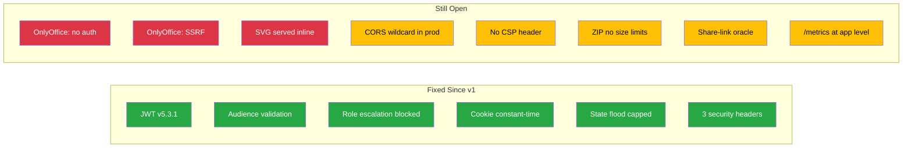
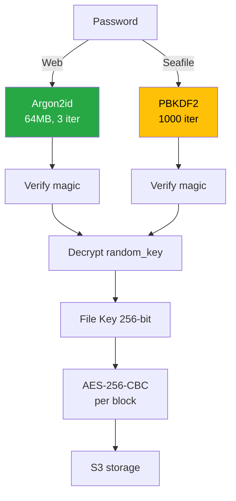
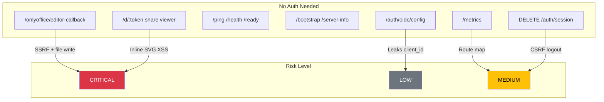

# SesameFS Security Architecture — Summary

> All diagrams use Mermaid syntax. Render on GitHub, VS Code, or [mermaid.live](https://mermaid.live).
> This page is the quick-reference. For detailed diagrams see the individual pages linked in the [diagram index](#diagram-index) below.

### How to read colors (all diagrams)

| Color | Meaning |
|-------|---------|
| **Red** | Critical vulnerability — must fix before production |
| **Orange** | Security gap — should fix soon |
| **Yellow** | Medium concern — defense-in-depth needed |
| **Green** | Security control working correctly |
| **Blue** | Encryption / cryptographic module |
| **Gray** | Infrastructure (no finding) |

---

## Diagram Index

| Diagram | What it shows | Link |
|---------|--------------|------|
| Architecture Overview | High-level system components and data flow | [architecture-overview.md](./architecture-overview.md) |
| Security Layer | Auth decision flow, OIDC login sequence, header status | [security-layer.md](./security-layer.md) |
| Authentication Layer | Token lifecycle, session invalidation, role mapping, rate limits | [auth-layer.md](./auth-layer.md) |
| Storage & Encryption | Upload/download pipelines, key management, compromise impact | [storage-layer.md](./storage-layer.md) |
| Full Architecture | Complete system map with every finding annotated | [full-architecture.md](./full-architecture.md) |

---

## 1. System Overview

**Key issues:** OnlyOffice callback (red) has zero auth. S3 (orange) has no server-side encryption. Share links (yellow) serve SVG inline.

---

## 2. Security Controls Status

**How to read:** Green boxes are findings fixed since the v1 assessment. Red boxes are critical issues still open. Yellow boxes are medium issues still open.

---

## 3. Encryption Architecture

**Key issue:** The Seafile-compatible path (yellow) uses PBKDF2 with 1,000 iterations. The web/API path (green) uses Argon2id, which is strong.

---

## 4. Attack Surface

**How to read:** These are all endpoints reachable without any credentials. Arrows show the risk each one carries.

---

## 5. Local vs Production Differences

| Check | Local :8082 | Prod sfs.nihaoshares.com |
|-------|-------------|--------------------------|
| OnlyOffice CB | HTTP 200, no auth | HTTP 200, no auth |
| CORS | `*` (dev mode) | `*` (config.prod.yaml) |
| /metrics | HTTP 200 exposed | HTTP 403 (nginx) |
| /ready | JSON with db/storage | Caught by nginx |
| OIDC config | `enabled: false` | Leaks client_id, issuer |
| Security headers | 3/5 from app | 5/7 (nginx adds 2) |
| Auth rate limit | 10/120 through | 26/120 through |
| Share-link oracle | 404 confirmed | 404 confirmed |
| CSRF logout | HTTP 200 | HTTP 200 |
