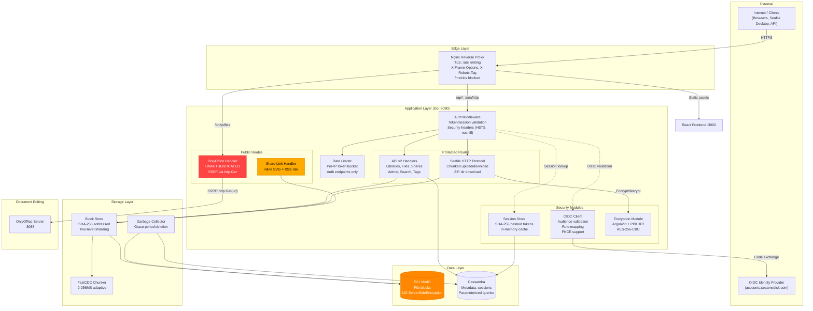
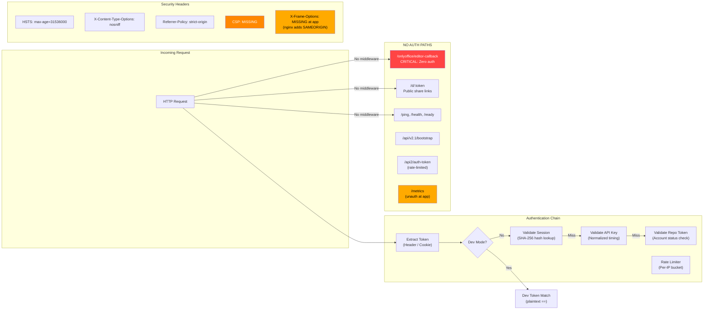
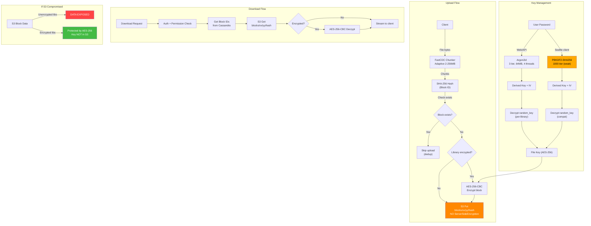
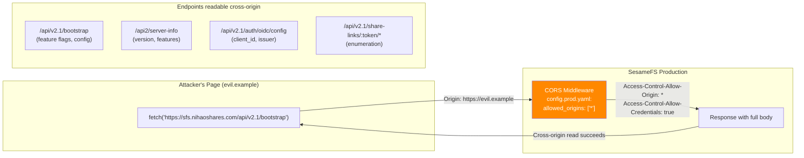

# SesameFS Security Architecture Diagrams

## 1. System Overview

## 2. Security Layer Detail

## 3. Storage & Encryption Architecture

## 4. OnlyOffice Attack Chain (V2-C1 + C-1)

```mermaid
flowchart LR
    Attacker["Attacker<br/>(No credentials needed)"]
    
    Attacker -->|"POST /onlyoffice/editor-callback<br/>status=2, url=http://169.254.169.254/..."| Endpoint["/onlyoffice/editor-callback<br/>NO AUTH MIDDLEWARE<br/>NO JWT VERIFICATION"]
    
    Endpoint -->|"1. Parse JSON body"| Parse["json.Unmarshal<br/>(no signature check)"]
    Parse -->|"2. Lookup doc_key"| DocKey["getDocKeyMapping<br/>(if key not found: exit)"]
    DocKey -->|"3. Get user from body"| UserID["userID = req.Users[0]<br/>(attacker controlled!)"]
    UserID -->|"4. Permission check"| Perm["HasLibraryAccess<br/>(uses attacker's userID)"]
    Perm -->|"5. Fetch attacker URL"| SSRF["http.Get(internalURL)<br/>No IP validation<br/>No body size limit<br/>No redirect policy"]
    SSRF -->|"6. Write to library"| Write["saveEditedDocument<br/>(overwrites target file)"]
    
    subgraph Impact["Impact"]
        direction TB
        I1["EC2 metadata theft<br/>(AWS credentials)"]
        I2["Internal service probing<br/>(Cassandra, other services)"]
        I3["Arbitrary file write<br/>(if valid doc_key known)"]
    end
    
    SSRF --> I1
    SSRF --> I2
    Write --> I3
    
    style Endpoint fill:#ff4444,color:#fff
    style SSRF fill:#ff4444,color:#fff
    style I1 fill:#ff4444,color:#fff
    style I2 fill:#ff4444,color:#fff
    style I3 fill:#ff4444,color:#fff
```

## 5. CORS Configuration Issue (M-2)

