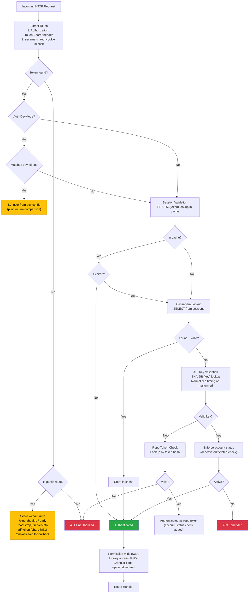
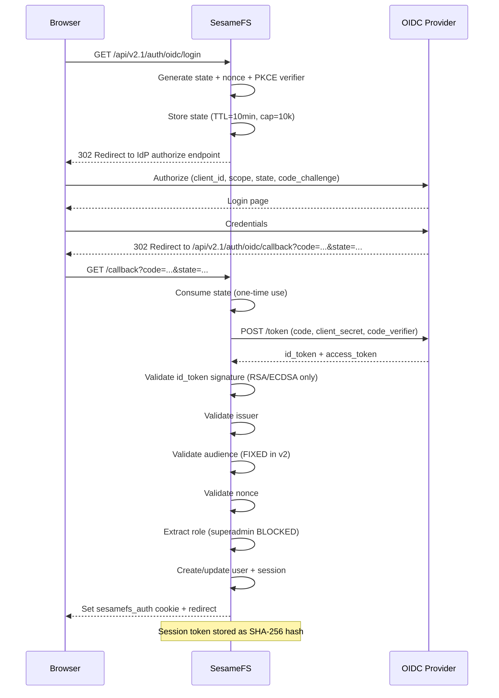
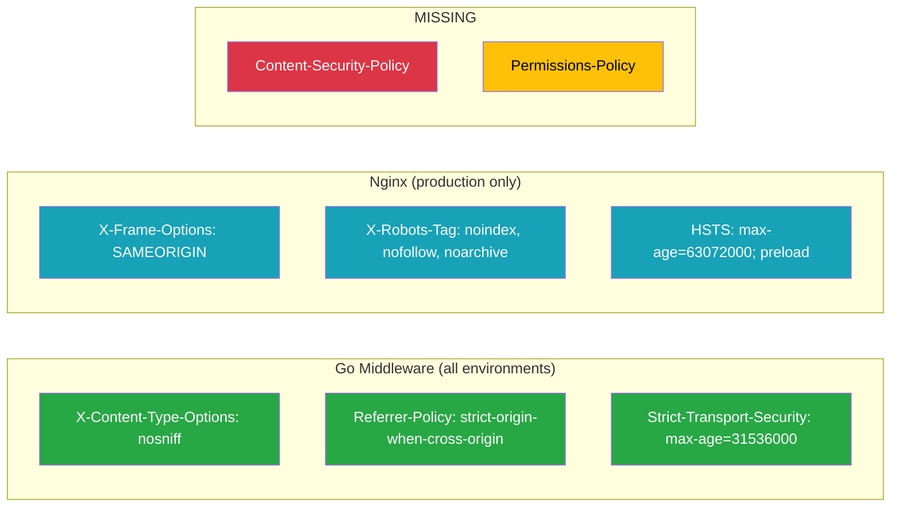

# SesameFS Security Layer

## Authentication & Authorization Flow

```mermaid
flowchart TD
    Request["Incoming HTTP Request"] --> Extract["Extract Token<br/>1. Authorization: Token/Bearer header<br/>2. sesamefs_auth cookie fallback"]

    Extract --> HasToken{"Token found?"}
    HasToken -->|"No"| PublicRoute{"Is public route?"}
    PublicRoute -->|"Yes"| Public["Serve without auth<br/>/ping, /health, /ready<br/>/bootstrap, /server-info<br/>/d/:token (share links)<br/>/onlyoffice/editor-callback"]
    PublicRoute -->|"No"| Reject401["401 Unauthorized"]

    HasToken -->|"Yes"| DevMode{"Auth.DevMode?"}
    DevMode -->|"Yes"| DevMatch{"Matches dev token?"}
    DevMatch -->|"Yes"| DevAuth["Set user from dev config<br/>(plaintext == comparison)"]
    DevMatch -->|"No"| SessionCheck

    DevMode -->|"No"| SessionCheck["Session Validation<br/>SHA-256(token) lookup in cache"]
    SessionCheck --> CacheHit{"In cache?"}
    CacheHit -->|"Yes"| CheckExpiry{"Expired?"}
    CheckExpiry -->|"No"| Authenticated["Authenticated"]
    CheckExpiry -->|"Yes"| DBLookup

    CacheHit -->|"No"| DBLookup["Cassandra Lookup<br/>SELECT from sessions"]
    DBLookup --> Found{"Found + valid?"}
    Found -->|"Yes"| CacheStore["Store in cache"] --> Authenticated
    Found -->|"No"| APIKeyCheck["API Key Validation<br/>SHA-256(key) lookup<br/>Normalized timing on malformed"]

    APIKeyCheck --> KeyValid{"Valid key?"}
    KeyValid -->|"Yes"| EnforceStatus["Enforce account status<br/>(deactivated/deleted check)"]
    KeyValid -->|"No"| RepoTokenCheck["Repo Token Check<br/>Lookup by token hash"]

    RepoTokenCheck --> RepoValid{"Valid?"}
    RepoValid -->|"Yes"| RepoAuth["Authenticated as repo token<br/>(account status check added)"]
    RepoValid -->|"No"| Reject401

    EnforceStatus --> StatusOK{"Active?"}
    StatusOK -->|"Yes"| Authenticated
    StatusOK -->|"No"| Reject403["403 Forbidden"]

    Authenticated --> PermCheck["Permission Middleware<br/>Library access: R/RW<br/>Granular flags: upload/download"]
    PermCheck --> Handler["Route Handler"]

    style Public fill:#ffc107,color:#000,stroke:#d4a106,stroke-width:2px
    style DevAuth fill:#ffc107,color:#000,stroke:#d4a106
    style Authenticated fill:#28a745,color:#fff
    style Reject401 fill:#dc3545,color:#fff
    style Reject403 fill:#dc3545,color:#fff
```

## OIDC Login Flow

```mermaid
sequenceDiagram
    participant Browser
    participant SesameFS
    participant IdP as OIDC Provider

    Browser->>SesameFS: GET /api/v2.1/auth/oidc/login
    SesameFS->>SesameFS: Generate state + nonce + PKCE verifier
    SesameFS->>SesameFS: Store state (TTL=10min, cap=10k)
    SesameFS-->>Browser: 302 Redirect to IdP authorize endpoint

    Browser->>IdP: Authorize (client_id, scope, state, code_challenge)
    IdP-->>Browser: Login page
    Browser->>IdP: Credentials
    IdP-->>Browser: 302 Redirect to /api/v2.1/auth/oidc/callback?code=...&state=...

    Browser->>SesameFS: GET /callback?code=...&state=...
    SesameFS->>SesameFS: Consume state (one-time use)
    SesameFS->>IdP: POST /token (code, client_secret, code_verifier)
    IdP-->>SesameFS: id_token + access_token

    SesameFS->>SesameFS: Validate id_token signature (RSA/ECDSA only)
    SesameFS->>SesameFS: Validate issuer
    SesameFS->>SesameFS: Validate audience (FIXED in v2)
    SesameFS->>SesameFS: Validate nonce
    SesameFS->>SesameFS: Extract role (superadmin BLOCKED)
    SesameFS->>SesameFS: Create/update user + session
    SesameFS-->>Browser: Set sesamefs_auth cookie + redirect

    Note over SesameFS: Session token stored as SHA-256 hash
```

## Security Headers Status

```mermaid
flowchart LR
    subgraph AppLevel["Go Middleware (all environments)"]
        H1["X-Content-Type-Options: nosniff"]
        H2["Referrer-Policy: strict-origin-when-cross-origin"]
        H3["Strict-Transport-Security: max-age=31536000"]
    end

    subgraph NginxLevel["Nginx (production only)"]
        H4["X-Frame-Options: SAMEORIGIN"]
        H5["X-Robots-Tag: noindex, nofollow, noarchive"]
        H6["HSTS: max-age=63072000; preload"]
    end

    subgraph Missing["MISSING"]
        H7["Content-Security-Policy"]
        H8["Permissions-Policy"]
    end

    style H1 fill:#28a745,color:#fff
    style H2 fill:#28a745,color:#fff
    style H3 fill:#28a745,color:#fff
    style H4 fill:#17a2b8,color:#fff
    style H5 fill:#17a2b8,color:#fff
    style H6 fill:#17a2b8,color:#fff
    style H7 fill:#dc3545,color:#fff
    style H8 fill:#ffc107,color:#000
```
