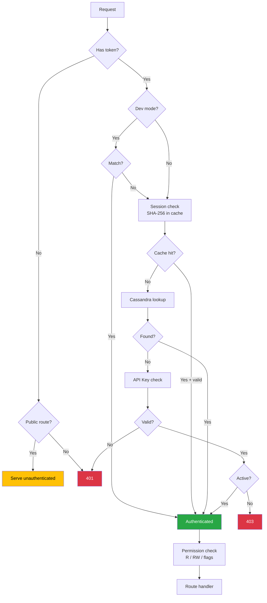
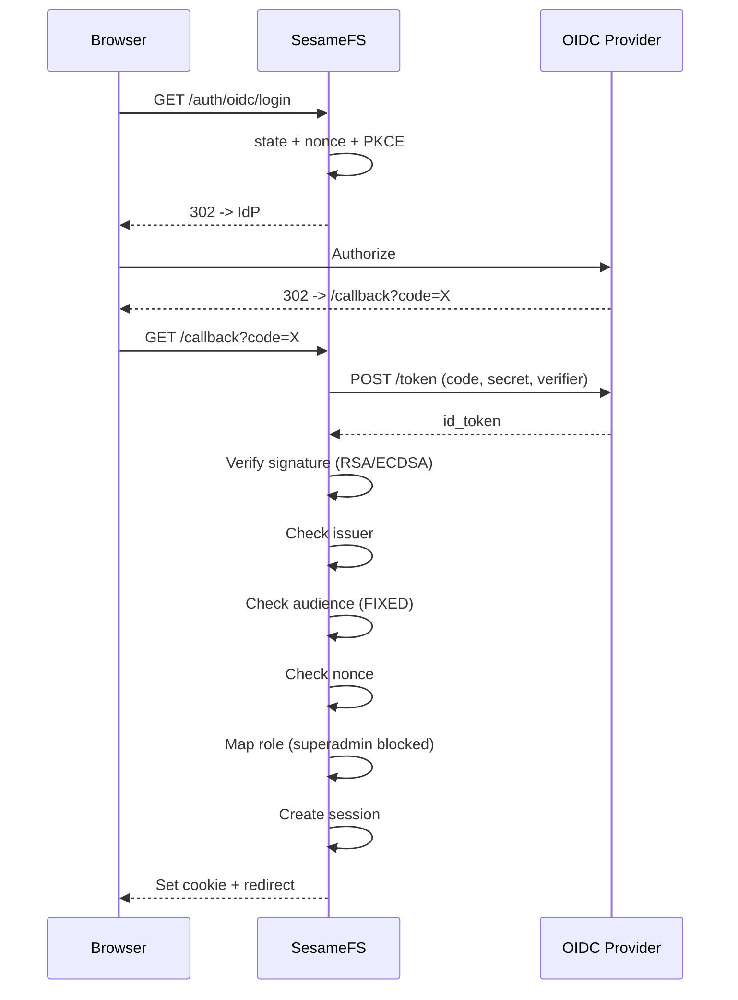

# SesameFS Security Layer

## Auth Flow

## OIDC Login

## Headers Status

| Header | App Level | Nginx (prod) |
|--------|-----------|-------------|
| X-Content-Type-Options: nosniff | Present | Present |
| Referrer-Policy | Present | Present |
| HSTS | Present | Present (preload) |
| X-Frame-Options | **Missing** | SAMEORIGIN |
| Content-Security-Policy | **Missing** | **Missing** |
| Permissions-Policy | **Missing** | **Missing** |
| X-Robots-Tag | **Missing** | Present |
