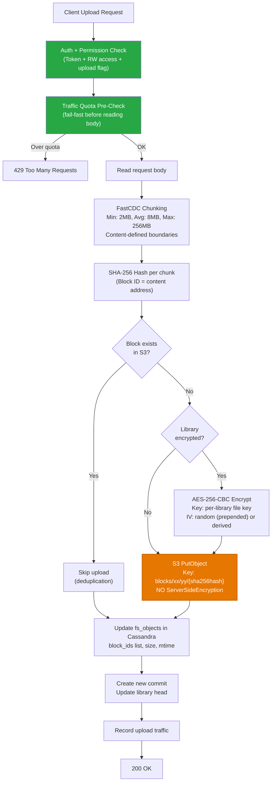
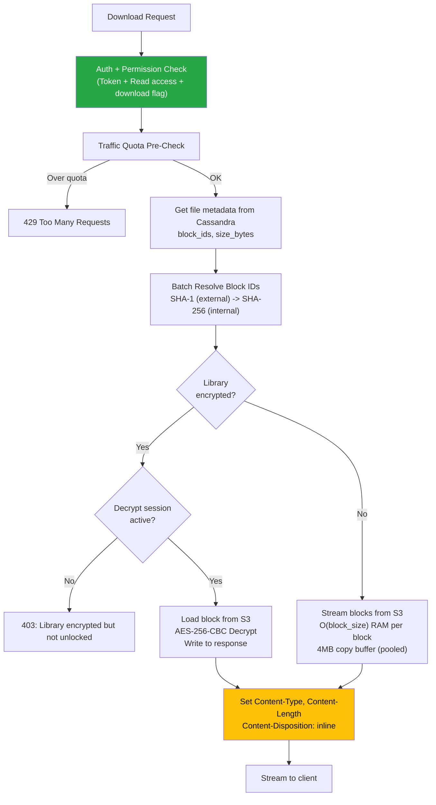
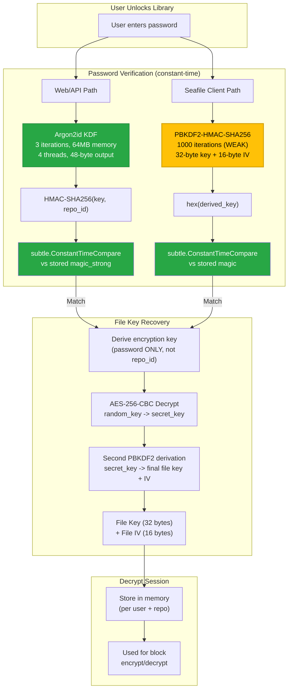

# SesameFS Storage & Encryption Layer

## Upload Flow

```mermaid
flowchart TD
    Client["Client Upload Request"] --> AuthCheck["Auth + Permission Check<br/>(Token + RW access + upload flag)"]
    AuthCheck --> QuotaCheck["Traffic Quota Pre-Check<br/>(fail-fast before reading body)"]
    QuotaCheck -->|"Over quota"| Reject429["429 Too Many Requests"]
    QuotaCheck -->|"OK"| ReadBody["Read request body"]

    ReadBody --> Chunking["FastCDC Chunking<br/>Min: 2MB, Avg: 8MB, Max: 256MB<br/>Content-defined boundaries"]
    Chunking --> HashBlock["SHA-256 Hash per chunk<br/>(Block ID = content address)"]

    HashBlock --> DedupCheck{"Block exists<br/>in S3?"}
    DedupCheck -->|"Yes"| SkipUpload["Skip upload<br/>(deduplication)"]
    DedupCheck -->|"No"| EncryptCheck{"Library<br/>encrypted?"}

    EncryptCheck -->|"Yes"| EncryptBlock["AES-256-CBC Encrypt<br/>Key: per-library file key<br/>IV: random (prepended) or derived"]
    EncryptCheck -->|"No"| S3Put

    EncryptBlock --> S3Put["S3 PutObject<br/>Key: blocks/xx/yy/{sha256hash}<br/>NO ServerSideEncryption"]

    SkipUpload --> UpdateFS["Update fs_objects in Cassandra<br/>block_ids list, size, mtime"]
    S3Put --> UpdateFS
    UpdateFS --> UpdateCommit["Create new commit<br/>Update library head"]
    UpdateCommit --> RecordTraffic["Record upload traffic"]
    RecordTraffic --> Response["200 OK"]

    style S3Put fill:#e67700,color:#fff,stroke:#cc6600,stroke-width:2px
    style QuotaCheck fill:#28a745,color:#fff
    style AuthCheck fill:#28a745,color:#fff
```

## Download Flow

```mermaid
flowchart TD
    Request["Download Request"] --> AuthCheck["Auth + Permission Check<br/>(Token + Read access + download flag)"]
    AuthCheck --> QuotaCheck["Traffic Quota Pre-Check"]
    QuotaCheck -->|"Over quota"| Reject["429 Too Many Requests"]
    QuotaCheck -->|"OK"| GetMeta["Get file metadata from Cassandra<br/>block_ids, size_bytes"]

    GetMeta --> ResolveBlocks["Batch Resolve Block IDs<br/>SHA-1 (external) -> SHA-256 (internal)"]
    ResolveBlocks --> EncryptCheck{"Library<br/>encrypted?"}

    EncryptCheck -->|"Yes"| HasDecryptSession{"Decrypt session<br/>active?"}
    HasDecryptSession -->|"No"| Reject403["403: Library encrypted but not unlocked"]
    HasDecryptSession -->|"Yes"| StreamEncrypted

    EncryptCheck -->|"No"| StreamPlain["Stream blocks from S3<br/>O(block_size) RAM per block<br/>4MB copy buffer (pooled)"]

    StreamEncrypted["Load block from S3<br/>AES-256-CBC Decrypt<br/>Write to response"]

    StreamPlain --> SetHeaders["Set Content-Type, Content-Length<br/>Content-Disposition: inline"]
    StreamEncrypted --> SetHeaders

    SetHeaders --> Response["Stream to client"]

    style AuthCheck fill:#28a745,color:#fff
    style SetHeaders fill:#ffc107,color:#000
```

## Encryption Key Management

```mermaid
flowchart TD
    subgraph UserAction["User Unlocks Library"]
        Password["User enters password"]
    end

    subgraph Verification["Password Verification (constant-time)"]
        Password --> StrongPath["Web/API Path"]
        Password --> CompatPath["Seafile Client Path"]

        StrongPath --> Argon2["Argon2id KDF<br/>3 iterations, 64MB memory<br/>4 threads, 48-byte output"]
        CompatPath --> PBKDF2["PBKDF2-HMAC-SHA256<br/>1000 iterations (WEAK)<br/>32-byte key + 16-byte IV"]

        Argon2 --> ComputeMagic1["HMAC-SHA256(key, repo_id)"]
        PBKDF2 --> ComputeMagic2["hex(derived_key)"]

        ComputeMagic1 --> ConstantCompare["subtle.ConstantTimeCompare<br/>vs stored magic_strong"]
        ComputeMagic2 --> ConstantCompare2["subtle.ConstantTimeCompare<br/>vs stored magic"]
    end

    subgraph KeyDecrypt["File Key Recovery"]
        ConstantCompare -->|"Match"| DeriveEncKey["Derive encryption key<br/>(password ONLY, not repo_id)"]
        ConstantCompare2 -->|"Match"| DeriveEncKey
        DeriveEncKey --> DecryptRandomKey["AES-256-CBC Decrypt<br/>random_key -> secret_key"]
        DecryptRandomKey --> SecondDerivation["Second PBKDF2 derivation<br/>secret_key -> final file key + IV"]
        SecondDerivation --> FileKey["File Key (32 bytes)<br/>+ File IV (16 bytes)"]
    end

    subgraph Usage["Decrypt Session"]
        FileKey --> StoreInMemory["Store in memory<br/>(per user + repo)"]
        StoreInMemory --> DecryptBlocks["Used for block<br/>encrypt/decrypt"]
    end

    style PBKDF2 fill:#ffc107,color:#000,stroke:#d4a106,stroke-width:2px
    style Argon2 fill:#28a745,color:#fff,stroke:#1e7e34
    style ConstantCompare fill:#28a745,color:#fff
    style ConstantCompare2 fill:#28a745,color:#fff
```

## Compromise Impact Matrix

```mermaid
flowchart TD
    subgraph Scenarios["Compromise Scenarios"]
        S1["S3 Bucket<br/>Compromised"]
        S2["Cassandra<br/>Compromised"]
        S3["App Server<br/>Compromised"]
        S4["OnlyOffice<br/>Spoofed"]
    end

    subgraph S1Impact["S3 Impact"]
        S1 --> S1a["Unencrypted libraries:<br/>ALL DATA EXPOSED"]
        S1 --> S1b["Encrypted libraries:<br/>PROTECTED<br/>(file key not in S3)"]
        S1 --> S1c["No SSE configured:<br/>bucket policy is only defense"]
    end

    subgraph S2Impact["Cassandra Impact"]
        S2 --> S2a["User records exposed<br/>(email, hashed passwords)"]
        S2 --> S2b["Session hashes exposed<br/>(SHA-256, not reversible)"]
        S2 --> S2c["Encrypted lib params:<br/>salt + magic exposed<br/>PBKDF2 1000 iter = offline brute-force"]
        S2 --> S2d["File tree exposed<br/>(names, sizes, structure)"]
    end

    subgraph S3Impact["App Server Impact"]
        S3 --> S3a["All secrets in env vars<br/>(S3 creds, Cassandra creds,<br/>OIDC secret, HMAC key)"]
        S3 --> S3b["Decrypt sessions in memory<br/>(unlocked library keys)"]
        S3 --> S3c["Full data access<br/>(same as legitimate server)"]
    end

    subgraph S4Impact["OnlyOffice Impact"]
        S4 --> S4a["ZERO AUTH needed<br/>(V2-C1)"]
        S4 --> S4b["SSRF to internal services<br/>(169.254.169.254, etc.)"]
        S4 --> S4c["Arbitrary file write<br/>(if valid doc_key known)"]
    end

    style S1a fill:#dc3545,color:#fff
    style S1b fill:#28a745,color:#fff
    style S1c fill:#e67700,color:#fff
    style S2c fill:#e67700,color:#fff
    style S3a fill:#dc3545,color:#fff
    style S3b fill:#dc3545,color:#fff
    style S4a fill:#dc3545,color:#fff
    style S4b fill:#dc3545,color:#fff
    style S4c fill:#dc3545,color:#fff
```
