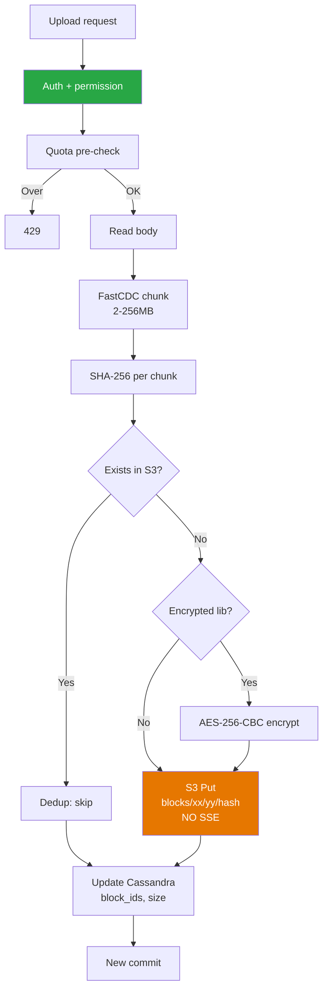
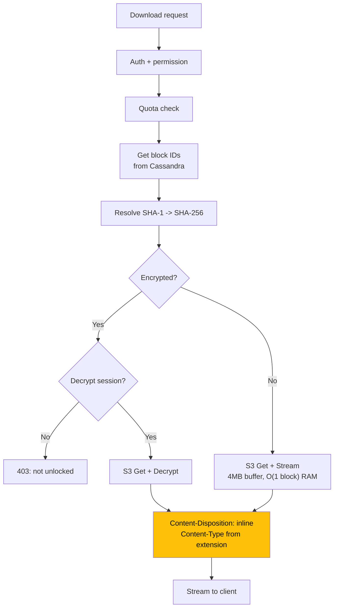
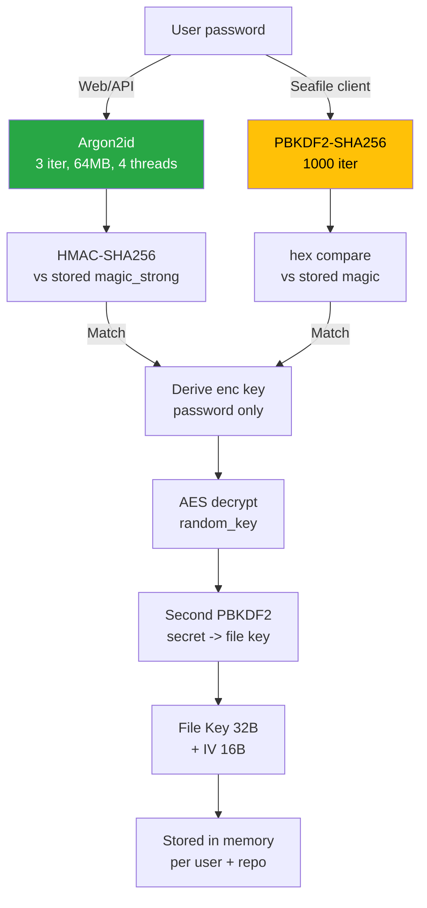
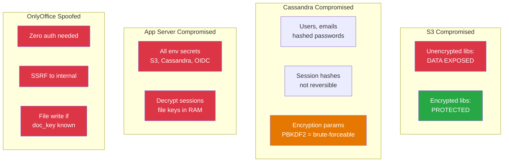

# SesameFS Storage & Encryption

## Upload Flow

```mermaid
flowchart TD
    Upload["Upload request"]
    Upload --> Auth["Auth + permission"]
    Auth --> Quota["Quota pre-check"]
    Quota -->|Over| R429["429"]
    Quota -->|OK| Read["Read body"]
    Read --> Chunk["FastCDC chunk<br/>2-256MB"]
    Chunk --> Hash["SHA-256 per chunk"]
    Hash --> Exists{"Exists in S3?"}
    Exists -->|Yes| Skip["Dedup: skip"]
    Exists -->|No| Enc{"Encrypted lib?"}
    Enc -->|Yes| AES["AES-256-CBC encrypt"]
    Enc -->|No| Put
    AES --> Put["S3 Put<br/>blocks/xx/yy/hash<br/>NO SSE"]
    Skip --> Meta["Update Cassandra<br/>block_ids, size"]
    Put --> Meta
    Meta --> Commit["New commit"]

    style Put fill:#e67700,color:#fff
    style Auth fill:#28a745,color:#fff
```

## Download Flow

```mermaid
flowchart TD
    DL["Download request"]
    DL --> Auth["Auth + permission"]
    Auth --> Quota["Quota check"]
    Quota --> Meta["Get block IDs<br/>from Cassandra"]
    Meta --> Resolve["Resolve SHA-1 -> SHA-256"]
    Resolve --> Enc{"Encrypted?"}
    Enc -->|Yes| Unlock{"Decrypt session?"}
    Unlock -->|No| R403["403: not unlocked"]
    Unlock -->|Yes| GetDec["S3 Get + Decrypt"]
    Enc -->|No| GetPlain["S3 Get + Stream<br/>4MB buffer, O(1 block) RAM"]
    GetDec --> Headers["Content-Disposition: inline<br/>Content-Type from extension"]
    GetPlain --> Headers
    Headers --> Client["Stream to client"]

    style Headers fill:#ffc107,color:#000
```

## Key Management

```mermaid
flowchart TD
    PW["User password"]

    PW -->|Web/API| Argon["Argon2id<br/>3 iter, 64MB, 4 threads"]
    PW -->|Seafile client| PBKDF["PBKDF2-SHA256<br/>1000 iter"]

    Argon --> Magic1["HMAC-SHA256<br/>vs stored magic_strong"]
    PBKDF --> Magic2["hex compare<br/>vs stored magic"]

    Magic1 -->|Match| Derive["Derive enc key<br/>password only"]
    Magic2 -->|Match| Derive

    Derive --> DecFK["AES decrypt<br/>random_key"]
    DecFK --> SecondKDF["Second PBKDF2<br/>secret -> file key"]
    SecondKDF --> FK["File Key 32B<br/>+ IV 16B"]
    FK --> Memory["Stored in memory<br/>per user + repo"]

    style PBKDF fill:#ffc107,color:#000
    style Argon fill:#28a745,color:#fff
```

## Compromise Scenarios

```mermaid
flowchart TD
    subgraph S3Breach["S3 Compromised"]
        S1A["Unencrypted libs:<br/>DATA EXPOSED"]
        S1B["Encrypted libs:<br/>PROTECTED"]
    end

    subgraph CassBreach["Cassandra Compromised"]
        S2A["Users, emails<br/>hashed passwords"]
        S2B["Session hashes<br/>not reversible"]
        S2C["Encryption params<br/>PBKDF2 = brute-forceable"]
    end

    subgraph AppBreach["App Server Compromised"]
        S3A["All env secrets<br/>S3, Cassandra, OIDC"]
        S3B["Decrypt sessions<br/>file keys in RAM"]
    end

    subgraph OOBreach["OnlyOffice Spoofed"]
        S4A["Zero auth needed"]
        S4B["SSRF to internal"]
        S4C["File write if<br/>doc_key known"]
    end

    style S1A fill:#dc3545,color:#fff
    style S1B fill:#28a745,color:#fff
    style S2C fill:#e67700,color:#fff
    style S3A fill:#dc3545,color:#fff
    style S3B fill:#dc3545,color:#fff
    style S4A fill:#dc3545,color:#fff
    style S4B fill:#dc3545,color:#fff
    style S4C fill:#dc3545,color:#fff
```
