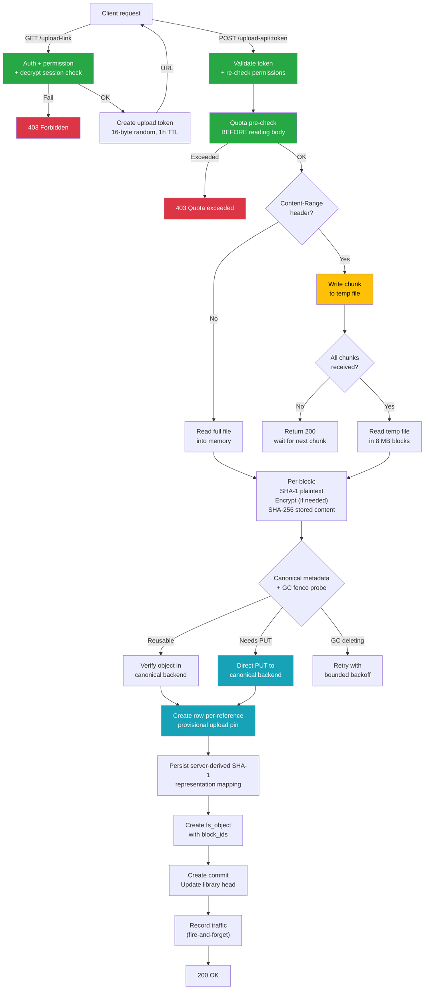
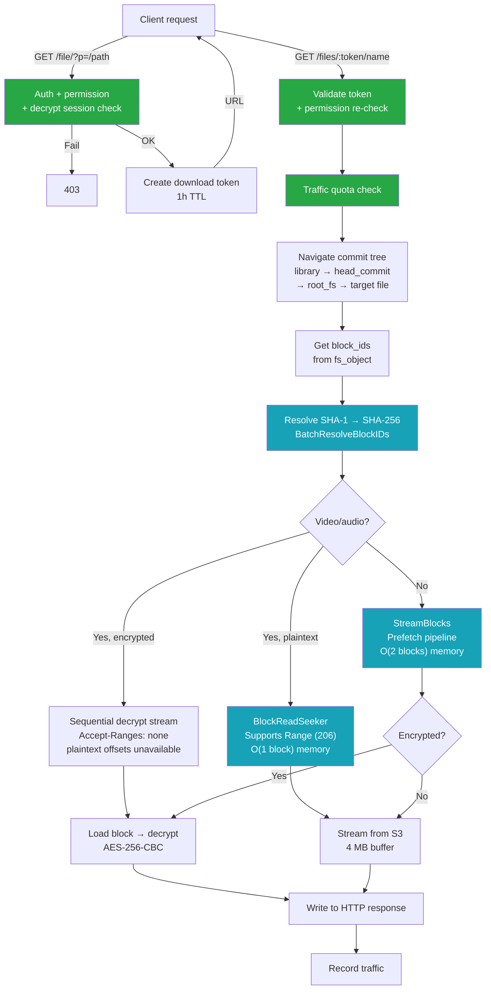
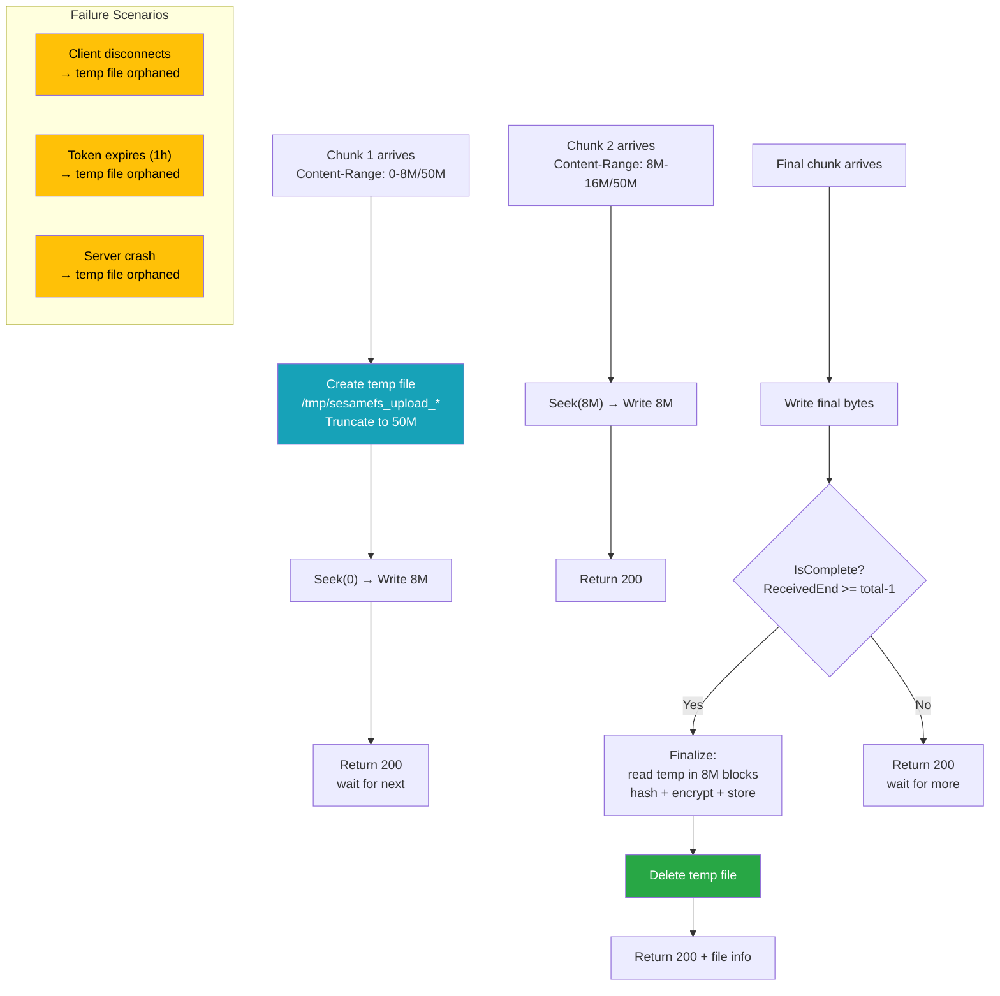
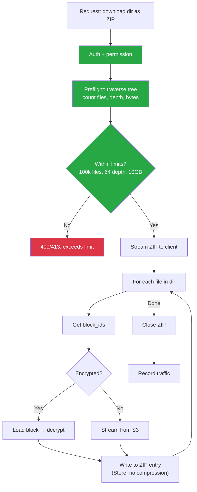
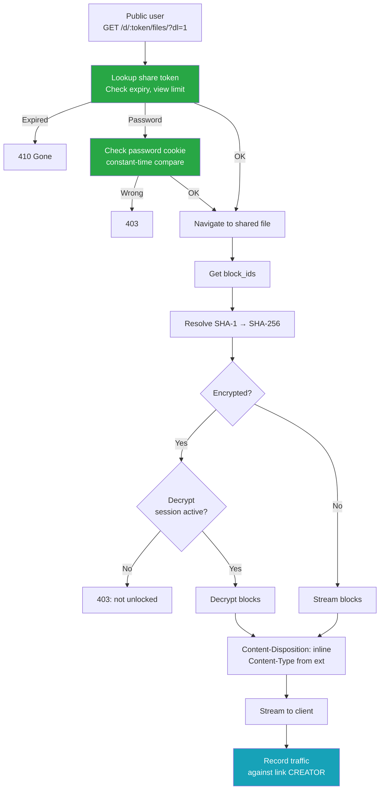

# Upload & Download Flow Diagrams

> How to read: Green nodes are security/safety checks. Blue nodes are storage operations.
> Yellow nodes are risk areas. Red nodes are potential failure points.

### How to read colors

| Color | Meaning |
|-------|---------|
| **Green** | Security check or safety mechanism |
| **Blue** | Storage / enqueue operation |
| **Yellow** | Risk area or edge case |
| **Red** | Failure or rejection |

---

## 1. Upload: Token → Store → Commit

---

## 2. Download: Token → Stream Blocks

---

## 3. Chunked Upload: Temp File Lifecycle

---

## 4. ZIP Directory Download

---

## 5. Share Link Download (Public)

